# MAGENTRA — The Big Picture

How MAGENTRA works, why it is built the way it is, and what breaks without a
compiler error. Written for the agents and people who change it.

Written against v0.20.2 on 2026-09-28. Where this document and the code
disagree, the code is right — and `node .claude/skills/bigpicture/bigpicture.mjs check`
exists to make that disagreement loud: every section below is bound in
[`coverage.json`](coverage.json) to the files that back it, and goes stale the
moment one of them changes.

**How to use it.** Find your area in §17 (concept → file), read the section that
owns it, then grep [`MAP.md`](MAP.md) — the generated per-file index with line
numbers — for the exact symbol. Before an edit, `bigpicture.mjs impact <file>`
names the sections that document the file; after it, `check` names the ones
your change made untrue. Fix them here, then `sync`. [`AGENTS.md`](../../AGENTS.md)
has the working rules; [`CONTEXT.md`](../../CONTEXT.md) the vocabulary.

| § | Section |
|---|---|
| [§1](#1--what-magentra-is) | What MAGENTRA is |
| [§2](#2--repository-map) | Repository map |
| [§3](#3--process-topology) | Process topology |
| [§4](#4--the-protocol--the-seam) | The protocol — the seam |
| [§5](#5--the-turn-loop) | The turn loop |
| [§6](#6--the-finishing-ladder) | The finishing ladder |
| [§7](#7--tools-and-the-permission-engine) | Tools and the permission engine |
| [§8](#8--the-vision-path) | The vision path |
| [§9](#9--token-algebra-and-context) | Token algebra and context |
| [§10](#10--settings-credentials-state-on-disk) | Settings, credentials, state on disk |
| [§11](#11--the-knowledge-layer) | The knowledge layer |
| [§12](#12--extension-surfaces) | Extension surfaces |
| [§13](#13--concurrent-workspaces) | Concurrent workspaces |
| [§14](#14--the-desktop-app) | The desktop app |
| [§15](#15--build-packaging-release-update) | Build, packaging, release, update |
| [§16](#16--invariants-tripwires-and-known-drift) | Invariants, tripwires and known drift |
| [§17](#17--concept--file-index) | Concept → file index |
| [§18](#18--the-tui) | The TUI |
| [§19](#19--the-feature-suite-and-the-gateway) | The feature suite and the gateway |


---

## §1 · What MAGENTRA is

**MAGENTRA is an agentic coding assistant: one headless engine that runs an LLM turn loop against a folder, and two frontends — an Electron desktop app (`app/`) and an Ink terminal UI (`tui/`) — that drive it. Neither frontend imports the engine. Each spawns it as a child process and exchanges newline-delimited JSON frames over its stdio.**

### What a user does with it

- **Opens a workspace** — a folder. The desktop app runs up to four at once, each in its own engine process (§13). The TUI runs one: the directory it was launched from, or `magentra <path>`.
- **Connects it to a model.** A saved connection profile (`~/.magentra/profiles.json`) or the setup wizard writes the API key into `<workspace>/.env` and the rest into `<workspace>/.magentra/settings.json`. The engine never reads the profile file; it boots from those two workspace files layered over `~/.magentra/settings.json`. Two provider shapes exist, Anthropic and OpenAI-compatible (hosted API, gateway, or a local server — an Ollama endpoint is detected behind the OpenAI-compatible provider and driven through its native API).
- **Asks for work.** The engine plans, reads and edits files, runs shell commands, spawns subagents, and asks before risky actions unless the session is in the OVERDRIVE stance (`CONTEXT.md`). The frontend renders the resulting event stream: streamed text and reasoning, tool calls and their output, file diffs, permission and question cards, the task list, token meters.
- **Comes back later.** Every conversation is an append-only transcript at `.magentra/sessions/<id>.jsonl`; sessions can be listed, resumed, renamed, archived and deleted — all by protocol frames, never by the frontend touching the file.

### The one rule

The protocol in `engine/protocol/src/types.ts` is the only integration surface. A frontend that can do something does it by sending a `FrontendRequest` and reading `CoreEvent`s (§4); a capability with no event/request pair does not exist for any frontend. The host process itself obeys the same rule: `engine/host/src/serve.ts` `runServe()` only calls `engine.send()` and drains `engine.events`.

That is what makes another frontend cheap: `tui/` contains no engine code at all, and `benchmarks/terminal-bench/driver.mjs` is a third, headless client of the same bundle.

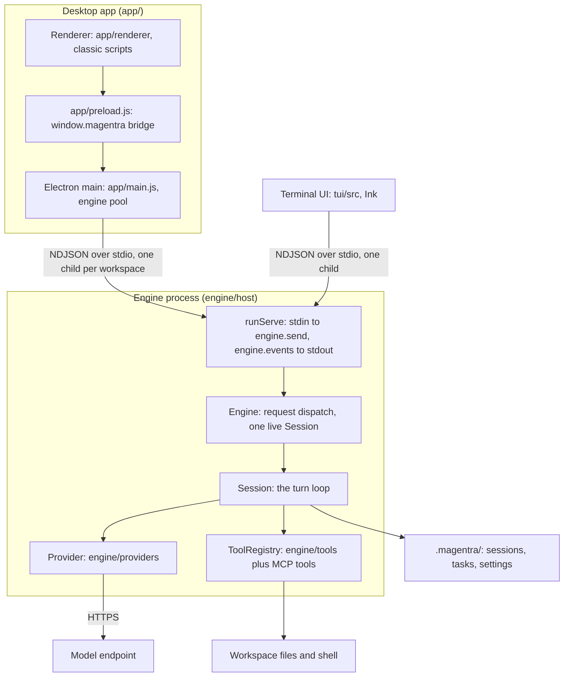

Events travel back up the same pipes: the engine pushes `CoreEvent`s into its queue, the host writes them to stdout, and each frontend renders them.

### What the engine owns, and what the frontends own

| The engine owns | The frontends own |
|---|---|
| The turn loop, system prompt and prompt registry (`engine/core/src/runtime/session.ts`, `engine/protocol/src/prompts.ts`) | Rendering the event stream |
| Tools and the permission decision (27 built-ins in `engine/tools/src/index.ts` `createDefaultRegistry()`, plus MCP tools registered at boot in `engine/host/src/bootstrap.ts`) | Showing permission and question cards and sending the answer back |
| Settings resolution: global, then project, then env overrides (`engine/core/src/config/settings.ts` `loadSettings()`) | Connection profiles and writing credentials into a workspace (`app/main/profiles.js`, `app/main/connection.js`; `tui/src/profiles.ts`) |
| Provider construction (`engine/core/src/config/providerFactory.ts` `createProviderForEndpoint()`) | App config — window, theme, recent folders (`app/main/config.js`, Electron `userData/config.json`) |
| Transcripts, task lists, session list/resume/rename/delete under `.magentra/` | The engine pool and tabs (`app/main.js`, §13) |
| The slash-command registry and the model rate card, shipped in `session_started` | Per-workspace NDJSON logs at `.magentra/logs/` (`app/main/logging.js`, desktop only) |
| Addons, hooks, cron, background jobs, image description | Folder trust for terminal sessions (`tui/src/trust.ts`, `~/.magentra/trusted-folders.json`) |

A frontend adopts the slash-command registry (`session_started.commands`, refreshed by `addons_updated.commands`) and the rate card (`session_started.rateCard`) as sent. It never derives `/<name>` or keeps a price table of its own; both would drift from what the engine dispatches and bills.

### Where the rule bends

These are the known places where a frontend and the engine share something other than frames. Each is deliberate; each is a trap if forgotten.

1. **The document extractor.** `app/main.js` `loadDocExtractor()` imports the engine's PDF/DOCX text extractor directly — `engine/core/dist/knowledge/docs.js` in development, the standalone `resources/engine/doc-extract.mjs` bundle when packaged (built by `app/scripts/bundle-engine.js`). Attached documents are read in the main process, not by the engine.
2. **Mirrored constants.** Values both halves need are duplicated with a comment naming the twin: `DEFAULT_BASE_URL`, `DEFAULT_API_KEY_ENV`, `VISION_API_KEY_ENV` and `isLocalBaseUrl()` in `app/main/config.js`, `IMAGE_TYPES` in `app/main.js`. The `tests/features/mirror-*.test.ts` files pin the pairs. (A comment in `app/main/config.js` still says nothing asserts the `isLocalBaseUrl` parity; `tests/features/mirror-local-endpoint.test.ts` now does.)
3. **Profiles are implemented twice.** `app/main/profiles.js` + `app/main/connection.js` and `tui/src/profiles.ts` both read `~/.magentra/profiles.json` and write the same `.env` + `settings.json` shape. A change to that shape must land in both.

### Invariants

- The engine has no terminal or UI concern. Only `engine/host` reads stdin or writes stdout; everything the engine says to a frontend is a `CoreEvent`. stderr is a side channel for warnings (the host's boot warnings, one in `engine/providers/src/openai-compat.ts`) that frontends may show but must never parse as protocol.
- A frontend never reads `.magentra/sessions/*.jsonl` itself. A resumed conversation arrives as one render-ready `session_restored` frame.
- What a frontend shows about cost, context size and the command palette comes from engine frames (`rateCard`, `context_update`, `turn_finished`, `commands`), not from a local copy.
- Persisted state is additive-only (`CONTEXT.md`): keys are added, never renamed or repurposed, so any version reads any other version's files and there is no migration machinery.

### Traps

- **Neither frontend is type-checked against the engine.** `tui/` is TypeScript but declares its own copy of the protocol; `app/` is plain JavaScript that matches bare strings. A protocol change compiles cleanly on both sides. On the TUI side `tests/features/tui-protocol-parity.test.ts` catches it; on the app side only a `ui` test that happens to drive that frame does (§4).
- **Stale comments call the desktop app the host's "only frontend"** (`engine/host/src/main.ts`, `engine/host/src/serve.ts`). The TUI and the benchmark driver spawn the same binary; treat any change to host arguments or framing as affecting all three.

---

## §2 · Repository map

**One npm workspace root holding five engine packages, two frontends, a test suite and developer tooling. The TypeScript build (`tsc -b`) sees only the engine and the TUI; the desktop app is plain JavaScript that no compiler checks, and `tests/` and `tools/` are checked — if at all — by separate commands.**

### The root

| File | What it is for |
|---|---|
| `package.json` | Workspace root: `workspaces` = `engine/*`, `app`, `tui`. Holds every npm script (`build`, `test*`, `typecheck:*`, `app`, `dist:*`, `gateway`, `brain-editor`, `commit`, `version:*`). |
| `package-lock.json` | The single lockfile for all workspaces. |
| `tsconfig.json` | The build graph: `files: []` plus project references to the five engine packages and `tui`. |
| `tsconfig.base.json` | Shared compiler options (strict, `NodeNext`, `composite`, `noUncheckedIndexedAccess`, `verbatimModuleSyntax`). |
| `VERSION`, `version.config.json` | The current version, and the version tool's config: which eight `package.json` files it bumps, commit types, scopes. |
| `README.md` | Install, the `magentra` terminal command, build and package commands. |
| `CHANGELOG.md` | Written by the version tool on release. Never edited by hand. |
| `VERSIONING.md` | How commit messages decide the next semver (`docs/adr/0008-the-version-is-semver.md`). |
| `CONTEXT.md` | The glossary — stance, OVERDRIVE, finishing rungs, additive-only state. |
| `FEATURES.md` | The feature backlog: every feature and whether a real test covers it. |
| `CONTRIBUTING.md`, `CODE_OF_CONDUCT.md`, `LICENSE`, `NOTICE` | Contribution terms; Apache-2.0 and its notice. |
| `AGENTS.md` | Entry point for coding agents. |
| `brain/` | The single source of model-facing defaults (§12): `prompts/<group-dir>/<id>.md` (one file per prompt outside the `subagent.*` group), `tools/<Name>/description.md` and optional `params.md` (tool description templates and `.describe()` texts), `availability.json` (the built-in tools a root session offers, per context), `behavior.json` (the behaviour knobs: rung budgets, stall thresholds, clarify limits, the evidence lists, what OVERDRIVE does). `README.md` is its contract; `.editorconfig` and `.gitattributes` keep its bytes LF and untrimmed. Never read at run time — compiled by `tools/brain/compile.mjs`. |
| `.gitignore` | Ignores every `dist/`, `app/build-resources/`, `app/dist/`, `.magentra/`, `.env*`, the generated `engine/protocol/src/brain.generated.ts`, and all of `.claude/` except `.claude/skills/`. |

### The engine: `engine/*`

Five packages, each `@magentra/<name>`, each compiled from `src/` to a gitignored `dist/` and consumed through its `package.json` `exports` (`dist/index.js`). The order is fixed by `tsconfig.json` project references and mirrored in each package's `dependencies`:

```
protocol  ←  providers  ←  core  ←  tools  ←  host
```

| Package | Depends on | Holds |
|---|---|---|
| `engine/protocol` | nothing (Node built-ins only) | `types.ts` (the wire contract, §4), `ndjson.ts` (framing), `tokens.ts` (the token algebra), `prompts.ts` (the prompt registry and `~/.magentra/prompts/<id>.txt` overrides), `brain.ts` (accessors over the compiled brain: tool descriptions, param texts, tool availability, and the behaviour knobs with their runtime validator), `brain.generated.ts` (gitignored, written by `tools/brain/compile.mjs`), `branding.ts` (`STATE_DIR_NAME = ".magentra"`, product name, repo URL) |
| `engine/providers` | protocol, `@anthropic-ai/sdk` | The `Provider` interface (`types.ts`), `anthropic.ts`, `openai-compat.ts`, `ollama.ts` (reached through openai-compat), `fake.ts` (scripted, for tests), `retry.ts`, `effort.ts`, `think.ts` |
| `engine/core` | protocol, providers, `zod` | The engine proper — see below |
| `engine/tools` | core, protocol, `fast-glob`, `@vscode/ripgrep`, `zod` | One module per tool and `createDefaultRegistry()` in `index.ts` |
| `engine/host` | core, protocol, providers, tools | The headless process: `main.ts` (argv, fatal boot), `bootstrap.ts` (builds an `Engine`), `serve.ts` (the stdio loop), `stdout.ts`, `env.ts` (`.env` loader). Package `main` is `dist/main.js`; `index.ts` is the library export. |

`engine/core` never imports `engine/tools`: tools are injected as a `ToolRegistry`, so the engine runs with any subset (subagents get restricted sets, tests register one tool). Inside `engine/core/src`:

| Folder | Contents |
|---|---|
| `runtime/` | `engine.ts` (the protocol endpoint: request dispatch, slash commands, sessions), `session.ts` (the turn loop, the largest source file in the repo), `permissions.ts`, `finishing.ts`, `sessionStats.ts`, `fileState.ts` |
| `agent/` | `tool.ts` (tool contract, `ToolRegistry`), `prompts.ts` (system-prompt sections), `agents.ts` (subagent types), `addons.ts`, `builtinAddons.ts`, `hooks.ts` |
| `config/` | `settings.ts` (the zod schema and layered loading), `providerFactory.ts`, `pricing.ts`, `frontmatter.ts` |
| `knowledge/` | `graph.ts` (import graph), `symbols.ts`, `reuseGate.ts`, `seeds.ts`, `standards.ts`, `workspace.ts`, `docs.ts` (PDF/DOCX extraction) |
| `scheduling/` | `background.ts`, `cron.ts`, `workflow.ts` |
| `state/` | `transcript.ts` (append-only JSONL), `taskStore.ts` |
| `integrations/` | `mcp.ts` (stdio MCP client) |
| `util/` | `asyncQueue.ts` (the single-consumer event queue), `fsAtomic.ts`, `zodToJsonSchema.ts` |

### The desktop app: `app/`

Plain CommonJS for Electron. Nothing in `app/` is type-checked (the `@typedef` comments in `app/main.js` are documentation, not a check).

| Path | What it is |
|---|---|
| `app/main.js` | The Electron main process: windows, the engine pool and tab routing (§13), spawning engines (§3), every `ipcMain` handler, the attach-file reader. |
| `app/main/` | Main-process modules with no window state: `config.js` (app config, mirrored engine constants, settings file I/O), `connection.js` (credential validation, connection test, `.env` rewriting), `profiles.js` (the global profile store), `logging.js` (per-workspace NDJSON session logs with redaction), `updates.js` (the two update tiers, `docs/adr/0009-updates-have-two-tiers.md`), `changes.js` (workspace-confined file resolution and undo). |
| `app/preload.js` | The `contextBridge` surface: `window.magentra`, the only thing the renderer can call. |
| `app/renderer/` | `index.html` (strict CSP, loads the modules), `styles.css`, `fonts/`, and `modules/*.js` — classic scripts sharing one global scope, loaded in the order `index.html` lists them. `tabs.js` must load after every module that owns per-tab globals and before `composer.js`, which registers the event listener. |
| `app/scripts/` | `launch.js` (dev start; Linux sandbox check; strips `ELECTRON_RUN_AS_NODE`), `bundle-engine.js` (esbuild: `engine.cjs`, `doc-extract.mjs`, `tui.mjs`, ripgrep, minified app into `app/build-resources/`), `dist.js` (electron-builder), `afterPack.js` (terminal launchers, ad hoc mac signing). |
| `app/shims/` | esbuild aliases: `ripgrep-shim.cjs` (resolves `rg` beside the bundle), `devtools-shim.cjs` (stubs `react-devtools-core` for `tui.mjs`). |
| `app/build/` | Packaging resources: `icon.png`, `installer.nsh` (NSIS PATH entry), `magentra.cmd` (Windows terminal command). |

### The terminal UI: `tui/`

TypeScript + Ink + React, inside the `tsc -b` graph but with **no** reference to or dependency on `engine/*`. `tui/src/protocol.ts` is a hand-kept subset of the wire types (§4). `tui/src/config.ts` finds the engine; `tui/src/engine/host.ts` spawns it; `tui/src/engine/useEngine.ts` is the event reducer; `components/` render. Ships bundled as `resources/engine/tui.mjs`.

### Tests: `tests/`

| Path | What it is |
|---|---|
| `tests/features/<feature-id>.test.ts` | One file per feature record; run by `node --test` with Node's type stripping (Node ≥ 22.18, no build step for the tests themselves). |
| `tests/lib/` | The test class hierarchy (`featureTest.ts` and one class per kind: pure, fs, proc, net, llm, ui) and harnesses (`engineHarness.ts`, `scriptedEngine.ts`, `appHarness.cjs`, `appDriver.ts`, …). |
| `tests/gateway/` | `features/*.json` — the committed feature inventory — and `descriptions/*.json`. |
| `tests/tsconfig.json` | `noEmit`, `allowImportingTsExtensions`, `erasableSyntaxOnly`; its own project. |

The tests import the engine as `@magentra/*`, which resolves to `engine/*/dist/`. `npm test` does not build. `tests/README.md` is the authority on kinds and commands.

### Developer tooling: `tools/`, `benchmarks/`, `docs/`, repo plumbing

| Path | What it is |
|---|---|
| `tools/magentra-gateway/` | The feature inventory and test gate (`npm run gateway`, via `tsx`). Imports `tui/src/profiles.ts` and `engine/core/src/util/fsAtomic.ts` by relative source path. Its `package.json` version is not a version-tool target and lags the product. |
| `tools/version/` | The semver/changelog tool (`npm run commit`, `version:*`), JavaScript typed by JSDoc. Called by `.githooks/commit-msg` and `.github/workflows/release.yml`. |
| `tools/brain/compile.mjs` | The brain compiler (plain Node, no dependencies): validates `brain/` (including every `behavior.json` key against `BEHAVIOR_SPEC`, and the prose `CLAIMS`, which only warn) and writes `engine/protocol/src/brain.generated.ts`. Run first by `npm run build` and `npm run typecheck`; `--check` validates and fails when the generated module is stale. |
| `tools/brain-editor/` | The brain editor (`npm run brain-editor`, via `tsx`; the gateway's local-server pattern): a page and an agent command line over one core, `src/model.ts`, that edits `brain/` or a profile folder. Every save is compiled on a staged copy by `tools/brain/compile.mjs` and loaded by the built engine (`src/probe.mjs`) before anything is written (§12). Imports `engine/core/src/util/fsAtomic.ts` by relative source path; serves the app's fonts from `app/renderer/fonts`. |
| `benchmarks/` | Benchmark task prompts (`01-…06-*.txt`, `agent-benchmark-prompt*.md`) and the Terminal-Bench 2.0 harness in `benchmarks/terminal-bench/` (`driver.mjs` is a headless NDJSON client of the unmodified `engine.cjs`). |
| `docs/big-picture/` | This document, the generated `MAP.md`, and `coverage.json` (read by `.claude/skills/bigpicture/bigpicture.mjs`). |
| `docs/adr/` | Product decisions: `0004-the-import-graph-has-two-tiers.md`, `0008-the-version-is-semver.md`, `0009-updates-have-two-tiers.md`. |
| `docs/decisions/` | The gateway and test-suite decision series (0001–0015, no 0006), `SPEC.md`, `INVENTORY.md`, `README.md`. |
| `.github/` | `workflows/ci.yml`, `workflows/release.yml`, issue and PR templates. |
| `.githooks/commit-msg` | Runs the version tool's message check; enabled by the root `prepare` script (`core.hooksPath`). |
| `.claude/skills/` | `bigboycoding/` (`blast-radius.mjs`: importer graph, frame and symbol seams) and `bigpicture/` (`bigpicture.mjs`: `map`, `impact`, `check`, `sync` for this document). |

### What checks what

| Code | Checked by | Run in CI? |
|---|---|---|
| `engine/*`, `tui/` | `npm run build` / `npm run typecheck` (both `node tools/brain/compile.mjs && tsc -b`) | yes, in `ci.yml` |
| `brain/` | `node tools/brain/compile.mjs` (the first step of `npm run build` and `npm run typecheck`); `brain-is-the-single-source` and `brain-controls-behavior` in `npm test` | yes, through `npm run build` in `ci.yml` |
| `app/` | nothing | — (only the `npm run smoke --workspace app` boot, and `ui`-kind tests under `npm run test:ui`) |
| `tests/` | `npm run typecheck:tests` (`tsc -p tests`) | no |
| `tools/magentra-gateway/` | `npm run typecheck:gateway` | no |
| `tools/brain-editor/` | `npm run typecheck:brain-editor`; `tests/features/brain-editor.test.ts` in `npm test` (its `ui/` is plain JS, checked by nothing) | the tests, yes; the typecheck, no |
| `tools/version/` | `npm run typecheck:version` (`checkJs`) | yes, the `types` job |

### npm workspaces, and what is not one

The workspaces are `engine/*`, `app` and `tui`. `tools/` and `tests/` are **not** workspaces and declare no dependencies of their own; they run on what the workspaces hoist into the root `node_modules`: `typescript` (root devDependency) for the gateway and the parity test, `zod` (from `engine/core` and `engine/tools`) for the gateway, `tsx` (a `tui` devDependency) for `npm run gateway` and `npm run brain-editor`, and the `@magentra/*` workspace links for the tests.

### Traps

- **`brain.generated.ts` is build output too.** It is gitignored and written only by `node tools/brain/compile.mjs` (the first half of `npm run build`). A bare `tsc -b` on a fresh clone fails on the missing module, and after a `brain/` edit it compiles the previous brain.
- **`dist/` is the thing that runs.** The tests, `npm run app` in development, the dev TUI and `app/main.js`'s dev doc-extractor all load `engine/*/dist/`. None of those commands builds it. Change `src/`, skip `npm run build`, and you test or run the previous build.
- **Moving a hoisted dependency breaks a non-workspace.** Dropping `zod` from the engine, or `tsx` from `tui`, silently breaks `tools/magentra-gateway` (and `tsx` also `tools/brain-editor`), which never declared them.
- **A new engine package needs three edits:** its `tsconfig.json` references, the root `tsconfig.json` references, and `version.config.json` targets — or it is either unbuilt or left at an old version.
- **`tsc -b` passing says nothing about `app/`.** See §4 for the check that does reach it.

---

## §3 · Process topology

**Every frontend runs the engine as a child process bound to one workspace and talks to it over the child's stdin and stdout, one JSON object per line. The desktop app keeps one such child per open workspace; the TUI keeps exactly one. The engine never knows which frontend, window or tab it serves.**

### Who spawns whom

| Spawner | Development | Packaged |
|---|---|---|
| `app/main.js` `engineEntryPoint()` + `startEngine()` | `node engine/host/dist/main.js --serve --cwd <ws>` | `process.execPath resources/engine/engine.cjs --serve --cwd <ws>` with `ELECTRON_RUN_AS_NODE=1` |
| `tui/src/config.ts` `resolveEngineSpawn()` | `node <engineHome>/engine/host/dist/main.js --cwd <ws>` | `process.execPath <dir of tui.mjs>/engine.cjs --cwd <ws>` with `ELECTRON_RUN_AS_NODE=1` |
| `benchmarks/terminal-bench/driver.mjs` | — | `process.execPath <engine.cjs> --cwd <ws>` |

- **Packaged means "no Node on the machine".** `engine.cjs` is `engine/host/dist/main.js` bundled by `app/scripts/bundle-engine.js` into one CommonJS file with no `node_modules`; Electron's own binary runs it as Node. The TUI ships the same way (`tui.mjs`) and finds the engine as its sibling: `isPackagedRun()` is literally "does `engine.cjs` exist next to me".
- **The dev TUI finds a checkout** through `~/.magentra-tui.json` `{ "engineHome": … }`. `loadConfig()` creates the file on first run with `guessEngineHome()` (the repo root two levels above `tui/src`) and throws an actionable error when `hostEntry(engineHome)` has not been built.
- **The child's cwd is the workspace** in both frontends, and `--cwd` names it again. The host works from `--cwd` and falls back to its process cwd only when the flag is absent.
- **`--serve` is accepted and ignored.** `engine/host/src/main.ts` `parseArgs()` knows only `--cwd` and `--serve`; any other flag is a fatal boot error. The app still passes `--serve` and `tests/features/engine-lifecycle.test.ts` asserts it does.

What else is a process: the Electron main process (one), one renderer per window, and the engine's own children — Bash tool commands and background jobs (`engine/tools/src/bash.ts`, detached into their own process group on POSIX), MCP servers (spawned during boot by `engine/core/src/integrations/mcp.ts`), and hook commands (`engine/core/src/agent/hooks.ts`). Subagents are **not** processes: they are child `Session`s inside the same engine.

### The environment a child gets

| | Desktop app | TUI |
|---|---|---|
| Base | the app's `process.env` | the TUI's `process.env` |
| Workspace keys | `app/main/connection.js` `readWorkspaceEnvKeys()` overlays every `*API_KEY` line of `<ws>/.env`, so the workspace key beats one exported in the shell | not overlaid |
| Model | `MAGENTRA_MODEL` = the model main chose: the workspace's saved `model` on open, `tab.model` on a restart, the app-wide last pick as fallback | not set |

Inside the host, `engine/host/src/env.ts` `loadDotEnv()` loads `<ws>/.env` but **only fills variables that are unset**, and `engine/core/src/config/settings.ts` applies env overrides (`MAGENTRA_MODEL`, `MAGENTRA_BASE_URL`, …) above both settings files. Two consequences: in the desktop app the model main passes outranks the settings files; in the TUI a key or `MAGENTRA_MODEL` exported in the user's shell beats the workspace's own.

### Inside the host

1. **`main.ts`** parses argv, calls `bootstrapEngine()`, prints boot warnings to **stderr** as `warning [source] message`, then `runServe()`. A failure goes through `fail()`: a `{ type: "error", fatal: true }` frame written **synchronously** with `writeFrameSync()` (`stdout.ts`), a stderr copy, then exit 1. The write is synchronous because stdout to a pipe is asynchronous and `process.exit()` would discard a buffered frame.
2. **`bootstrap.ts`** `bootstrapEngine()` — free of any frontend concern: `.env`, `loadSettings()`, the insecure-TLS switch, the Windows Git Bash check, API-key resolution (`MissingApiKeyError` unless the endpoint is local), `createProviderForEndpoint()`, `createDefaultRegistry()` plus every MCP server's tools (awaited, so a slow MCP server delays the first frame), addons, `new Engine(...)`.
3. **`serve.ts`** `runServe()` calls `engine.start()` (which emits `session_started`, `task_list_updated`, and a background `model_catalog`), starts one pump loop draining `engine.events` to stdout, and reads `decodeFrames(process.stdin)`. Anything with a string `type` goes to `engine.send()`; anything else gets `{ type: "error", message: "invalid request frame", fatal: false }`.

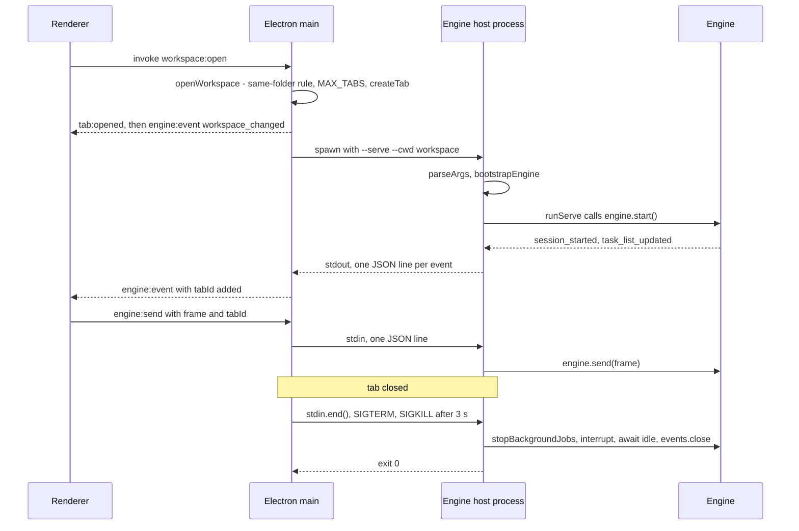

### The desktop bridge: renderer ↔ main

The renderer is sandboxed (`contextIsolation: true`, `nodeIntegration: false`, `sandbox` on except in the Windows portable build, a CSP of `script-src 'self'`). Its only door is `app/preload.js`, which exposes `window.magentra` over `contextBridge`. The engine traffic uses four IPC channels:

| Channel | Direction | Carries |
|---|---|---|
| `engine:send` | renderer → main | a bare frame (goes to the sender window's active tab) or `{ frame, tabId }` (goes to that tab) — main tells them apart by whether the payload has a top-level string `type` |
| `engine:interrupt`, `engine:restart` | renderer → main | no tabId: always the sender window's active tab |
| `engine:permission` | renderer → main | `{ id, decision, message?, tabId? }`; main builds the `permission_response` frame |
| `engine:event` | main → renderer | every engine frame with `tabId` added, plus main's own `workspace_changed`, `engine_notice`, `engine_exit` and "engine is not running" `error` frames (§4) |

Main parses engine stdout itself (split on `\n`, drop a trailing `\r`, `JSON.parse`), logs each frame through `logEngineFrame()`, and forwards it. An unparseable stdout line is logged and dropped, never forwarded. stderr lines are logged; `classifyEngineStderr()` drops Node noise and the `Error:`/`fatal:` copies of fatal frames, and turns a `warning …` line into an `engine_notice`.

### Shutdown

The engine stops for one of two reasons, and both run the same `shutdown()` in `serve.ts`:

- **stdin reaches EOF** — the frontend closed the pipe or died;
- **SIGTERM**.

`shutdown()` reaps detached background jobs first (`engine.stopBackgroundJobs()`; an interrupt alone does not reach them), sends itself `{ type: "interrupt" }`, awaits `engine.idle()`, closes the event queue, waits for the pump to flush, and sets exit code 0 (the SIGTERM path then calls `process.exit(0)`). The rule behind it: a turn nobody is listening to must be interrupted, not left running and spending tokens.

The frontends' side:

- `app/main.js` `stopEngine()` marks `child.expectedExit`, ends stdin, sends SIGTERM, escalates to SIGKILL after 3 s, and parks the child in `tab.dying` until it exits (§13). `startEngine()` never spawns a replacement for a tab whose `dying` child is still alive.
- `tui/src/engine/host.ts` `kill()` ends stdin and calls `child.kill()` only if the child is still running 1.5 s later.
- The app stops every engine on `window-all-closed` and `before-quit`.

### Invariants

- stdout carries protocol frames and nothing else. Any diagnostic goes to stderr.
- The first stdout frame of a healthy boot is `session_started`; a failed boot writes a fatal `error` frame to stdout before exit 1 (`tests/features/engine-host.test.ts`).
- A frontend that disappears ends its engine: EOF alone is enough (`closing-stdin-drains-the-work-in-flight-and-exits-zero`).
- One child per tab at any moment, including during a restart.
- `bootstrapEngine()` stays frontend-free. Tests and embedders call it directly (`engine/host/src/index.ts` exports it with `runServe` and `loadDotEnv`).

### Traps

- **On Windows the desktop app does not let the host shut down gracefully.** There `child.kill("SIGTERM")` is TerminateProcess, and `stopEngine()` sends it in the same tick as the EOF. The drain, the interrupt and `stopBackgroundJobs()` have no time to run when a tab closes; the kill ends the engine. The graceful path holds on POSIX and in the TUI, which waits before killing.
- **The EOF path never calls `process.exit()`.** It relies on the event loop emptying. The host never closes its MCP clients (`McpClient.close()` is not called on shutdown), so a configured MCP server's piped child can keep the host alive after EOF until a frontend's kill timer fires.
- **Two engines of different vintages.** Development runs `engine/host/dist/`; `npm run app` does not build it. A stale `dist/` runs old engine code under a new app.
- **A boot warning is a string contract.** `main.ts` prints `warning [source] message`; `classifyEngineStderr()` in `app/main.js` recognises exactly that shape. Change one, change both.
- **`ELECTRON_RUN_AS_NODE` must never reach the Electron app itself.** `app/scripts/launch.js` deletes it before starting Electron, and the packaged TUI deletes it before handing off to the GUI (`tui/src/cli.tsx`); otherwise Electron starts as plain Node and no window appears.

---

## §4 · The protocol — the seam

**Two tagged unions in `engine/protocol/src/types.ts` — `CoreEvent` (engine → frontend) and `FrontendRequest` (frontend → engine) — framed as one JSON object per line. It is the only contract between the engine and its frontends, and the least protected one: the desktop app matches it by bare strings no compiler sees, and the TUI matches it through a hand-kept copy.**

### Where it lives

| File | Holds |
|---|---|
| `engine/protocol/src/types.ts` | `PROTOCOL_VERSION`, `CoreEvent`, `FrontendRequest`, and the shapes they carry: `TaskItem`, `Usage`, `Question`, `SessionSummary`, `PermissionDecision`, `SlashCommandInfo`, `ConnectionSpec`, `VisionConnectionSpec`, `REASONING_EFFORTS`, `ImageAttachment`, `RestoredMessage` |
| `engine/protocol/src/ndjson.ts` | `encodeFrame()` (`JSON.stringify(frame) + "\n"`) and `decodeFrames()` |
| `engine/protocol/src/index.ts` | Re-exports `branding`, `prompts`, `types`, `tokens`, `ndjson` — `@magentra/protocol` is all five |

`PROTOCOL_VERSION = 1`, sent to the frontend as `session_started.v`.

### The shape

Frames are bare objects discriminated by `type`. There is no envelope, no sequence number and no session id on the wire; the only correlation is the ids individual frames carry — `turnId`, a tool call's `id`, `permission_request.id`, `question_request.id`, `agentId`, a background `taskId`. (`types.ts` also declares a `Frame` type with a `kind` field; nothing uses it and no frame on the wire has `kind`.)

`decodeFrames()` reads bytes through a streaming `TextDecoder`, so a multi-byte UTF-8 character split across two chunks arrives whole. It splits on `\n`, drops a trailing `\r`, skips blank lines, yields an unterminated last line when the stream ends, and turns a line that is not JSON into `{ type: "error", message: "unparseable frame: <first 200 chars>", fatal: false }` instead of throwing.

The product reads the stream in three places, each with its own line splitter — only the host uses `decodeFrames()` — and embedders skip the wire entirely:

| Reader | Where | A bad line becomes |
|---|---|---|
| Engine host, stdin | `engine/host/src/serve.ts` | an error object with a string `type`, which is request-like, so it reaches `Engine.send()` and comes back as `Unknown request type "error"` |
| Desktop main, engine stdout | `app/main.js` `startEngine()` | a log line; the frame is dropped |
| TUI, engine stdout | `tui/src/engine/host.ts` `startHost()` | a non-fatal `error` event |
| In process (no wire) | `engine.events` (`AsyncQueue`) + `engine.send()` | — (tests and embedders; one consumer only, see §13) |

### Engine → frontend: the event families

| Family | Frames |
|---|---|
| Session | `session_started` (version, ids, cwd, model, `reasoningEffort?`, `overdrive`, the slash-command registry, the rate card, `addons?`), `session_restored` (the render-ready paint list), `session_list`, `session_report`, `model_catalog`, `cwd_changed` |
| Turn | `turn_started`, `text_delta`, `thinking_delta`, `turn_finished` (`stopReason`, `usage`, `contextTokens`, `contextWarn?`, `overdriveSnapshot?`) |
| Tool calls | `tool_call_streaming`, `tool_call_started`, `tool_output_delta`, `tool_call_finished`, `file_edited` (with a unified diff) |
| Subagents | `agent_spawned`, `agent_finished`; tool-call frames carry `subagent`, `agentId`, `agentDesc` when a subagent made them |
| Asks | `permission_request`, `question_request` |
| Live state | `task_list_updated`, `context_update`, `overdrive_changed`, `background_notification` (`payload: unknown`) |
| Addons | `addons_updated` (roster plus refreshed `commands`), `addon_draft`, `addon_export` |
| Diagnostics | `command_output`, `retry_status`, `error` (`message`, `fatal`) |

Timestamps (`at`) are engine-clock epoch ms; frontends time turns and calls from them, not from arrival.

### Frontend → engine: the request families

| Family | Frames | Sent by |
|---|---|---|
| Turn | `user_message` (`text`, `images?`), `steer_message`, `interrupt` | app, TUI |
| Answers | `permission_response`, `question_response` | app, TUI |
| Commands | `slash_command` (`command`, `args?` — a single string), `bang_command` | app, TUI |
| Live settings | `set_model`, `set_overdrive` | app, TUI |
| | `set_connection` (a whole `ConnectionSpec`), `set_vision`, `set_deletion_guard`, `set_compact_limit` | app |
| Sessions | `list_sessions`, `resume_session` | app, TUI |
| | `rename_session`, `archive_session`, `delete_session` | app |
| Background | `stop_background` | app |
| Addons | `generate_addon`, `install_addon`, `export_addon` | app |

`Engine.send()` in `engine/core/src/runtime/engine.ts` is one `switch`; its `default` arm answers an unknown `type` with a non-fatal `error` rather than dropping it.

### Two round trips

- **Permission.** `permission_request { id, tool, input, description?, subject?, grant? }` → the engine parks a resolver in `pendingPermissions` with **no timeout** → `permission_response { id, decision, message? }`, where `decision` is `allow_once | allow_session | allow_always | deny`. `allow_always` persists only the exact `subject` (or the command shape named in `grant`); with no `subject`, a frontend offers only allow-once and deny.
- **Question.** `question_request { id, questions }` → `question_response { id, answers }` with answers keyed **positionally**, `"q:<index>"`, so two identical question texts cannot collide (the text is accepted as a fallback). Answers accumulate across frames; the tool resolves only when every question has one, or when `interrupt` settles the round with what was collected.

### The version

The engine sends `v` and never checks the frontend. The app never reads `v`. The TUI compares it with its own `PROTOCOL_VERSION` in `tui/src/engine/useEngine.ts` and prints an error line on a mismatch, then carries on. In a packaged build the app, the TUI and `engine.cjs` ship in one artifact and cannot disagree; a mismatch needs a development setup (a dev TUI whose `engineHome` is another checkout, or a stale `dist/`). No document says when to bump the number. What lets it stay at 1 is that both frontends ignore event types they do not know: the renderer's `handleEngineEvent()` and the TUI's reducer both end in a `default` that does nothing.

### Why `app/` is the most dangerous seam

`app/` is plain JavaScript outside every compiler (§2). It speaks the protocol through string literals:

- `app/renderer/modules/landing.js` `handleEngineEvent()` — one `case "<type>":` per event, every engine event included;
- request frames built as object literals in renderer modules (`composer.js`, `tabs.js`, `landing.js`, `state.js`, `addons.js`, `workbench.js`) and in `app/main.js` (`permission_response`, `set_model`, `set_connection`, `set_vision`, `generate_addon`);
- sets of type names in `app/main.js`: `USER_ACTION_FRAMES`, `STATE_SYNC_FRAMES`.

Rename a variant or a field in `types.ts` and `npm run build` passes, the TUI still compiles against its own copy, `npm test` stays green, and the desktop app breaks at runtime. Only the `ui`-kind tests, run by `npm run test:ui`, drive the real app.

`app/main.js` also adds to the wire on the way through:

- **`tabId`** is spread onto every forwarded event (`{ ...event, tabId }`). An engine field named `tabId` would be silently overwritten.
- **App-only event types** reach the renderer on the same channel: `workspace_changed`, `engine_notice` (a classified stderr warning), `engine_exit` (`code`, `signal`, `expected`), and an `error` "The engine is not running" frame. No engine event may take one of these names.
- **Dropped writes.** `writeToEngine()` only writes when the child's stdin is writable. A dropped frame whose type is in `USER_ACTION_FRAMES` surfaces that `error`; any other drop is logged only. A new user-initiated request must be added to that set, or a dead engine swallows it without a word.
- **Log redaction.** `redactFrameForLog()` masks `connection.apiKey` and `connection.vision.apiKey` and shrinks `images` to name, type and size. That is why `set_connection` and `generate_addon` carry their key inside `connection`: a secret in a new request must travel there too, or get its own rule.

### Check a frame before you touch it

```
node .claude/skills/bigboycoding/blast-radius.mjs --frame <type>
```

It lists every mention of the frame string, split into *emitted / declared* and *matched / handled*, marks each `app/` line with `!`, and ends with how many of them the compiler cannot see. `--frame cwd_changed`, for example, shows the declarations in `types.ts` and `tui/src/protocol.ts`, the emitter in `engine/core/src/runtime/session.ts`, and the handlers in `landing.js` (flagged) and `useEngine.ts`. It works on frame **types**. For a field rename, grep the field name in `app/` and `tui/src` as well, in both directions.

### The TUI's copy

`tui/src/protocol.ts` is still a hand-copied subset. `tui/` has no dependency on `engine/protocol` and the file imports nothing. It declares every engine event type — most with the fields the TUI reads, three (`file_edited`, `addon_draft`, `addon_export`) in one loose catch-all arm — and only the requests the TUI sends.

`tests/features/tui-protocol-parity.test.ts` keeps it in step. It is `pure`, runs under plain `npm test`, parses both files with the TypeScript compiler API and asserts:

- the two `PROTOCOL_VERSION`s are equal;
- every event type the TUI declares is an engine event;
- every request the TUI sends exists on the engine with the same property types, and sends every property the engine requires;
- every event field the TUI reads exists on the engine arm and is not more optional there;
- the compiler accepts every engine event as a TUI `CoreEvent`, and every TUI request as an engine `FrontendRequest`.

`background_notification` is excluded from the assignability check by the product owner's decision of 2026-09-20 (the engine says `payload: unknown`, the TUI narrows it), and a second assertion pins the exclusion to that one event. The practical effect: **a new engine event fails this test until the TUI declares it**, if only in the catch-all arm. A new request does not; the TUI need not send it.

The TUI's NDJSON reader (`tui/src/engine/host.ts`) is also a hand copy of the framing rules; no test compares it with `decodeFrames()`.

### What pins the wire

| Test | Pins |
|---|---|
| `tests/features/wire-round-trip.test.ts` | Every variant survives `decodeFrames(encodeFrame(x))`. The samples are a mapped type over `CoreEvent["type"]` and `FrontendRequest["type"]`, so a variant without a sample is a type error — but only under `npm run typecheck:tests`, which CI does not run. |
| `tests/features/ndjson-resilience.test.ts` | The decoder: bad lines, CRLF, split frames, unterminated last line, blank lines. |
| `tests/features/engine-host.test.ts` | The same rules over the real host's stdio. |
| `tests/features/tui-protocol-parity.test.ts` | The TUI's copy. |

Nothing pins the `app/` side except the `ui` tests.

### Invariants

- One JSON object per line, `\n`-terminated UTF-8. A malformed line is a non-fatal error in both directions, never a dead transport.
- Frontends tolerate event types they do not know.
- Frontends adopt `commands` and `rateCard` as sent (§1); they never derive them.
- `question_response.answers` is keyed `"q:<index>"`.
- In a `ConnectionSpec`, an absent `baseUrl` or `vision` means cleared, not "keep the old one".
- The wire says `"openai-compat"`; the settings schema says `"openai-compatible"`. `Engine.handleSetConnection()` maps one to the other, in one place.

---

## §5 · The turn loop

**`Session.runTurn()` in `engine/core/src/runtime/session.ts` is the agent: one user message goes in, a loop of model call → tool batch → results runs until the finishing ladder (§6) lets it end, and every step leaves as a CoreEvent. `Engine` in `engine/core/src/runtime/engine.ts` decides which Session is current and lets only one piece of exclusive work touch it at a time.**

### The engine around the session

`Engine.send()` is the whole request surface (§4). Its dispatch, grouped:

| Request | What happens |
|---|---|
| `user_message` | `startExclusive()` → attached images described first (`withImageDescriptions`, §8) → `session.runTurn()` |
| `steer_message` | busy → `Session.steer()` queues it; idle → starts a turn like `user_message` |
| `interrupt` | `Session.interrupt()`, then settles any half-answered question round and prints `⏹ stopped` |
| `permission_response`, `question_response` | resolve the promise the running tool is awaiting |
| `slash_command` | `handleSlash()`: `/help /clear /compact /session /tasks /addons /overdrive /settings /resume /sessions` (case-insensitive, one registry `slashCommands(behavior)` feeds both `/help` and `session_started.commands`; the `/overdrive` description and the `/overdrive on` and `/overdrive off` lines come from `overdriveTexts()`, composed from the engine's resolved behaviour so they say what the guards and self-verify will really do); any other name runs the addon of that name as a turn (`handleAddonCommand`), else `Unknown command` |
| `bang_command` | runs the shell line and adds its input and output to the conversation as context, followed by `reminder.shell-command` ("…context, not a request"); while busy it is queued and flushed after the turn, never spliced between a `tool_use` and its results |
| `list/resume/rename/archive/delete_session` | see "Sessions" below |
| `set_model`, `set_connection`, `set_overdrive`, `set_vision`, `set_compact_limit`, `set_deletion_guard` | mutate the live session; see "Live swaps" |

`startExclusive()` flips `Engine.busy` synchronously (a same-tick second send is refused with `⏳ busy …`), chains the work on `turnPromise` (what `idle()` awaits), and afterwards runs retention GC (`gcStateFiles`), flushes queued `!` commands and fires `maybeAutoNameSession()`. Turns, `/compact` and addon invocations all go through it.

**Sessions.** `listSessions()` reads the top level of `.magentra/sessions/*.jsonl` only (subagent transcripts live in `sessions/subagents/`, archived ones in `sessions/archive/`), labels each from the latest `meta` record, newest first. `resumeSession()` is refused while busy, replays the transcript (`Transcript.replay`: applies `compaction` records, repairs unpaired tool calls), rebuilds the ledger with `SessionStats.fromSnapshot`, restores label and OVERDRIVE from meta, then emits `session_started` and `session_restored` (`reconstructForDisplay` strips reminders). Rename appends a `meta` record merged over the latest one, so stats and model stay visible to resume. Archive moves the file; delete removes it and its task JSON. Neither applies to the active session.

**Live swaps.** Every provider call reads `this.settings.model` and `this.provider` at call time, so a swap lands on the next request with messages, id, tasks and stance intact. `set_model` persists through `setSetting` and mirrors into the shared settings object. `set_connection` rewrites the in-memory connection (provider, base URL, model, `contextWindow`, `reasoningEffort`, key via the environment, vision endpoint, TLS) and calls `rebuildProvider()` → `Session.setProvider()`; it persists nothing, because the app has already written the files. `/settings` on a key in `CONNECTION_SETTING_KEYS` takes the same rebuild path. Subagents already running keep the provider they were spawned with.

### Prompt assembly

`Session.buildSystemPrompt()` runs on **every** model call and calls `buildSystemPrompt()` in `engine/core/src/agent/prompts.ts`:

1. The `brain/prompts/1-core-system` sections, in the order of their `order:` frontmatter (`coreSectionOrder()`, the compiled `BRAIN_CORE_ORDER`). brain decides which core sections exist and where each sits: a section file added there joins the prompt with no code change. Each is a registered prompt (`system.*`) whose default text is `brain/prompts/1-core-system/<id>.md` (§12), rendered with the same `{product, repo}` vars, trimmed, and dropped when blank. Two of them are data sections whose text code fills, in their place in the order:
   - the environment block (`system.environment`, `environmentBlock()`: cwd, git yes/no, platform, model, date);
   - the addons block (`system.addons-block`, `addonsBlock()`): names and descriptions only, and only when an addon is installed.

   The shipped order (10 … 110) is `system.identity`, `harness`, `communication`, `action-care`, `git`, `code-style`, `tasks`, `working-method`, `autonomy`, then `environment` and `addons-block`. `behaviorCore()` is that order minus the two data sections. The exported `SECTION_*` constants are the nine shipped defaults (`promptDefault`, which never reads an override); assembly reads whatever is in force, so an override in `~/.magentra/prompts/<id>.txt` replaces a section, and an emptied one (or a file shipped `enabled: false`) is dropped.
2. Extra sections: `SessionOptions.extraPromptSections`, then the dynamic sections in insertion order (`overdrive` while OVERDRIVE is on, `deletion-policy` (`system.deletion-policy`) while Allow deletions is on), then `STANDARDS.md` (or `.magentra/STANDARDS.md`) under `system.standards-header`, re-read from disk each call.

Tool schemas come from `toolSchemas()`: the tools `ToolRegistry.offered()` returns (enabled, and for a root session also in the current context's set from `brain/availability.json`: `overdrive` while OVERDRIVE is on, `main` otherwise, §7), with descriptions resolved through the registry. Because the set follows the live OVERDRIVE flag, toggling it can change the next request's tool list as well as its prompt.

### The behaviour a session runs with

The loop's budgets, thresholds and switches are not constants in `session.ts`. They are the knobs of `brain/behavior.json` (§12), compiled into the engine as `BRAIN_BEHAVIOR`:

- **`Session.behavior`** is `resolveBehavior(opts.behavior)` (`engine/protocol/src/brain.ts`): the shipped object, or `SessionOptions.behavior` merged over it and validated by the compiler's own rules. It is the BASE, without OVERDRIVE overrides. The `PermissionEngine` gets it (it reads only `overdrive.guards.*`), and so does the pre-turn snapshot (`overdrive.preTurnSnapshot.*`).
- **`Session.activeBehavior()`** is `effectiveBehavior(behavior, overdrive && !child)`: the base, with `overdrive.overrides` merged in while OVERDRIVE is on in a ROOT session. Every turn-loop decision reads it at the moment it decides, so a mid-turn `set_overdrive` changes the next decision. The same object comes back for the same stance, which keeps the detector caches in `finishing.ts` (a `WeakMap` per behaviour object) warm.
- **`EngineOptions.behavior`** (a `BehaviorOverride`) is passed to every root session the engine creates (boot, `/clear`, `/resume`). The engine resolves it too, for `overdriveTexts()`. An invalid override throws when the engine or session is built, naming the dotted key. It is an embedder and test seam like `toolAvailability`: not a setting, never persisted. `behaviorWith({...})` builds one from the shipped object; `tests/lib/scriptedEngine.ts` passes it through as `behavior`.
- **Children** get the parent's resolved base object (`spawnAgent()` passes `behavior: this.behavior`), which `resolveBehavior` hands back unchanged because it already validated it. A child never takes the OVERDRIVE overrides and never self-verifies (§6).

### Before the loop

In order: refuse if already busy → `UserPromptSubmit` hook (a block emits `error` and returns **before** `turn_started`; context becomes a reminder) → plan-first reminder if the task list is empty and `reminders.planFirst.enabled` (once, re-armed when the list fills and empties) → reset the per-turn observations and rung counters §6 judges → new `AbortController`, `turnUsage`, and on a root `stats.beginPhase()` (§9) → `turn_started` → `addonNamedIn()` (a `/name` anywhere in the text adds `reminder.addon-named` and skips clarify) → clarify pre-layer (`maybeClarify`: runs only when `settings.clarify && clarify.enabled`, so brain can switch it off but never on; root only; the model is `clarify.model`, `"main"` = `settings.model`, `"small"` = `smallModel ?? model`; grounded, when `clarify.skim.enabled`, by a graph skeleton or else a peek at the `clarify.skim.peekFiles`; at most `clarify.maxQuestions` (5, the number its prompt allows) questions reach the user; fail-open on any error; OVERDRIVE does not skip it) → OVERDRIVE root only: `snapshotForOverdrive()` (`git stash create`, tracked files only, timeout `overdrive.preTurnSnapshot.timeoutMs`, 10 s) unless `overdrive.preTurnSnapshot.enabled` is false → push the user message with clarify answers and queued reminders.

### One round

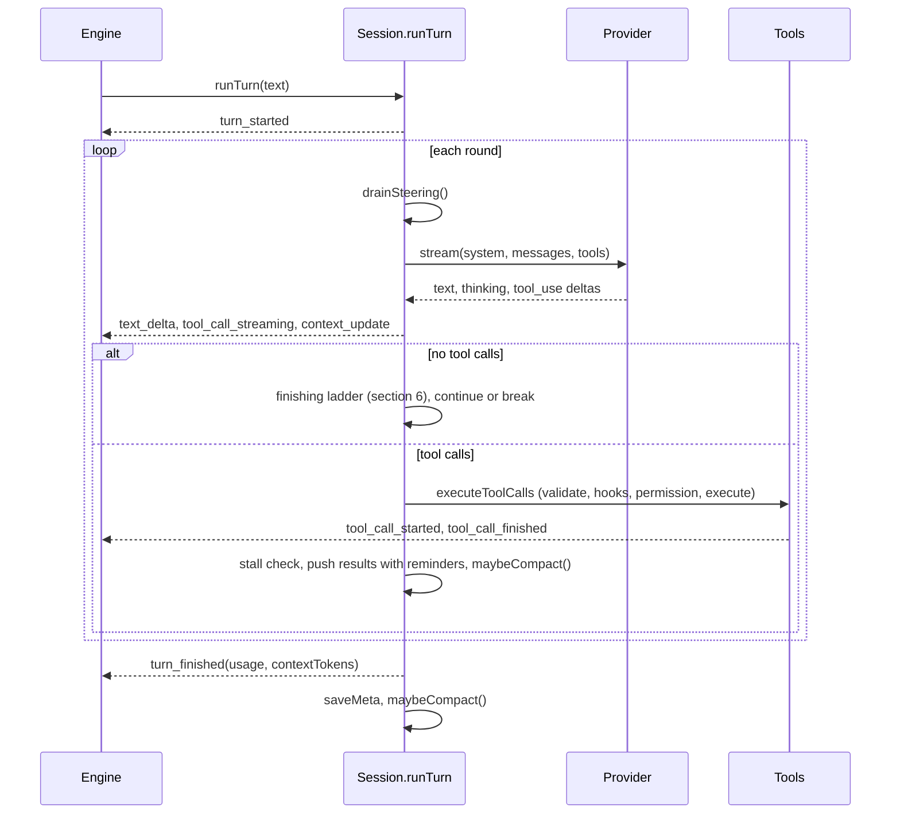

`streamAssistantTurn()` sends `model`, the system prompt, the whole history, tools, `maxTokensPerResponse`, `reasoningEffort` when set, `onRetry` (each retry becomes `retry_status`) and `onNegotiated` (a clamp note is shown once per distinct text via `noteNegotiation`). It relays deltas unless `suppressAssistantText` is set (§6), announces each call as it is written (`tool_call_streaming`, at most once per `TOOL_STREAM_EMIT_MS`), banks usage and saves meta at most every 30 s. The assistant message is rebuilt as one thinking block, one text block, then the `tool_use` blocks. Interleaving is not preserved.

Then `runTurn()` adds the usage to `turnUsage` and handles the silent self-verify reply (§6). A thrown overflow error (`isContextOverflowError`) or a `context_overflow` stop compacts with force and retries or resumes, at most `context.overflowRecoveries` (2) per turn between them. It pushes the assistant message and updates `cutoffStreak` (and `overflowStreak`, §6). With no tool calls the ladder decides. Otherwise it records reported symptoms (`findSymptoms`, the latest `finishing.selfVerify.maxSymptoms` kept), counts silent reasoning (root only, when `reminders.silentReasoning.enabled`: `reminders.silentReasoning.thresholdChars` (8,000) characters of reasoning with no text adds `reminder.silent-reasoning` once per stretch), runs the batch, adds `reminder.error-batch` if any result failed and `reminders.errorBatch.enabled`, runs the stall detector, pushes the results, applies the tool-path cutoff bound (§6) and calls `maybeCompact()` (§9).

**Caps.** `capped` is true only for a child, and `spawnAgent()` sets the child's `maxIterationsPerTurn` and `maxTokensPerTurn` to `Number.MAX_SAFE_INTEGER`. In practice no turn has a numeric cap. The brakes are the ladder's bounds, the cutoff streak, the stall detector and the user's interrupt.

### Executing a tool batch

`executeToolCalls()` first vets each call. A disabled tool or a registered tool the root session's availability withholds (both refused by name with `reminder.tool-switched-off`), an unknown name (`Unknown tool "…". Available tools: …`, listing the offered set), truncated JSON (answered with `reminder.tool-cutoff`, so the model reissues the call rather than debugging it), or input that fails zod even after one `repairPrimitiveTypes()` pass (`"true"`/`"5"` become a boolean or number when unambiguous) becomes an error result. File edits outside the workspace or onto a protected path get that path as their permission subject. Each surviving call then runs: search terms go to the reuse log, a `Write` may add a reuse reminder (it never blocks), a `PreToolUse` hook may block (no `tool_call_started`), then `permissions.check()` (§7). A denial is an error result whose text is the outcome's `message` (a `reminder.permission-*` or `reminder.overdrive-*-refused` prompt), or `Permission denied.` when that prompt is switched off. An approval note becomes a reminder (`reminder.approval-note`). A `PreToolUse` block's result is wrapped in `reminder.pre-tool-use-hook`. Then `tool_call_started`, `tool.execute()`, `observeTurnWork()` (§6), `truncateResult()` (head and tail kept, the tool's `outputByteLimit` or `tools.defaultOutputBytes`, 40,000 bytes), and a `PostToolUse` hook, whose block text is appended to the result wrapped in `reminder.post-tool-use-hook`. A tool that throws returns `reminder.tool-failed` (`Tool failed: {{error}}`; the bare message when switched off), and a call that never settled (the batch was aborted) returns `reminder.tool-did-not-run` (`Tool did not run.`). A tool image is replaced by its vision description; with vision unavailable it becomes `vision.tool-image-unseen`, and when describing it fails, `vision.tool-image-failed` (either note emptied drops the image silently).

Scheduling: read-class and `parallelSafe` calls, plus every refusal, start at once. All other calls run one at a time in call order, so permission prompts never race, with an abort check between them. `tool_call_finished` goes out as each call settles. Results come back in call order, with images replaced by vision text (`describeToolImages`, §8).

### Reminders, steering, stalls

`remind()` queues text (an empty string is dropped). `withReminders()` appends the whole queue, each item wrapped in `<system-reminder>`, to the next message built through it: the turn's user message, each tool-result message, and the synthetic results after an overflow. Ladder messages are pushed directly and do not drain the queue. Steering (`steer()`) is drained at the top of every round and as the first ladder rung. It arrives as a user message prefixed with `reminder.steering` ("The user adds, mid-run…"; an emptied prefix sends the bare text), re-arms self-verify (its round count goes back to 0) and clears the stall state. The stall detector fingerprints (tool name + raw JSON, isError + content), excluding `toolUseId`. On the `stall.repeatRounds`-th (3rd) identical round in a row it adds `reminder.stall-pivot` (`stall.pivots` times per turn, 2, with the status line `⚡ stall detected — forcing strategy pivot n/<pivots>`), then `reminder.stall-ask` on every later stall. It only reminds, and it has no off switch: it is the one brake on a looping uncapped root turn. Rounds whose results mint fresh ids (background launches) or carry images are never seen as identical.

### Ending, errors, interrupt

The `catch` block synthesizes a `tool_result` for every unanswered `tool_use` (`syntheticToolResults`, `unansweredToolUseIds`) before recording anything, so the history stays valid for the next request and for `/resume`. An abort sets `stopReason: "aborted"` and adds `reminder.interrupted`. Any other error becomes a `friendlyProviderError()` `error` event, and when unanswered calls were repaired `reminder.turn-error` rides along with the synthetic results. A blocking `Stop` hook's reason reaches the model wrapped in `reminder.stop-hook`. The `finally` block clears `busy`, `suppressAssistantText` and the controller, closes the phase (root) and emits `turn_finished` (`usage`, `contextTokens`, optional `contextWarn` and `overdriveSnapshot`). It then force-saves meta. `maybeCompact()` runs after that, outside `finally`.

`Session.interrupt()` aborts this session's controller, interrupts every foreground child (`liveChildren`) and stops this session's running background jobs.

### Subagents

`spawnAgent()` (reached through the `Agent` tool in `engine/tools/src/agent.ts`, which is read-class and `parallelSafe`, so several spawns in one response fan out) resolves a type from `AGENT_TYPES` (`general-purpose` = every tool; `explore`, `plan` = Read, Glob, Grep, TaskList, TaskGet) and refuses beyond `MAX_CHILDREN` (8) concurrent children per session. It builds a child `Session` with: a registry subset minus `Agent` (`agentToolNames`); a system prompt built once (core, environment, role, `subagent.result-contract`) and passed as `systemPromptOverride`; the parent's provider, `PermissionEngine` and `SessionStats` by reference; `child: true`. It announces `agent_spawned` (`agentId` `ag_N`, `background: true` for a detached run) before the child's first model call. The child's events pass through `emitFromChild()`: turn, text, thinking and streaming frames are dropped, tool frames are tagged `subagent`/`agentId`/`agentDesc`, and everything else passes unchanged. Foreground: the tool result is `finalAssistantText(child)`. Background: `BackgroundManager.launch` writes it to the task output file.

Limits verifiable in code:

- **Own task list.** The child's `TaskStore` is keyed by its own id, and its `task_list_updated` frames pass through untagged, so a child that creates tasks replaces the list the frontend shows.
- **No hooks, addons, cron or OVERDRIVE.** There is no `hookRunner`, no addons (the `Addon` tool answers "(none installed)"), no `services.cron`, and `overdrive` stays false, so the child never takes `overdrive.overrides`. It never self-verifies either: rung 8 is gated on `!child`, whatever `finishing.selfVerify.maxRounds` says, because its DONE would become the result the parent reads. Every other knob reaches it through the parent's base behaviour. The child also never sees the OVERDRIVE, deletion-policy or STANDARDS sections, although the permission engine it shares does follow OVERDRIVE.
- **Root sessions do not offer `Agent` by default.** The shipped `brain/availability.json` withholds `Agent` and `Workflow` in both contexts (§7), so the model reaches `spawnAgent()` only when an embedder or test opts `Agent` back in (`EngineOptions.toolAvailability`, e.g. `toolAvailabilityWith("Agent")`). Children ignore availability: their registry is `this.registry.subset(agentToolNames(def, registry.list()))`.
- **Recursion guard is partial.** Only `Agent` is removed. A general-purpose child keeps `Workflow` (`engine/tools/src/workflow.ts`), whose `agent()` hook calls the child's own `spawnAgent()`.
- **Background jobs outlive the child.** Each child has its own `BackgroundManager`. Jobs a finished child left running are reachable neither by the parent's `interrupt()` nor by `Engine.stopBackgroundJobs()`.
- **Errors look like success.** A child's provider error is caught inside its own `runTurn()`. The parent receives the last text (or `(the subagent produced no text output)`), and `agent_finished` carries no `isError`.
- **Every child gets the plan-first reminder** (while `reminders.planFirst.enabled`), even `explore` and `plan`, which have no `TaskCreate`.

### No test holds the system prompt's wording

No test compares the assembled prompt with a stored copy (`docs/decisions/0016-no-test-holds-prompt-wording.md`, which superseded the pin of 0015). `system-prompt-assembly` and `brain-controls-behavior` prove which sections appear, once each, in `coreSectionOrder()`, with their placeholders filled, reading every expected text from brain. A rewording of a core section changes every session and leaves the suite green; the owner reviews it.

### Invariants

- A `tool_use` is always followed by a message carrying a `tool_result` for each of its ids, whether real, a refusal, "Tool did not run." or synthetic. Anything that pushes a message between them corrupts the session and every resume of it.
- Only a root opens or closes the stats phase, measures the context, writes meta, snapshots for OVERDRIVE, clarifies, counts silence, self-verifies, or takes `overdrive.overrides`.
- A behaviour value reaches a session only through `resolveBehavior()`, so it has passed the compiler's own rules. No engine module keeps a copy of a knob as a constant (`brain-controls-behavior` checks that each replaced constant is gone).
- One exclusive job per engine. `Session.busy` covers `runTurn()` only; `Engine.busy` covers the whole job.

### Traps

- `Session.busy` is already false while the post-turn `maybeCompact()` runs. A `steer_message` in that window takes the new-turn path, is refused by `startExclusive()`, and the text is lost behind a `⏳ busy` note.
- The system prompt is rebuilt per call from live state, so toggling OVERDRIVE or Allow deletions, or editing STANDARDS.md, changes the next request's prompt bytes mid-turn. Toggling OVERDRIVE also switches the knobs `activeBehavior()` returns for the next decision of the running turn.
- `observeTurnWork()` sees only this session's calls. Edits or test runs done by a subagent are invisible to the parent's evidence rungs (§6).

---

## §6 · The finishing ladder

**When a response arrives with no tool calls, `runTurn()` does not end the turn. It walks a fixed ladder of checks. Each rung that fires pushes one user-role message, emits a `command_output` marker, and `continue`s the loop. The loop `break`s only when every rung declines. Each rung has a bound, because an interactive turn has no iteration cap (§5).**

The ladder is the `if (toolCalls.length === 0) { … }` block in `Session.runTurn()` (`engine/core/src/runtime/session.ts`). The pure predicates for the evidence and self-verify rungs live in `engine/core/src/runtime/finishing.ts`, which imports only `node:path` and `@magentra/protocol`, so it can be checked in isolation. The bounds, thresholds and detector lists are `brain/behavior.json` knobs (`finishing.*`, `evidence.*`, §12), read off `activeBehavior()` (§5) at this end of the turn; the values below are the shipped ones. Every rung text is a registered prompt whose default is a `brain/` file (§12): `brain/prompts/4-end-of-turn-rungs/` for the evidence and self-verify rungs `finishing.ts` names with `brainPrompt()`, `brain/prompts/3-in-turn-reminders/` for the recovery, wrap-up and cutoff texts `session.ts` names.

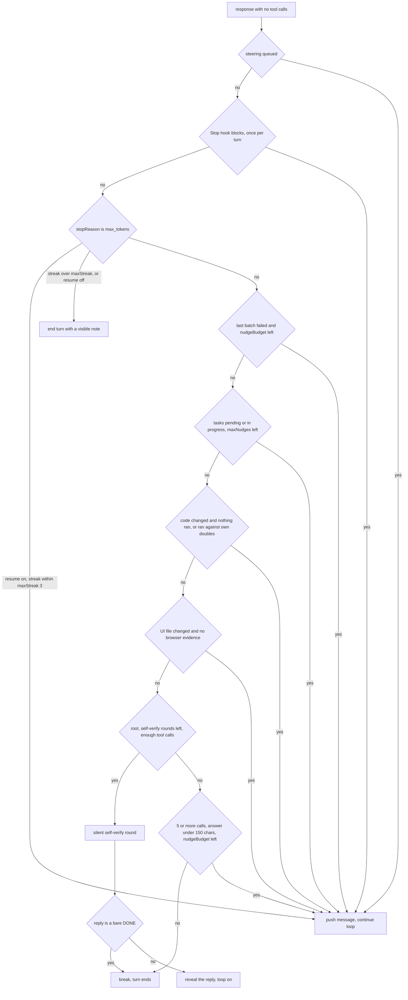

### The rungs, in code order

Except for steering and the cutoff, every rung requires `stopReason === "end_turn"`. A `refusal` (or any other stop) therefore falls straight through to `break`. Rungs 4 to 9 also do not fire while their own prompt is switched off (blank override or `enabled: false`): no marker, no message, no model call, and no count spent. Rung 3 with `reminder.length-continuation` off resumes nothing, the overflow resume included, and ends the turn with its `⏸` line. Knob names below are under `finishing.` unless written in full.

| # | Rung | Fires when | Bound | Marker, then prompt pushed |
|---|---|---|---|---|
| 1 | Steering | `drainSteering()` finds queued text | none, since the user drives it | the queued text, prefixed with `reminder.steering` |
| 2 | Stop hook | `!stopHookFired && hooks.has("Stop")` and the hook blocks | once per turn (`stopHookFired` is set before the hook runs) | `reminder.stop-hook` (`Stop hook: {{reason}}`) |
| 3 | Length cutoff ("LAYER 3") | `stopReason === "max_tokens"`, `reminder.length-continuation` is on, `lengthCutoff.enabled` (or this is the resume after an overflow compaction), and `cutoffStreak <= lengthCutoff.maxStreak` (3) | consecutive streak. Past it the turn ends with `⏸ … cut off N times in a row`; with resuming off it ends with `⏸ the response was cut off at the output limit — resuming is switched off` | `↻ continuing after output-length cutoff`, `reminder.length-continuation` |
| 4 | Error recovery ("LAYER 2") | `errorRecovery.enabled && lastBatchHadError && nudgeCount < nudgeBudget` (3) | `nudgeCount++`, and the flag is spent (`lastBatchHadError = false`) | `↻ auto-recovery…`, `reminder.recovery-nudge` |
| 5 | Incomplete tasks ("LAYER 1.5") | `!lastBatchHadError && incompleteTasksNudges < incompleteTasks.maxNudges` (1) and any task is `pending`/`in_progress` | `incompleteTasks.maxNudges` per turn. Does not touch `nudgeCount` | `↻ tasks incomplete — continuing`, `reminder.incomplete-tasks` listing them |
| 6 | Runtime evidence | `evidenceNudges < runtimeEvidence.maxNudges` (1), `codeFilesAmong(filesChangedThisTurn)` non-empty, and either no command ran or one ran while this turn wrote a test double | `runtimeEvidence.maxNudges` per turn | `↻ nothing was run…` or `↻ checked against your own stand-in…`, `finishing.runtime-evidence` |
| 7 | Browser evidence | `browserNudges < browserEvidence.maxNudges` (1), `uiFilesAmong(filesChangedThisTurn)` non-empty, `!browserEvidenceThisTurn` | `browserEvidence.maxNudges` per turn, **its own counter** | `↻ the page was never opened in a browser…`, `finishing.browser-evidence` |
| 8 | Self-verify | `!child && selfVerifyRounds < selfVerify.maxRounds && totalToolCallsThisTurn >= selfVerify.minToolCalls` (1) and `selfVerifyText()` is defined. `maxRounds` ships 0, and `overdrive.overrides` sets it to 1, so it runs in OVERDRIVE only | `selfVerify.maxRounds` per turn, re-armed by steering | `⚡ overdrive: self-verifying…` (printed only while OVERDRIVE is on), `finishing.self-verify` |
| 9 | Wrap-up ("LAYER 1") | `wrapUp.enabled && !lastBatchHadError && totalToolCallsThisTurn >= wrapUp.minToolCalls (5) && assistantTextLength < wrapUp.answerShorterThanChars (150) && nudgeCount < nudgeBudget` | shares `nudgeCount` with rung 4 | `↻ requesting a work summary`, `reminder.wrapup-nudge`. When files were written and a STANDARDS.md exists, it adds `reminder.wrapup-standards`, a line asking to confirm the diff complies |

The field counters (`evidenceNudges`, `browserNudges`, `incompleteTasksNudges`) and the observations they judge reset together at turn start. `stopHookFired`, `selfVerifyRounds`, `nudgeCount`, `cutoffStreak` and `overflowStreak` are locals of `runTurn()`. Without steering or cutoffs, a turn buys at most 1 + `nudgeBudget` + the three `maxNudges` + `selfVerify.maxRounds` extra rounds: eight with the shipped OVERDRIVE values (Stop hook 1, `nudgeCount` 3, tasks 1, runtime evidence 1, browser evidence 1, self-verify 1), seven outside OVERDRIVE, and at most 23 for any valid brain. Cutoff resumes are bounded per streak. A complete response resets the streak.

### Just before the ladder

- **`context_overflow` stop.** `maybeCompact(true)`. If it compacted and recoveries remain (`context.overflowRecoveries`, 2, shared with the thrown-overflow retry), the stop is rewritten to `max_tokens` and the local `resumeAfterOverflow` is set, so rung 3 resumes it. That resume is not the length-cutoff knobs' to stop: `lengthCutoff.enabled` false or a `maxStreak` of 0 does not end a turn that compaction just rescued. It still counts in `cutoffStreak` as before; `overflowStreak` counts how much of the current streak is recovered overflows, and the bound for such a resume is `cutoffStreak <= max(maxStreak, overflowStreak)`. With the shipped values (streak 3, recoveries 2) that is exactly `cutoffStreak <= maxStreak`. Otherwise the turn ends with an `error` and synthetic results for any pending calls.
- **Cutoff with tool calls.** The same `↻` marker is emitted. The truncated call is answered with `reminder.tool-cutoff` inside `executeToolCalls()`, and complete calls in the batch still run. The streak check (past the same bound → `⏸ … cut off mid tool call …`) sits **after** the results are pushed, so the history never ends on an unanswered `tool_use`. `lengthCutoff.enabled` does not apply on this path: only the streak does.
- **The self-verify verdict.** When `verifyBuffered` is set, the response just received is the answer to rung 8 (see below).

### What the evidence rungs see

`observeTurnWork()` runs only for calls that actually executed, after the hooks and permission check. A refused or blocked call leaves no trace. The word lists it judges by are `evidence.*` in `brain/behavior.json`: plain strings, never regexes. `finishing.ts` escapes and joins them into its detectors (`detectorsOf()`, cached per behaviour object), so no list entry can make a pattern catastrophic, and an emptied list compiles to a pattern that matches nothing. Every judge takes the behaviour object as an argument; `finishing.ts` holds no value of its own.

- `Bash` sets `ranCommandThisTurn` whatever its exit code: a nonzero exit is an observation. When the call succeeded and `looksLikeBrowserRun()` matches a command segment (a word of `evidence.browserRun.tools`: playwright, puppeteer, selenium, webdriver, cypress, chromedp, wkhtmltoimage; or a flag of `evidence.browserRun.flags`: `--headless`, `--screenshot`; not a head in `evidence.browserRun.readOnlyHeads` such as `cat`/`grep`/`ls`, not an install, not `--version`), it also sets `browserEvidenceThisTurn`. The install patterns and the `sudo`/`env` prefix strip stay regexes in code.
- A successful `Read` of a path ending in an `evidence.screenshotExtensions` suffix (`.png/.jpg/.jpeg/.gif/.webp/.bmp`, `isScreenshotPath()`) sets `browserEvidenceThisTurn`: the screenshot reached the vision model.
- A successful `Write`/`Edit` adds the file (workspace-relative, absolute when outside) to `filesChangedThisTurn`. If the text **this call wrote** (`content`/`new_string`) contains an `evidence.testDoubleMarkers` entry (`MagicMock`, `jest.mock(`, `vi.fn(`, `class Fake`, `def stub_`, …), the file also goes into `doubleFilesThisTurn`. Markers are chosen for precision, not coverage.
- `codeFilesAmong()` keeps the `evidence.codeExtensions` (runnable source, including `.html`/`.css`/`.vue`/`.svelte`, excluding docs, config and data). `uiFilesAmong()` keeps the `evidence.uiExtensions` minus `name.<infix>.ext` files for each `evidence.uiExcludeInfixes` word (`test`, `spec`, `stories`). The reminders name `finishing.maxNamedFiles` (8) files, then count the rest.
- The runtime-evidence text substitutes `finishing.vision-on` or `finishing.vision-off` (on only when `visionUnavailableReason()` is undefined) and, when doubles were written, `finishing.double-clause`. Both evidence texts accept "I could not run this, here is what stays unverified" as a complete answer. That closing paragraph keeps the rung from pushing the model into writing a mock just to get a passing check.

### Self-verify

`selfVerifyText()` builds the prompt around one `{{closing}}` slot: `…closing-code` (names the changed code, demands observed behaviour or an honest gap) or `…closing-plain` ("never invent verification rituals"). It then appends `…symptoms` (failures the model reported in its tool-round text, found by `findSymptoms()`, the latest `selfVerify.maxSymptoms` (6) kept) and `…hedges` (`findHedges()` on the final answer, up to `selfVerify.maxHedges` (5)). If the whole text renders empty it returns `undefined`, and the rung does not fire. The symptom, hedge and not-a-symptom detectors stay English regexes in code.

When it fires, `suppressAssistantText` mutes the next response's text and thinking deltas. On the next pass, before any other handling: if the reply has no tool calls and `isSelfVerifyDone()` holds (once markdown and punctuation are stripped, every remaining word is `done`, in any case), the sentinel is pushed so the history stays well-formed, OVERDRIVE prints `✓ overdrive: verified — nothing left to do`, and the loop breaks. Anything else, including "No" or a localized word, is revealed as one `text_delta`, and the loop carries on normally (tools run, or the ladder runs again with one more round spent). The `finally` block clears `suppressAssistantText`, so a turn that dies mid-verify cannot mute the next one.

With the shipped brain it runs in OVERDRIVE only (base `selfVerify.maxRounds` 0, `overdrive.overrides` 1), because an attended turn already has a checkpoint: the user reads the reply. A brain that sets the base above 0 self-verifies attended turns too, silently: the two `overdrive:` status lines print only in OVERDRIVE. It needs `selfVerify.minToolCalls` (1) tool calls, so a conversational turn ends instantly. It never runs in a child.

### Why the order is load-bearing

- **Steering first**: the user's mid-run guidance must be acted on, never lost to a clean break.
- **Stop hook next**: a user-configured policy outranks the engine's own heuristics.
- **Cutoff before judgement**: a truncated answer is unfinished text. Nudging or verifying half a sentence is wasted work. It is also the only rung that handles `max_tokens`.
- **Failure before bookkeeping**: rungs 5 and 9 both require `!lastBatchHadError`, so a real failure is addressed before open tasks or summaries.
- **Evidence above self-verify**: a DONE breaks the loop where it stands, so anything ranked below self-verify never runs on a turn that goes well. Today only the wrap-up sits below it, deliberately: on an OVERDRIVE tool turn, self-verify subsumes the wrap-up nudge.

### Invariants

- Every rung has a bound: a counter, a budget or a streak. A new rung without one loops an uncapped root turn until the user interrupts. Every knob that sets a bound has a finite range in the compiler's spec (`BEHAVIOR_SPEC`), so no brain can make a rung unbounded; brain exposes on/off switches, counts and budgets, never the order.
- `finishing.nudgeBudget` is shared by exactly rungs 4 and 9. Rung 5 must not spend it.
- A rung pushes a user message and then `continue`s. It never pushes between a `tool_use` and its results.
- `finishing.ts` stays pure: no imports from the session or the permission engine.

### Traps and drift

- **Steering and the Stop hook degrade instead of switching off.** Rungs 3 to 9 honour a switched-off prompt (see the table). Rungs 1 and 2 do not: an emptied `reminder.steering` sends the user's text bare, and an emptied `reminder.stop-hook` sends the hook's reason bare (an empty reason as well, and the turn ends as if the hook had not blocked).
- **`errorRecovery.enabled` false leaves the failed-batch flag unspent.** Rung 4 is the only place that clears `lastBatchHadError`, so on an error-ended turn rungs 5 and 9 (which require it false) skip that end too. Self-verify and the evidence rungs do not read the flag.
- **Stale descriptions in the prompt registry.** The `where` text of `finishing.browser-evidence` (in `brain/prompts/4-end-of-turn-rungs/`) says it shares the runtime-evidence fuse; it has its own counter (`browserNudges`), so both can fire in one turn. Several `where` lines state shipped values (`reminder.recovery-nudge` "Capped at 3", although those 3 are shared with the wrap-up; `reminder.silent-reasoning` "8,000+"; `reminder.stall-pivot` "three consecutive"; `finishing.self-verify` "never in normal mode"). They are metadata no model reads, so the compiler's claim check does not cover them: they go stale silently when a knob moves.
- **Only `Bash` counts as running something.** `observeTurnWork()` ignores other tools. It also sees only this session: a parent that edits and delegates the test run to a subagent still gets "nothing was run", and a parent whose edits were all made by a subagent gets no evidence rung at all.
- **Subagents climb the same ladder** against their own observations and task list, with the parent's base knobs, without rung 8 (gated on `!child`) and without the Stop hook (children get no hook runner).

---

## §7 · Tools and the permission engine

**Everything the model can do is a `ToolDefinition` in a `ToolRegistry`, and every call it makes goes through one pipeline in `Session.executeToolCalls()`: parse, validate, hook, permission check, execute, truncate. The permission engine allows by default. What it guards is a kind of *target* — a process kill by name, a protected path, a deletion — never a class of tool.**

### The tool contract

`engine/core/src/agent/tool.ts` defines `ToolDefinition<I>`. The fields that change behaviour:

| Field | What it does |
|---|---|
| `name`, `description`, `descriptionVars` | The description is a template. A built-in tool's is `toolDescription(name)`, read from `brain/tools/<Name>/description.md` (§12). Runtime values go in `{{slots}}` filled from `descriptionVars` (which stay in code), never interpolated into the template. |
| `inputSchema` (zod) | Validated before execution. The code owns its shape (types, optional/required, enums, defaults). Every `.describe()` text is `toolParam(name, path)`, read from `brain/tools/<Name>/params.md`. `rawInputSchema` (MCP only) replaces it on the wire. |
| `permissionClass` | `read`, `mutate`, `execute`, `network` or `interact`. It has exactly two consumers: `read` runs in parallel, and `execute` gets command-shape grants (below). |
| `parallelSafe` | Runs concurrently even when the class is not `read` (Agent, Addon, GraphQuery, TaskCreate, TaskUpdate). |
| `isFileEdit` | Write and Edit only. Turns on the out-of-workspace and protected-path checks. |
| `permissionSubject` | The string rules match against (the Bash command, a file path). |
| `deletionSubject`, `deletionScope`, `processKillSubject` | What the guards see (see below). |
| `outputByteLimit` | Result budget before truncation. Absent, the session uses `tools.defaultOutputBytes` from `brain/behavior.json` (40 000 bytes). Read raises it to 250 000. |
| `searchTerms` | Evidence for the reuse gate (§11). Only Grep, Glob and GraphQuery implement it. |

`ToolRegistry.register()` throws on a duplicate name. It also publishes the description to the prompt registry as `tool.<name>` (`registerToolPrompt`), so an override file can retune it (§12). `enabled()` drops any tool whose description prompt is blank (`isToolDisabled`). A blank description withholds the tool entirely. `subset(names)` builds a subagent's registry. `offered(availability, overdrive)` is `enabled()` narrowed by a root session's per-context tool set from `brain/availability.json` (built-in names only; `undefined` for a child skips it). `list()` is never filtered, so the wire pin and subagent subsets still see all 27 tools.

### Availability: which built-in tools a root session offers

`brain/availability.json` holds two explicit lists of built-in tool names, `main` (OVERDRIVE off) and `overdrive` (OVERDRIVE on). The shipped file lists all 27 except `Agent` and `Workflow`, in both. `Session` resolves it once in its constructor (`resolveToolAvailability(opts.toolAvailability)` in `engine/protocol/src/brain.ts`) and keeps `undefined` for a child. `isToolOffered(name, availability, overdrive)` passes every name that is not built-in (`BRAIN_BUILTIN_TOOLS`, the compiler's fixed `BUILTIN_TOOLS`), so MCP tools and an embedder's own tools are never filtered. The context is read live from `Session.overdrive`, so `set_overdrive` changes the offered set on the next request.

A withheld tool is absent from `toolSchemas()` (and so from the context estimate) and a call to it is refused by name with `reminder.tool-switched-off`, the same refusal as a blank description. The override is `EngineOptions.toolAvailability` (passed to every root session the engine creates: boot, `/clear`, `/resume`) or `SessionOptions.toolAvailability`: a context it names replaces that list, an omitted one keeps the shipped list, and an unknown name throws. `toolAvailabilityWith(...names)` adds names to both shipped lists; tests use it to opt `Agent` back in. It is not a setting and is never persisted.

What reaches the provider is `Session.toolSchemas()`, over `registry.offered(...)`. The description comes from `toolDescriptionText()` (override-aware, slots filled). The schema is `rawInputSchema ?? zodToJsonSchema(inputSchema)`, and `engine/core/src/util/zodToJsonSchema.ts` renders zod as draft-7 in **input** mode, so a field with a `.default()` is optional on the wire.

### The registry: 27 tools plus MCP

`createDefaultRegistry()` in `engine/tools/src/index.ts` registers the 27 tools below. `bootstrapEngine()` in `engine/host/src/bootstrap.ts` then adds one tool per MCP server tool (§12).

| Family | Tools (class) |
|---|---|
| Files | Read (read), Write (mutate), Edit (mutate), Glob (read), Grep (read) |
| Shell | Bash (execute), Monitor (execute) |
| Background control | TaskOutput (read), TaskStop (execute) |
| Task list | TaskCreate (interact), TaskUpdate (interact), TaskList (read), TaskGet (read) |
| Interaction | AskUserQuestion (interact), PushNotification (interact) |
| Delegation | Agent (read, parallelSafe), Workflow (execute) |
| Network | WebFetch (network), WebSearch (network) |
| Knowledge | GraphQuery (read), §11 |
| Git isolation | EnterWorktree (execute), ExitWorktree (execute) |
| Scheduling | CronCreate, CronDelete, CronList, ScheduleWakeup (all interact), §12 |
| Extension | Addon (read), §12 |
| MCP | `mcp__<server>__<tool>` (network), from `engine/core/src/integrations/mcp.ts` |

The registry always holds all 27. What a root session *offers* is narrower: the shipped `brain/availability.json` withholds Agent and Workflow (see Availability above). Subagent types in `engine/core/src/agent/agents.ts` get registry subsets. `explore` and `plan` get Read, Glob, Grep, TaskList and TaskGet. `general-purpose` gets everything except Agent. A child shares the parent's `PermissionEngine` and cannot ask the user.

### One call, end to end

Each call in a batch is planned in order inside `executeToolCalls()`:

1. A disabled tool name, a registered tool the root's availability withholds in the current context, or an unknown tool name is refused. Truncated JSON (`isUnparseable`) is refused with `reminder.tool-cutoff`, which tells the model the call did **not** run.
2. `inputSchema.safeParse()`. On failure there is one `repairPrimitiveTypes()` pass, which converts only a `"true"`/`"false"` or numeric string that zod flagged as the wrong primitive. It never uses `z.coerce`, because `Boolean("false")` is `true`.
3. The subject is computed. For an `isFileEdit` tool, `fileEditOutsideWorkspace()` and `fileEditProtectedPath()` read `file_path`, `path` or `notebook_path` from the input.
4. `searchTerms` are logged. For Write, the reuse gate may queue a reminder.
5. The **PreToolUse hook runs before the permission check.** Exit code 2 blocks the call, and the call is never announced.
6. `PermissionEngine.check()`. Outcomes from rules and the stance are appended to the transcript as `permission` records. User decisions are recorded inside the approval callback.
7. `tool_call_started` is emitted, even for a refusal, so every `tool_call_finished` has a row. Then `execute()` runs, then `truncateResult()` (head plus tail, with a marker), then the PostToolUse hook.

A thrown `execute()` becomes `{ content: "Tool failed: …", isError: true }` (the `reminder.tool-failed` prompt) unless the turn was aborted. Errors are data. Calls with class `read` or with `parallelSafe` run concurrently. All other calls run one at a time in order, so permission prompts never race. Each `tool_call_finished` goes out as soon as its own call settles.

### Permission resolution

`engine/core/src/runtime/permissions.ts` `PermissionEngine.check()` applies this order (pinned by `tests/features/permission-stances.test.ts`; the OVERDRIVE guard values by `tests/features/brain-controls-behavior.test.ts`):

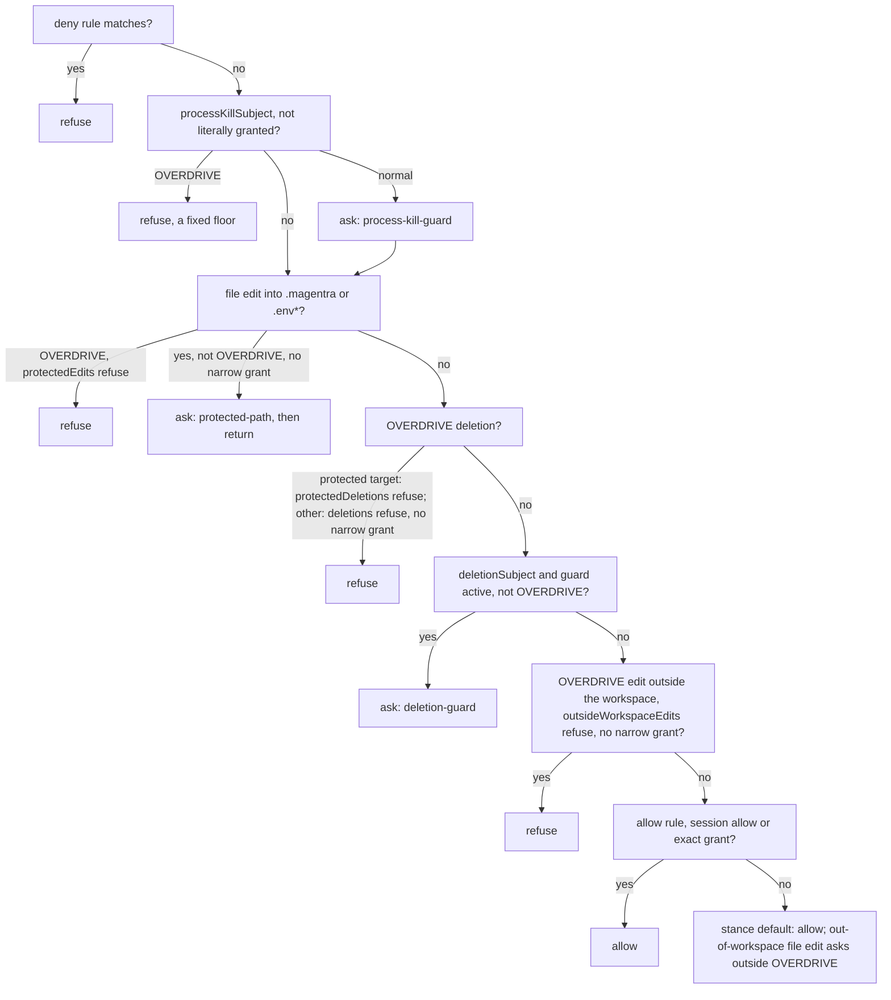

- **Stance default is allow for every class.** `stanceDefault()` returns `"allow"`. The only path into the `ask` branch is a Write or Edit whose target is outside the workspace, outside OVERDRIVE.
- **OVERDRIVE never asks.** Each guarded target either runs unasked or is refused, as `overdrive.guards.*` in `brain/behavior.json` says. Each key is `"run"` (shipped) or `"refuse"`, so brain can only tighten OVERDRIVE, never make it ask. A policy refusal has source `mode`, never records a grant, and carries its own prompt (`reminder.overdrive-deletion-refused`, `…-protected-edit-refused`, `…-outside-edit-refused`), which is sent only under `"refuse"`. The protected decision comes first and its value wins: a protected target is never also judged by `deletions` or `outsideWorkspaceEdits`, and nothing passes a protected refusal. A non-protected refusal (`deletions`, `outsideWorkspaceEdits`) is passed by the same deliberate narrow grant that passes the attended guards: an explicit subject-scoped allow rule or a literal grant, never a broad rule, a session allow or a command shape.
- **Process-kill guard.** Only a *literal* allow rule (`Bash(taskkill /F /IM x.exe)`, no `*`) or a literal exact grant overrides it. A glob rule such as `Bash(cd *)` also matches `cd app && pkill node` and must not count. In OVERDRIVE the guard refuses (`reminder.permission-kill-overdrive`), because nobody is there to ask; that refusal is a fixed floor with no brain key. An approval does not end the check: a command that also deletes still meets the deletion guard.
- **Protected-path guard.** `protectedEditPath()` matches any `.magentra` path segment (the workspace and `~/.magentra` alike) and any `.env` or `.env.*` basename. Outside OVERDRIVE it asks, and it is satisfied by an explicit subject-scoped rule that is not `Tool(*)`, or by a literal grant. In OVERDRIVE `overdrive.guards.protectedEdits` decides: `"run"` lets the edit through, `"refuse"` refuses it whatever the rules say.
- **Deletion guard.** Outside OVERDRIVE it asks, unless the "Allow deletions" switch (`set_deletion_guard` → `Session.setDeletionPolicy()`, which also adds the `system.deletion-policy` section) is on, except for a `deletionScope` of `"protected"`, which asks in every mode but OVERDRIVE. A protected deletion is sent without a `subject`, so a frontend cannot offer "always allow", and it never records a grant. In OVERDRIVE it never asks: `overdrive.guards.protectedDeletions` decides a protected target and `overdrive.guards.deletions` everything else, whatever the Allow-deletions switch says. `check()` reads only `"protected"` from `deletionScope`; `"workspace"` and `"unknown"` are guarded alike.
- **Out-of-workspace edits.** In OVERDRIVE with `overdrive.guards.outsideWorkspaceEdits = "refuse"`, a Write or Edit outside the workspace is refused before the allow rules are read. `protectedEdits` and `outsideWorkspaceEdits` cover the `isFileEdit` tools (Write, Edit) only.
- **Deny rules** refuse in every stance, including OVERDRIVE.
- **Refusal texts are brain prompts.** `reminder.permission-rule-denied`, `-kill-overdrive`, `-kill-declined`, `-protected-declined`, `-deletion-declined` and `-declined` (the decline texts get the user's note through a `{{detail}}` slot), plus the three OVERDRIVE refusals. A prompt switched off leaves the outcome's `message` out, and the session answers the call with a bare `Permission denied.`.

### Grants

- **Rules** in `settings.permissions.allow` and `deny` are `Tool` or `Tool(glob)`, with `*` as the only wildcard (`globToRegex`).
- **"Always allow"** records an `ExactGrant {tool, subject, prefix?}` in `permissions.allowExact`. `addExactPermission()` in `engine/core/src/config/settings.ts` writes it to the project file when `<cwd>/.magentra` exists, else to the global file. It is also pushed into the in-memory settings, so `/clear` keeps it. Grants are compared as literal strings, so a `*` in an approved command stays a `*`.
- **Command-shape grants.** `deriveAlwaysGrant()` turns an approved execute-class command into a prefix grant. `mkdir -p a` becomes `mkdir`. The CLIs in `MULTI_COMMAND_CLIS` keep two tokens (`git push`). `npm`, `pnpm` and `yarn` `run` keep three. Compound or substituted commands stay exact. Guards only accept literal grants (`matchesExact(…, literalOnly)`), so a shape from a benign approval never lets `git push --force` skip a guard. Today no execute call reaches the `ask` branch, so shape grants are latent. They come back into play only if `stanceDefault` asks again.
- **"Allow this session"** allows the whole tool for the session. That is safe because the guards run before allow rules.

### Bash specifics — `engine/tools/src/bash.ts`

- **Shell.** `spawnShell()` runs `resolveBashPath()`, which tries `MAGENTRA_BASH` first, then Git Bash on Windows, then `bash`, and runs `bash -c` with stdin ignored. On POSIX the child is `detached` (its own process group), so `killTree()` can SIGKILL `-pid`. On Windows it runs `taskkill /pid N /T /F`.
- **cwd.** A foreground command gets a trailer that prints `__MAGENTRA_PWD__` plus `pwd -W || pwd`. The value is stored in a `WeakMap` keyed by `SessionServices`, stamped with the session cwd it was recorded under. When EnterWorktree or ExitWorktree moves the session cwd, the tracked value is discarded. Environment variables and functions do not persist. Background commands start in the effective cwd but do not update it.
- **Foreground.** Timeout is 120 000 ms by default, 600 000 max. A timeout or abort kills the process tree. Output is clipped to 30 000 characters, head plus tail. Live output streams as `tool_output_delta` every 250 ms. A non-zero exit is `isError`. Files the model had Read that this command changed are named in the result (`FileState.changedSinceRead()`). A bare foreground `sleep N` is refused.
- **Background.** `run_in_background` hands off to `BackgroundManager.launch()` (§12): output goes to `.magentra/tasks/<id>.output`, and a `<task-notification>` reminder (`reminder.background-exit`) is queued on exit. TaskStop and TaskOutput act on the task id.
- **Foreground sleep.** A bare `sleep N` is refused with `bash.foreground-sleep` (bare `Foreground sleep is blocked.` when that prompt is switched off).
- **Deletion detection.** `bashDeletionSubject()` flags these: `rm`, `rmdir`, `del`, `unlink`, `rimraf`, `shred`, `trash` and `Remove-Item` as command words; `git clean`, `git rm`, `git push --force`/`-f`, `git reset --hard` and `git stash drop`/`clear`; `terraform destroy`, SQL `drop`/`truncate` and `kubectl delete`; case-sensitive `git branch -D`; `git checkout -- <path>`; `find … -delete`; and `mv -f` or an `mv` whose destination is outside the tree.
- **Deletion scope.** `bashDeletionScope()` returns `"protected"` when a target *is* a `.magentra` directory (or `.magentra/*`), when a glob's literal tail could expand to one, or when an unparseable command mentions `.magentra`. A path *inside* the state dir (`rm -rf .magentra/worktrees/foo`) is `"workspace"`. `check()` acts only on `"protected"`. The `workspace`/`unknown` split in the `deletionScope` doc comment changes nothing today.
- **Process-kill detection.** `bashProcessKillSubject()` reads *command positions*, not words anywhere, so a commit message that mentions `pkill` is not a kill. It tokenizes quotes, substitutions and heredocs (`simpleCommands`), unwraps runners, and recurses into `bash -c …` and `echo … | bash` up to depth 3. It flags `pkill`, `killall`, `taskkill /IM` (or taskkill without `/PID`), `tskill <name>`, `Stop-Process -Name` or a piped Stop-Process, `kill -1`, `wmic process … delete`, a Win32_Process terminate, `.Kill()`, and any kill fed by `pgrep`, `pidof`, `ps`, `Get-Process` or `tasklist`. Monitor uses the same subjects.

### Worktrees — `engine/tools/src/worktree.ts`

EnterWorktree with `name` runs `git worktree add <cwd>/.magentra/worktrees/<name> -b magentra/<name> <base>`. The base is `origin/HEAD`'s target when `settings.worktree.baseRef` is `"fresh"` and there is a remote, else `HEAD`. With `path`, it switches into an existing registered worktree, compared through `realpathSync.native`. There is one active worktree per session. `setCwd` emits `cwd_changed {worktree: true}`. ExitWorktree `remove` refuses, and lists the work, when the tree is dirty or has commits not in its base, unless `discard_changes` is set. It then runs `git worktree remove --force` and `git branch -D`. A path-entered worktree is never removed. `remove` has a `deletionSubject` (and no `deletionScope`), so it meets the deletion guard, and in OVERDRIVE with `overdrive.guards.deletions = "refuse"` the agent cannot remove its worktree.

### The wire contract is not pinned

No test freezes the tools' descriptions or JSON Schemas (`docs/decisions/0016-no-test-holds-prompt-wording.md`). `tests/features/tool-registry-contract.test.ts` pins the 27 names and that each tool has a description, a real zod schema, a permission class and an `execute`. A renamed field, a newly required one, a widened enum or a reworded description reaches the model with the suite green. Descriptions and parameter texts live in `brain/tools/`; MCP tools are outside brain. The provider receives `zodToJsonSchema()`'s draft-7 input-mode rendering of each schema.

### Invariants

- A tool never throws into the loop. Failures return `isError: true` with a sentence the model can act on.
- Edit needs a prior Read of the file, and Write needs one for an existing file. `FileState` (`engine/core/src/runtime/fileState.ts`) compares mtime and size; "changed on disk since" means re-Read.
- Glob skips `.magentra/` unless the pattern or path names it.
- A deny rule the user wrote always refuses, in every stance.

### Traps

- **A worktree edit asks.** A worktree created by EnterWorktree lives under `.magentra/worktrees/`. Every Write or Edit inside it therefore matches `protectedEditPath()` and asks outside OVERDRIVE, and in OVERDRIVE with `overdrive.guards.protectedEdits = "refuse"` it is refused outright, so no file in a worktree can be edited. This is verified in code and no test covers it.
- **Shell writes bypass the protected-path guard.** `echo x > .env` goes through Bash, and `fileEditProtectedPath()` only reads the path fields of `isFileEdit` tools. The same holds for `overdrive.guards.protectedEdits` and `outsideWorkspaceEdits`.
- **Deletion detection is best-effort.** `bashDeletionSubject()` knows deleting commands by name, and `bashDeletionScope()` judges `"protected"` from the command's own target words: it does not follow a `cd` earlier in a compound command, and a path *inside* `.magentra` is `"workspace"`, so it follows `overdrive.guards.deletions`, not `protectedDeletions`. Treat `"refuse"` as a strong default, not a sandbox. A refused call can be retried by the model; in an uncapped root turn only the stall detector's reminders bound that.
- **A new built-in tool needs three edits beyond its module.** Its name in `BUILTIN_TOOLS` (`tools/brain/compile.mjs`), a `brain/tools/<Name>/` folder (the compile fails without one), and an entry in both lists of `brain/availability.json`, or root sessions silently never offer it. `brain-is-the-single-source` checks `BUILTIN_TOOLS` against the registry.
- **A new tool is not guarded by default.** A new file-editing tool must set `isFileEdit` and name its path `file_path`, `path` or `notebook_path`, or both edit checks silently skip it. A new destructive tool needs a `deletionSubject`, or the deletion guard never sees it.
- **A PreToolUse hook sees calls that the permission engine may still refuse.**

---

## §8 · The vision path

**The coding model is never handed a picture, even one that claims to support images. Every image — a composer attachment, a Read of an image file, an image part in a tool result — goes to a second endpoint, `settings.visionConnection`. That endpoint writes a description, and the description enters the conversation wrapped in text that says the main model did not see the picture. The same section covers the transports in `engine/providers/src/`, where a connection becomes wire fields, including reasoning-effort clamping.**

### Why it is built this way

- The coding model may sit on an endpoint that rejects image parts outright.
- What the agent "saw" becomes auditable text in the transcript. Every later claim about the picture rests on something checkable, and compaction summarizes words, not bytes.
- The wrapper (`vision.description-wrapper`) tells the model it did not see the image and must not claim otherwise. A confident comment on a picture nobody read is the failure this prevents.

### Configuration: a profile points at a profile

`~/.magentra/profiles.json` (`app/main/profiles.js`) holds connection profiles. A profile's `visionProfileId` names *another* profile. `sanitizeProfile()` resolves that pointer to `visionName` and `visionModel` for the UI and never sends the key. `deleteProfile()` clears any pointer to the deleted id, so a dangling reference cannot surface later at connect time. The wizard's picker (`renderVisionOptions` in `app/renderer/modules/setup.js`) leaves the profile being edited out of its own list: a connection cannot describe images for itself.

Applying a profile runs `applyValidatedConnection()` in `app/main.js`:

1. `resolveVisionSelection()` (`app/main/connection.js`) looks up the pointed-at profile and validates it with `validateCredentialPayload()`. An empty `profileId` means "no vision model".
2. `writeWorkspaceEnvKeys()` writes `MAGENTRA_VISION_API_KEY` to `<ws>/.env`. With no vision endpoint the line is removed (`removeWhenEmpty`).
3. `updateWorkspaceSettings()` writes `visionConnection {provider, model, baseUrl?, contextWindow?, allowInsecureTls?, profileId}` and `vision` into `<ws>/.magentra/settings.json`. The key never goes there. With no vision model, both keys are deleted, and `clearGlobalSettingsKeys()` deletes them from `~/.magentra/settings.json` too, because the project layer merges over the global one (§10).
4. A live engine receives `set_connection`. Its `vision` block follows the rule **absent means cleared** (`ConnectionSpec` in `engine/protocol/src/types.ts`). `Engine.handleSetConnection()` rewrites `settings.visionConnection`, including the `apiKey` in memory, or deletes it and sets `vision = false`.

The engine resolves the key with `resolveVisionApiKey()` in `engine/core/src/config/settings.ts`: the env var first, then `visionConnection.apiKey`. "No key" is a valid answer for a LAN vision box.

### The one gate

`Session.visionUnavailableReason()` returns a reason when there is no `visionConnection` ("names no vision model"), or when `vision` is false ("switched off"). Otherwise it returns `undefined`. The flag alone is never enough: a switch that is on with no endpoint behind it can look at nothing. Everything asks this one function: the attachment path, the Read tool, `describeToolImages()`, and the runtime-evidence rungs (§6), which only suggest a visual check when vision is usable. `set_vision` refuses to turn on without a `visionConnection`. On the app side, `context:pickFiles` offers image types only when `currentVisionConnection()` has a connection *and* it is enabled. `readAttachment()` refuses an image otherwise.

### Three entry points, one describer

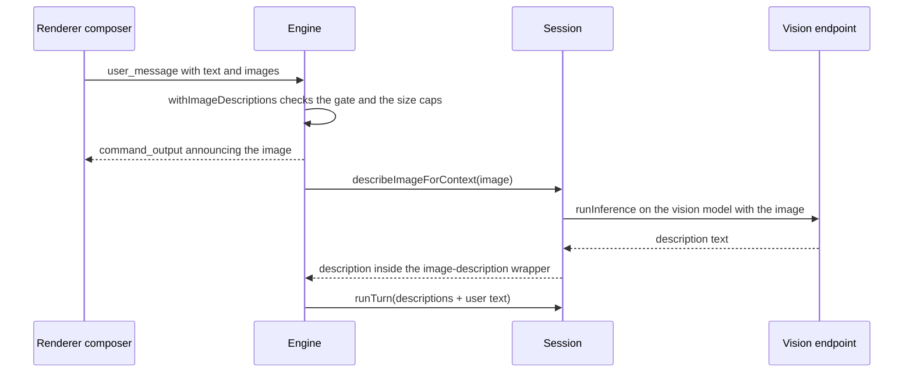

1. **Attachments.** `imageFrameParts()` in `app/renderer/modules/composer.js` puts `images: [{name, mediaType, data}]` on `user_message` or `steer_message`. The app caps a pick at `MAX_ATTACH_FILES` (15) and `MAX_ATTACH_TOTAL_BYTES` (2 MB). The engine does not trust the frontend. `Engine.withImageDescriptions()` enforces `MAX_IMAGES_PER_MESSAGE` (8) and `MAX_IMAGE_DATA_CHARS` (9 000 000 base64 characters). It announces each image *before* the call, because describing runs inside the turn lock and a silent interface reads as a swallowed message. It then prepends the description blocks to the typed text. An image it cannot use becomes a bracketed note from brain: `vision.attached-unreadable` (no image of the message read: gate closed or too many), `vision.attached-malformed`, `vision.attached-too-large` or `vision.attached-failed`. A note switched off is dropped; its bare fact stands in only when the message would otherwise be empty.
2. **The Read tool.** `engine/tools/src/read.ts` maps `IMAGE_TYPES` (png, jpg, jpeg, gif, webp) to media types. When the gate is closed it returns `isError` with `read.image-unseen` ("you cannot see it … say plainly that it stays unverified"), and when describing fails, `read.image-failed`; each falls back to its bare fact when switched off. It refuses files over `MAX_IMAGE_BYTES` (8 MB). Otherwise it returns `describeImageForContext()` and records the Read.
3. **Tool results.** `Session.describeToolImages()` turns every image `ToolResultPart` into a description, or into a "You have NOT seen it" note (`vision.tool-image-unseen` / `vision.tool-image-failed`; an emptied note drops the image). This matters because the OpenAI-compatible wire cannot carry an image in a `role: "tool"` message (`flattenToolResult` writes `[image omitted]`). Today it has no producer: no registered tool returns image parts, and `McpClient.callTool()` flattens MCP image content to `[image content omitted]` before it gets here.

`Session.describeImage()` is **private**, so nothing can put an unwrapped description into the conversation. It builds the vision provider through the same `createProviderForEndpoint(endpointSpecFromSettings(visionConnection, key))` as the main connection, cached under the key `[provider, baseUrl, contextWindow, apiKey]`. The key is part of the cache key because it is baked into the provider instance. It then calls `runInference()` with the `vision.describe` system prompt, the `vision.describe-request` user line (`Describe this image ({{label}}).`; emptied, `describeImage()` throws and the image becomes the failure note), `VISION_DESCRIBE_MAX_TOKENS` (4 000) and the image, on `visionConnection.model`. The tokens are banked in the session ledger. An empty description throws. No reasoning effort is sent on this call.

**Nothing here fails the turn.** An image that cannot be described becomes a bracketed note plus a non-fatal `error` event, and the typed text still runs.

### Providers and the factory

`engine/core/src/config/providerFactory.ts` is the one mapping from settings to a provider. `endpointSpecFromSettings()` takes a structural `ConnectionSettings`, which both the top-level settings and `visionConnection` satisfy. Boot (`bootstrapEngine`), the live swap (`Engine.rebuildProvider`) and the vision call therefore build providers identically. An Anthropic endpoint ignores `baseUrl`. `numCtx` is set only when `isLocalBaseUrl(baseUrl)` and a `contextWindow` exists.

| File | Role |
|---|---|
| `openai-compat.ts` | Hand-rolled fetch plus SSE. It learns from 400/422 bodies which `NegotiableField`s to drop or rename (`stream_options`, `max_tokens`→`max_completion_tokens`, `num_ctx`, `chat_template_kwargs`, `reasoning_content`), once per provider instance. `tools` is never dropped. A user image becomes a content array with an `image_url` data URL, and only when an image is present. An in-band `{"error"}` chunk becomes a `ProviderHttpError`. Up to `MAX_BAD_SSE_LINES` (5) undecodable lines are tolerated. |
| `ollama.ts` | Native `POST /api/chat` (NDJSON). Selected by `OpenAICompatProvider.ollamaNative()`, which probes `<origin>/api/version` once (1.5 s timeout), only when `numCtx` is set and the base URL ends in `/v1`. Ollama's `/v1` layer has no `options`, so `num_ctx` sent there is dropped silently. Native mode sends `options.num_ctx`, `num_predict` and `think`. Images go as base64 strings on the user message. |
| `anthropic.ts` | Official SDK, with its own retries off in favour of `withRetry` (so they are visible). Images go as base64 blocks, including inside tool results. |
| `effort.ts` | `WIRE_EFFORTS`, `toWireEffort()` and `EffortClamp`. |
| `think.ts` | `ThinkTagSplitter` routes inline `<think>` text to the thinking channel (used by openai-compat and ollama). |

### Reasoning effort and clamping

`REASONING_EFFORTS` in `engine/protocol/src/types.ts` is `off, minimal, low, medium, high, xhigh, max`. It is mirrored in `app/main/config.js` and pinned by `tests/features/mirror-reasoning-efforts.test.ts`. Session passes `settings.reasoningEffort` on every main call and on the compaction summarizer. An absent value sends nothing, which means the endpoint's default.

| Transport | Wire field | When the endpoint refuses |
|---|---|---|
| OpenAI-compatible | `reasoning_effort`. `off` sends `none` plus `chat_template_kwargs.enable_thinking: false`. | `EffortClamp.reject()` handles bodies that mention reasoning effort. A level above `high` lowers the ceiling (max → xhigh → high). A level below `high` raises the floor. A refused `high`, or an unknown-field complaint, drops the field for good. A refused `none` stops sending `none`. |
| Ollama | `think`: `false` or a level string; minimal → low, xhigh → max | Level string → boolean → field dropped |
| Anthropic | `output_config.effort`. `off` and `minimal` clamp up to `low`. `thinking` is never sent. | A 400 that mentions effort or output_config goes through the same `EffortClamp` |

The note is reported on the request that was *accepted*, through `StreamRequest.onNegotiated`. `Session.noteNegotiation()` shows it once per distinct text per session, as `⚙ …`. What a provider learns lives as long as that provider instance, so a connection change (which rebuilds the provider) starts learning over. Pinned by `tests/features/reasoning-effort-clamp.test.ts` and `openai-compatible-is-negotiated-not-assumed.test.ts`.

The wizard's TEST button (`testEndpoint()` → `discoverContextLimit()` in `app/main/connection.js`) asks the server for the largest window it will run. It uses `max_model_len` from the catalog, and, for a local base URL only, Ollama `/api/show`, LM Studio `/api/v0/models` and llama.cpp `/props`. The renderer fills or caps CONTEXT SIZE from the answer.

### Invariants

- The main model never receives image bytes. Every path goes through `describeImageForContext()`.
- `visionUnavailableReason()` is the only answer to "can I look at an image".
- A connection saved without a vision block leaves no vision model behind, in the app or in the engine (`tests/features/connection-absent-means-cleared.test.ts`).
- `IMAGE_TYPES` matches between `read.ts` and `app/main.js` (`mirror-image-types.test.ts`), and `VISION_API_KEY_ENV` matches between engine and app (`mirror-vision-key-env.test.ts`).
- The vision key lives in `.env`, never in the project settings file the app writes.

### Traps

- **A live vision-key change does not take.** `handleSetConnection()` writes the new vision key into `settings.visionConnection.apiKey` but never touches `process.env.MAGENTRA_VISION_API_KEY`. The app injects that variable at spawn from `.env`, and `resolveVisionApiKey()` reads the env first. After a live swap to a vision endpoint with a different key (or none), the boot-time key keeps being sent until the engine restarts. This is verified in code and no test covers it.
- **A blank `vision.describe` override does not disable the call.** `describeImage()` uses `promptText()`, not `promptTextIfEnabled()`, so a blank override sends an empty system prompt.
- **Check the build first.** In development the app spawns `engine/host/dist/main.js`, and `npm run app` does not build. A vision feature missing from a stale `dist/` looks exactly like images being silently dropped. Check `dist/` freshness before debugging (§15).

---

## §9 · Token algebra and context

**`engine/protocol/src/tokens.ts` defines three token quantities once: B(t), D(t) and T_turn. `SessionStats` banks them, frontends only display them, and they must never be added to each other. The context-window setting turns B(t) into an auto-compaction trigger that replaces the oldest history with a model-written summary.**

### The three quantities

| Symbol | Name | Definition | Engine source | On the wire |
|---|---|---|---|---|
| B(t) | Current context | `inputTokensOf(usage)` = `inputTokens + cacheWriteTokens + cacheReadTokens` of the latest **root, conversational** call. Point-in-time: replaced by each call, never summed. Output is not part of it. | `SessionStats.contextTokens` | `context_update.contextTokens`, `turn_finished.contextTokens` |
| D(t) | Deliberation output | Output tokens of every call banked in the open phase (root, its side calls, every subagent), plus an estimate of the reply still streaming. Starts each turn at 0 and only climbs. | `phase.outputTokens`, `liveDeliberationTokens()` | `context_update.outputTokens` live, and `turn_finished.usage.outputTokens` as the authoritative D_final |
| T_turn | Cumulative turn usage | All four classes summed over the phase. The cost of the turn, not its size. | `SessionStats.endPhase()` | `turn_finished.usage` |

A fourth figure, per-model session usage (`byModel`, `totalUsage()`), accumulates across the whole session and feeds `/session`.

`Usage` (`engine/protocol/src/types.ts`) has four **disjoint** classes, each billed at its own rate. Providers normalize to that: the OpenAI-compatible adapter subtracts `cached_tokens` from `prompt_tokens`, so `inputTokens` always means fresh prompt tokens. `reasoningTokens` is the reasoning part **inside** `outputTokens`, never added to it. `reasoningEstimated` marks a count derived from streamed characters.

### Where the numbers come from

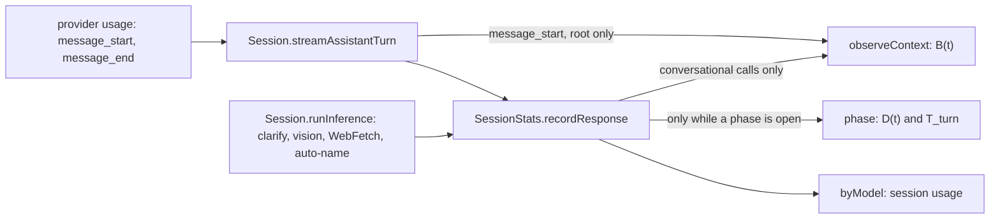

- **One ledger per tree.** A child `Session` receives the parent's `SessionStats` by reference, so `/session` and the live meters cover the whole tree. `recordResponse(model, usage, apiMs, conversational)` is called with `conversational = !child` from the turn loop and `false` from `runInference()`, so neither a subagent nor a side call can move B(t).
- **Phases are root-only.** `runTurn()` calls `beginPhase()` just before `turn_started` and `endPhase()` in its `finally` block. A child only adds to the phase already in flight. A closed phase ignores later calls, which still land in `byModel`.
- **B(t) is never written as 0 from a measurement.** `observeContext()` ignores an all-zero usage ("not measured"). When a provider omits usage entirely, the root raises `contextTokens` to at least `estimateContextTokens()` (a messages-only estimate). Apart from a real measurement, only compaction sets it, and only to an estimate (below). `/clear` builds a fresh `SessionStats`. `/resume` restores it from the transcript's `meta` snapshot (`snapshot()` / `fromSnapshot()`: `startedAt`, `apiMs`, line counts, `contextTokens`, `byModel`), which is written at most every 30 s mid-turn and always at turn end.

**What T_turn does and does not contain.** It includes every main-loop call of the root and its subagents, and every `runInference()` side call made while the turn runs: clarify, WebFetch digestion, and images described for `Read`, tool results or steering text. It excludes three kinds of call:

- Images attached to the `user_message` itself. `Engine.withImageDescriptions()` runs before `runTurn()` opens the phase, so these reach `byModel` only.
- Auto-naming, which runs after the phase has closed.
- **The compaction summarizer.** `runSummarizer()` streams from the provider directly and never calls `recordResponse()`, so its tokens appear in no ledger at all: not the phase, not `byModel`, not `/session`. This contradicts the doc comments on `recordResponse()` and on `turn_finished.usage`, which both list summarization as banked.

### Live meters

`emitLiveTokens()` inside `streamAssistantTurn()`:

- **B live.** A root seeds each call with `estimateContextNow()` (system prompt, tool schemas, addons and messages, all estimated), because a call's input does not change while it streams. It replaces the seed with the exact figure at `message_start` when the provider sends one, and banks the final figure at `message_end`. A child reports the root's current `contextTokens` and emits nothing until the root has measured once. A 0 is never pushed as "empty".
- **D live.** `liveDeliberationTokens(estimateTokens(text + thinking + tool-argument characters))` returns the banked phase output plus this call's tail, **ratcheted**: several subagents stream at once, each knowing only its own tail, and a counter that goes backwards reads as a bug. D_final at `turn_finished` corrects any over-estimate.
- **Reasoning live.** `min(output, banked reasoning + estimate(thinking chars))`. At the end of a call with streamed reasoning and no reported reasoning count (a reported 0 is treated as none), the call's usage gets `reasoningTokens = min(output, estimate)` and `reasoningEstimated: true`.
- **Pacing.** A new `context_update` goes out when B changes or D has grown by 200 or more. `contextWarn` rides along once B reaches `floor(limit × 0.9)`.

The renderer (`app/renderer/modules/landing.js`, `session.js`) resets D and reasoning at `turn_started` and leaves B untouched. An absent `context_update.outputTokens` means unchanged. Mid-stream reasoning is shown as estimated, and `turn_finished` supplies B, D_final and the final reasoning figure. It shows `ctx ~12k` with no percentage, because the real limit varies per endpoint, and `↑ 12k out · ~8.1k reasoning`. When several workspaces are tiled, the top bar sums B across the open tabs. That is legal because each tab is a different conversation. It never sums one conversation's B over time. `/session` (`SessionStats.format`) prints current context (prefixed `~` before any measurement), per-model cumulative usage with `(reasoning …)` inside output, an estimated breakdown, and free space against the auto-compact limit.

**Estimates.** `CHARS_PER_TOKEN` is 3.5, deliberately below the real ~4 for English, so estimates over-count: compacting a little early is recoverable, overflowing is not. `estimateTokens()` computes `ceil(chars / 3.5)`, and an estimate is always replaced by provider usage when that arrives. `app/renderer/modules/tokens.js` repeats `CHARS_PER_TOKEN`, `estimateTokens` and `formatTokens` because the renderer cannot import the protocol. `tests/features/mirror-token-algebra.test.ts` pins the copies as identical. The renderer's reasoning label (`~8.1k reasoning`) is its own and differs from `reasoningPart()` (`reasoning ~8.1k`).

### The window and the compaction limit

- `contextWindowFor(model, settings)` (`engine/core/src/config/pricing.ts`) returns `settings.contextWindow` when set. The connection wizard requires it; `set_connection` or `/settings contextWindow` change it live. Otherwise it returns 128,000, because the built-in model table is empty. `announceSession()` emits a non-fatal `error` whenever the window is unset.
- `derivedCompactLimit()` = `floor(window × compactionThreshold)`. The threshold defaults to 0.8 (schema range 0.1–1), leaving the last fifth as headroom for the next reply and its tool results.
- `effectiveCompactLimit()`: with no UI cap it is the derived limit. A cap ≤ 0 means off (0). Otherwise it is `min(cap, derived)`, so the cap can lower the limit, never raise it. The cap arrives as `set_compact_limit`. The desktop stores it as `uiSettings.compactLimit` (default 1,024,000) and re-sends it on every session start. The TUI, headless runs and subagents send none, and still compact at the derived limit.

### When compaction fires, and what it does

`maybeCompact(force)` runs at four points:

- mid-turn, after every tool-result push;
- at the end of `runTurn()`, after `turn_finished`;
- on `/compact` (forced, as an exclusive job wrapped in a non-stoppable `background_notification`);
- in overflow recovery (forced): a thrown error that `isContextOverflowError()` classifies as overflow (any 413, or a 4xx or status-less error whose message reads as overflow; never a 5xx) retries the same call, and a `context_overflow` stop resumes as a cutoff. Both share a limit of `context.overflowRecoveries` (2) recoveries per turn (§6).

When not forced, it gates on `limit > 0 && max(measured, estimateContextNow()) >= limit`. The measured value is B for a root and 0 for a child, whose shared figure belongs to the root. The estimate is in the gate because between rounds the measurement lags by the reply and the results just appended.

1. It declines, with a note, when `compaction.system` is emptied: swapping history for an uninstructed reply is worse than no compaction.
2. It keeps the last `context.compaction.keepTailMessages` (6) messages (`forceKeepTailMessages`, 2, when forced; the compiler rejects a force value above the normal one) and walks the split back so the tail never opens with a `tool_result` whose `tool_use` was summarized away. If nothing precedes the tail, it does nothing.
3. It serializes the head (`serializeForSummary`): thinking is dropped, tool calls are clipped to 1,500 characters and string results to 4,000 (head and tail), non-string results become `[non-text result]`. Then it chunks the text by `summarizerBudget()`: reply = `min(maxTokensPerResponse, clamp(10% of window, 2,000, 8,192))`, chunk = `clamp((window − 2 × reply − 1,000) × 3.5, 4,000, 200,000)` characters. A rolling summary is carried from chunk to chunk.
4. `runSummarizer()` calls `smallModel ?? model` on the same provider with `compaction.system` and the connection's `reasoningEffort`, under its own `AbortController`, so an interrupt cannot stop it.
5. It replaces history with `[user: compaction.wrapper(summary), …tail]` and appends a `compaction` record `{replacedCount, summary}`. `Transcript.replay()` applies the same cut on resume. The wrapper tells the model not to wrap up because of the compaction.
6. On a root, it sets `contextTokens = estimateContextNow()` (never 0) and emits `context_update` with no `outputTokens`. An automatic compaction also prints `Auto-compacted (~N tokens summarized)` and names the reason: the UI cap, or threshold × window. Usage totals are never reduced.

### Invariants

- Never add B(t), D(t) and T_turn. B is replaced on every call, never accumulated. Output never enters B. T_turn is cost, not size.
- B is the sum of all three input classes. `inputTokens` alone under-reports whenever caching is on.
- Only the root writes B and opens or closes a phase. Children bank usage only and gate compaction on their own estimate.
- A zero measurement means "not measured". Compaction resets B to an estimate, never to 0.
- Reasoning is inside output. An estimate is never final.

### How a meter goes wrong

| Symptom | Cause |
|---|---|
| Context reads near-empty on a full window | `usage.inputTokens` read alone while most of the prompt arrived as cache reads |
| Context climbs every round of one turn | B summed across calls, or output added to it |
| User's meter jumps when a subagent reads a big file | a child wrote `contextTokens` (guarded by `conversational = !child` and the `!child` checks) |
| Meter or compaction safety drops to 0 | an all-zero usage adopted, or compaction resetting to 0 |
| Output counter jumps backwards during a fan-out | the ratchet in `liveDeliberationTokens()` bypassed |
| Output counter resets mid-turn | a child calling `beginPhase()` |
| Counter snaps to 0 after `/compact` | a frontend reading an absent `outputTokens` as 0 |
| A 32k local model never compacts and dies at its wall | `contextWindow` unset, so 128k is assumed, or a UI cap of 0 |
| `/session` and the on-screen meter round differently | the two `formatTokens` copies drifted |

### Known drift

- The compaction summarizer is unbanked (above), although the doc comments claim it is banked.
- `app/renderer/modules/state.js` says a fresh engine session "starts at 0 (off)". In fact `autoCompactLimit` starts `undefined`, which means the window-derived limit.
- The `~N tokens summarized` note reports the whole context before compaction, not the size of the span it replaced.

---

## §10 · Settings, credentials, state on disk

**`settingsSchema` in `engine/core/src/config/settings.ts` is the single definition of every setting. Four layers merge into it. The desktop app mirrors a handful of its constants in `app/main/config.js` and writes the same files. State lives in the workspace's `.magentra/` directory and `.env`, and in the user's `~/.magentra/`. A file two processes share is written atomically. Persisted keys are additive-only, which is why there is no migration code anywhere.**

### Four layers, later wins per key

`loadSettings(cwd)` builds the effective settings in this order:

1. schema defaults (`settingsSchema`);
2. `~/.magentra/settings.json` (`globalSettingsPath()`);
3. `<cwd>/.magentra/settings.json` (`projectSettingsPath()`);
4. environment variables (`ENV_OVERRIDES`): `MAGENTRA_PROVIDER`, `MAGENTRA_MODEL`, `MAGENTRA_SMALL_MODEL`, `MAGENTRA_VISION`, `MAGENTRA_BASE_URL`, `MAGENTRA_API_KEY_ENV`, `MAGENTRA_MAX_ITERATIONS` and `MAGENTRA_MAX_TOKENS_PER_TURN`.

Nested objects deep-merge; arrays and scalars replace. `contextWindow` deliberately has no env override: one storage, one resolver. A file with invalid JSON produces a warning and is skipped. Unknown top-level keys produce a warning and are carried through (`.passthrough()`). `describeSettings()` attributes each leaf to env, project, global or default, and redacts every leaf named `apiKey` (`isSecretPath`). `/settings` with no arguments prints that list.

### The schema's key groups (24 top-level keys)

| Group | Keys and defaults | See |
|---|---|---|
| Connection | `provider` (`openai-compatible`), `model` (`deepseek-ai/DeepSeek-V4-Flash`), `baseUrl` (absent → `DEFAULT_OPENAI_BASE_URL`), `apiKeyEnv`, `apiKey`, `allowInsecureTls` (false), `contextWindow`, `reasoningEffort` | §8 |
| Vision | `vision` (false), `visionConnection {provider, model, baseUrl?, apiKey?, contextWindow?, allowInsecureTls?, profileId?}` | §8 |
| Side model | `smallModel`: WebFetch digests, compaction summaries, the default for `runInference` | §9 |
| Turn and context | `maxTokensPerResponse` (32768), `maxTokensPerTurn` (200000), `maxIterationsPerTurn` (50), `compactionThreshold` (0.8) | §5, §9 |
| Behaviour | `clarify` (true), `reuseCheck {mode: remind or off, maxHits 5, blockThreshold 0.75, remindThreshold 0.5}`, `search {enabled true, provider?, apiKeyEnv?}` | §6, §11 |
| Permissions | `permissions {allow[], deny[], allowExact[{tool, subject, prefix?}]}` | §7 |
| Extensions | `hooks {}`, `mcpServers {}`, `worktree {baseRef: fresh or head}` | §12, §7 |
| Housekeeping | `retention {sessions 100, tasks 100}`, `pricing {}` (per-model rate cards; no card means no cost estimate) | — |

**Behaviour policy is not a setting.** The build's policy values (rung budgets, the stall thresholds, clarify's limits, what OVERDRIVE does) are `brain/behavior.json` knobs (§12), the same for every user of a build. No settings key duplicates one, nothing persists one, and there is no per-user layer for them; the only runtime channel is the embedder and test seam `EngineOptions.behavior` (§5). Where the two meet, the setting decides *whether* or *when* and the knob decides *how*: `settings.clarify` gates clarify and `clarify.enabled` can only switch it off further, `clarify.model` picks `model` or `smallModel`; `maxTokensPerResponse` decides when a reply is cut off and `finishing.lengthCutoff.*` whether it is resumed; `compactionThreshold` / `contextWindow` decide when compaction fires and `context.*` what it keeps and how often an overflow is recovered; the Allow-deletions switch governs attended deletions and `overdrive.guards.*` only the OVERDRIVE stance. User allow and deny rules sit above every knob.

When a change takes effect is declared per key in `SETTING_TIMING` in `engine/core/src/runtime/engine.ts`. The map is typed `Record<keyof typeof settingsSchema.shape, …>`, so adding a schema key without a timing fails `tsc` (pinned by `tests/features/setting-timing.test.ts`). The timings are `session` (the connection keys in `CONNECTION_SETTING_KEYS` rebuild the provider on the spot), `nextTurn`, `clear` (`permissions`, `worktree`, `reuseCheck`) and `restart` (`hooks`, `mcpServers`, which are wired at boot).

### Writing settings

- **`setSetting(cwd, dotPath, raw, target)`** backs `/settings [global] <key> <value>`. The value goes through `coerceSettingValue()`. It writes the **global** file when `target` is `"global"`, when the leaf is a secret (`apiKey`), or when `<cwd>/.magentra` does not exist; otherwise the project file. The value `auto` unsets the key in *both* layers. It validates the edited layer on its own and falls back to validating the merged layers (`mergedLayersAreValid`), because a nested block can be split on purpose: `visionConnection.apiKey` goes global while its `model` stays in the project file.
- **`writeSettingsFile()`** always writes through `writeFileAtomic(…, 0o600)`.
- **The app writes the same files.** `updateWorkspaceSettings()` (read-modify-write, last writer wins) handles the project file and `clearGlobalSettingsKeys()` the global one. Because project merges over global, anything the app clears it clears in both layers. Saving a connection always deletes `apiKeyEnv`.

### Credentials

| Where | What | Written by |
|---|---|---|
| `<ws>/.env` | `MAGENTRA_API_KEY` (or `ANTHROPIC_API_KEY`, per `apiKeyEnvVarFor()`), `MAGENTRA_VISION_API_KEY` | `writeWorkspaceEnvKeys()` in `app/main/connection.js`, in one pass at 0600, removing the legacy `DEEPINFRA_API_KEY` line |
| `~/.magentra/profiles.json` | Named connection profiles, keys included, 0600 | `app/main/profiles.js`. The engine never reads it; `tui/src/profiles.ts` reads it and commits a profile the way the app does. |
| `~/.magentra/settings.json` | `apiKey`, when set through `/settings` | `setSetting()`, which routes every secret here |

The engine reads `.env` once, at boot (`loadDotEnv()` in `engine/host/src/env.ts`), and a variable already set in the environment wins. The app goes further: `readWorkspaceEnvKeys()` overlays the workspace's `*_API_KEY` lines onto the engine child's environment, so a stale key exported in the user's shell cannot shadow the key they just saved. Key resolution is `resolveApiKeySource()`, in this order: the pinned `apiKeyEnv`; the standard names (`MAGENTRA_API_KEY`, `OPENAI_API_KEY`, `DEEPINFRA_API_KEY`, or `ANTHROPIC_API_KEY` for Anthropic); then `settings.apiKey`. A blank variable counts as unset. A pin naming an unset variable produces a boot warning (pinned by `api-key-resolution-has-no-silent-shadow.test.ts`). The renderer never holds a key: profiles cross IPC as `hasKey`.

### The keyless LAN rule

`isLocalBaseUrl()` returns true for `localhost`, `*.localhost`, `*.local`, `::1`, `0.0.0.0`, `host.docker.internal`, `127.*`, `10.*`, `192.168.*` and `172.16–31.*`. There are two copies, one in `engine/core/src/config/providerFactory.ts` and one in `app/main/config.js`. `tests/features/mirror-local-endpoint.test.ts` and `local-means-the-lan-in-both-halves.test.ts` keep them identical. The comments in both files that say nothing asserts parity are stale.

- **Engine.** `bootstrapEngine()` throws `MissingApiKeyError` when there is no key, unless the provider is OpenAI-compatible and the base URL is local.
- **App.** `hasCredentials()` in `app/main.js` asks the same question in the same order. `validateCredentialPayload()` is looser: it accepts a keyless save for *any* explicit base URL. A keyless non-LAN URL therefore saves, then fails `hasCredentials()`.
- **Live swap.** A keyless `set_connection` deletes every key variable the process knows, so "no key configured" and "no key sent" mean the same thing.

### Where state lives

| Path | Contents |
|---|---|
| `<ws>/.magentra/settings.json` | Project layer |
| `<ws>/.magentra/sessions/<id>.jsonl` | Append-only transcript (`Transcript` in `engine/core/src/state/transcript.ts`). Record kinds: `message`, `system_prompt`, `permission`, `compaction`, `meta`. |
| `…/sessions/subagents/`, `…/sessions/archive/` | Child transcripts, kept out of the resumable listing, and archived sessions (`archive_session` moves them there; move one back to restore it) |
| `<ws>/.magentra/tasks/` | `<sessionId>.json` task lists (`TaskStore`) and `<kind>_<hex>.output` background output |
| `<ws>/.magentra/worktrees/<name>/` | EnterWorktree checkouts (§7) |
| `<ws>/.magentra/workflows/<runId>.jsonl` | Workflow journal (§12) |
| `<ws>/.magentra/scheduled_tasks.json` | Durable cron jobs (§12) |
| `<ws>/.magentra/graph.json`, `symbols.json` | Knowledge caches (§11) |
| `<ws>/.magentra/addons/` | Workspace addons (§12) |
| `<ws>/.magentra/logs/desktop-<UTC>.log` | The app's NDJSON launch log, redacted and pruned (`app/main/logging.js`) |
| `<ws>/.env`, `<ws>/STANDARDS.md` | Keys; binding code style (§11) |
| `~/.magentra/` | `settings.json`, `profiles.json`, `prompts/<id>.txt` (or `MAGENTRA_PROMPTS_DIR`), `addons/`, and `trusted-folders.json` (terminal folder trust, `tui/src/trust.ts`) |
| `~/.magentra-tui.json` | The terminal's dev config, one key: `engineHome` (`tui/src/config.ts`) |
| Electron `userData/config.json` | Window bounds, theme, `recentWorkspaces` (10), model, `updateCheck` (`readConfig()` in `app/main/config.js`) |

`Engine.gcStateFiles()` runs whenever a session is announced (boot, `/clear`, `/resume`), after each exclusive job, and when `retention` changes. It prunes by mtime: `sessions/*.jsonl` and `sessions/subagents/*.jsonl` to `retention.sessions` (a pruned transcript's task JSON goes with it), and `tasks/*.json|*.output` to `retention.tasks`. The live session's files and running jobs' output files are never candidates.

### Atomic writes

`writeFileAtomic()` in `engine/core/src/util/fsAtomic.ts` writes `<file>.tmp` and renames it over the target. On Windows, where rename-over can throw, it falls back to remove-then-rename. The mode is applied to the temp file and then `chmod`-ed, so 0600 holds on every write, not only on the first. The engine uses it for settings, `graph.json`, `symbols.json` and task lists. `writeJsonAtomic()` in `app/main/config.js` is the same algorithm for `config.json`, `profiles.json` and both settings layers. `tests/features/state-files-are-written-atomically.test.ts` pins one helper per half of the app.

Atomic means no reader ever sees a torn file. It does not prevent a lost update: the last writer wins. It exists because a truncated `settings.json` reads as "no settings", which presents as a workspace that lost its endpoint and key.

### Additive-only state

`CONTEXT.md` defines it: a key in persisted state is only ever *added*, never renamed and never given a new meaning. Removal is safe, because every reader treats an absent key as its default. That is what makes going back a version safe, and why there are no migrations. You can see it in the code: `reuseCheck.mode` still accepts the retired `"gate"` and maps it to `"remind"`, and files carrying the removed `permissionMode` still load. Caches are different. `GraphData.version` (§11) may reject and rebuild, because the data is derived.

### Traps

- **One bad value resets everything.** When the merged layers fail `settingsSchema`, `loadSettings()` warns and returns `settingsSchema.parse({})`. *Every* setting falls back to its default, not just the bad key.
- **`maxIterationsPerTurn` and `maxTokensPerTurn` cap nothing in a normal run.** They are enforced only when `opts.child` is set, and `spawnAgent()` lifts both to `Number.MAX_SAFE_INTEGER` for every child. `maxTokensPerTurn`'s one live reader is the Workflow budget.
- **Some writers are not atomic.** `.env` (app and terminal), `scheduled_tasks.json`, `trusted-folders.json`, installed addon files, and the terminal's own settings writes in `tui/src/profiles.ts` use plain `writeFileSync`.
- **The app loosens the project file's mode.** `updateWorkspaceSettings()` passes no mode, so after an app write the project `settings.json` gets the default umask mode, not the engine's 0600. Only the global layer is written 0600 by both halves. Keep secrets out of the project file.
- **Two copies of the defaults.** `DEFAULT_MODEL`, `DEFAULT_BASE_URL`, `DEFAULT_API_KEY_ENV`, `VISION_API_KEY_ENV`, `REASONING_EFFORTS` and `isLocalBaseUrl` exist in both the engine (`settings.ts`, `providerFactory.ts`, `engine/protocol/src/types.ts`) and `app/main/config.js`. Change them together. The `mirror-*` tests catch drift in the base URL, the vision key variable, the effort levels and the LAN rule. Nothing pins `DEFAULT_MODEL`.

---

## §11 · The knowledge layer

**`engine/core/src/knowledge/` produces cheap, deterministic, model-free facts about the workspace: an import graph (`graph.ts`), a symbol index (`symbols.ts`), the resolver that turns a request into files (`seeds.ts`), document text extraction (`docs.ts`) and the user's binding code style (`standards.ts`). Beside them sit the reuse gate (`reuseGate.ts`) and a depth-1 workspace probe (`workspace.ts`). Everything is a hand-rolled scan, with no AST and no parser dependency. The caches in `.magentra/` refresh by mtime and size and are built on demand, never at startup.**

### The import graph — `graph.ts`

`GraphData` is `{ version: 3, files: Record<id, {mtimeMs, size, imports[]}> }`. Its parts:

- **Node ids** are workspace-relative paths with forward slashes, from `normalizeToId()`. That function is shared with `seeds.ts` and the GraphQuery tool, because an id that two callers spell differently is a file the graph silently cannot find. External dependencies are synthetic `pkg:<name>` nodes: they take part in the graph but are never scanned.
- **The walk** covers `SCAN_EXTS` and skips every dot-directory (`.git`, `.magentra`), any directory whose name starts with `tmp` or `build`, and `node_modules`, `dist`, `out`, `coverage`, `vendor` and `target` (`shouldSkipDir`). It stops at `MAX_FILES` (5000), `MAX_FILE_BYTES` (1 MB) and `MAX_DEPTH` (12).
- **Two phases.** `buildGraph()` first lists every file, then resolves imports against a `ResolveContext`: all ids, ids by directory and by basename, the `go.mod` module path, and the workspace packages declared in the root `package.json`. Namespace imports (`com.example.Foo`, `App\Mailer`, a Go package path) can only be resolved against the whole file list.
- **Incremental.** An entry whose mtime and size are unchanged keeps its already-resolved imports without being re-read. A specifier that only became resolvable because *another* file appeared is picked up the next time this file changes.
- **`loadOrBuildGraph()`** rebuilds from scratch when `graph.json` is missing, corrupt or has another version. It saves only when something changed, through `writeFileAtomic`, best-effort. It is called only by the GraphQuery tool and by the clarify pre-layer's codebase skim, and the skim is gated by `workspaceLooksNonTrivial()`.
- **JS/TS resolution** (`resolveJsSpec`) tries the relative specifier as written, the `.js`→`.ts` family (the repo's ESM convention), `TRY_EXTS`, then `index.*`. An unresolved relative import is **dropped**. A bare specifier that names a sibling workspace package resolves to that package's *source* entry (`src/index.*` or `index.*`). Its `exports`/`main` point into `dist/`, which the scan skips. Anything else becomes a `pkg:` node.

### Two tiers (ADR 0004) — still true

`docs/adr/0004-the-import-graph-has-two-tiers.md` describes the split, and `LANG_BY_EXT` implements it exactly:

| Tier | Extensions | Edges |
|---|---|---|
| 1 | TS/JS (`.ts .tsx .mts .cts .js .jsx .mjs .cjs .vue .svelte`), `.py`, C/C++/Obj-C (`.c .h .cc .cpp .cxx .hpp .hh .hxx .m .mm`), `.rb`, `.php`, `.java .kt .kts`, `.go`, `.rs` | Real edges, resolved directly (`#include "x.h"`, `require_relative`) or by convention (a JVM or PHP namespace by unique path suffix; a Go import path to every `.go` file in that package's directory; Rust `mod` plus `crate::`/`super::`/`self::`) |
| 2 | `.cs .swift .scala .dart .lua .ex .exs .erl .hs .clj .zig .nim .pl .sh .bash .ps1 .sql` | Nodes only (`langOf` → `"none"`). A Swift import names a module and a C# `using` names a namespace; neither names a file. |

A Tier 2 repository still gets a useful graph: `slice` seeds from paths *and* symbols, so edge-less files are found and ranked.

### Drop the edge when unsure

This rule governs every extractor. When a suffix match is ambiguous, `bySuffix()` returns nothing. A JVM import that resolves to no file adds nothing, not even a `pkg:` node, because nothing in the syntax says whether it is first-party. Ruby's bare `require` and C's `<angle>` includes become `pkg:` nodes, never guessed files. Self-edges are removed. A conservative miss is cheap. An invented edge poisons PageRank, the blast radius, slices, and the reuse gate downstream.

### The version bump rule

Cached entries keep the imports the *old* scanner found. A fix to extraction or resolution is therefore invisible on every workspace that already has a `graph.json`, unless `GraphData.version` is bumped. The `version: 3` literal type, the `buildGraph()` return value and the `isValidGraph()` check move together. The history lives in the `GraphData` doc comment: version 2 made multi-line braced imports visible and resolved workspace packages to their source; version 3 anchored side-effect imports to a statement position, so the word `import` inside a string no longer invents a package. The symbol index follows the same rule with its own `version: 2` (`isValidIndex`). Pinned by `tests/features/import-graph.test.ts`.

### Analytics and the GraphQuery tool

These are pure functions over `GraphData`:

- `pagerank()`: personalized power iteration (damping 0.85, ε 1e-8, at most 200 iterations). An import edge u→v weighs 1.0 and its reverse 0.5, so relevance flows both ways. Optional `seedWeights`.
- `blastRadius()`: transitive importers by hop distance.
- `dependencies()`: the forward closure.
- `articulationPoints()`: cut vertices and bridges over the undirected, non-`pkg` view.
- `slice()`: seeds first, then files by descending rank while the byte-estimated tokens fit the budget.
- `graphStats()`.

`engine/tools/src/graphQuery.ts` exposes five ops: `slice` (budget 12 000 tokens by default, 60 000 max), `blast`, `deps`, `structure` (top 15 by rank, articulation points, bridges, counts) and `rank` (top 20). Output is capped at 200 lines. `blast` and `deps` take only `files`. `slice` and `rank` resolve seeds.

### Seeds — `seeds.ts`

`resolveSeeds(graph, cwd, {files, query}, symbols?)` is the one place that decides which files a topic concerns. It takes the explicit files present in the graph, plus the ids that contain any whitespace-separated query keyword as a substring, plus the files of the best symbol matches (`findSimilarSymbols`, at most 12 hits with score ≥ 0.4). File paths alone are weak evidence: "make the approval card show progress" matches no filename. Symbols carry it, and for Tier 2 they are the only signal. A symbol-index failure never loses the path seeds.

### The symbol index — `symbols.ts`

`SymbolIndexData` is `{ version: 2, files: {symbols[], lines[]} }`, with 1-based declaration lines aligned to the names and at most 200 symbols per file. It is persisted to `.magentra/symbols.json` atomically. It imports `SCAN_EXTS`, `extOf`, `langOf` and `shouldSkipDir` from `graph.ts`, so widening the graph widens the index. Extraction is per language:

- TS/JS: export declarations, export lists, `module.exports.X`.
- Python: column-0 `def` and `class`.
- `DECL_PATTERNS` for C, Ruby, PHP, JVM, Go (capitalized names only) and Rust (`pub` items).
- A generic class/func pattern set for Tier 2.

`findSimilarSymbols()` scores names by token-set Jaccard over `tokensOf()` (camelCase and separator splits, stopwords and fragments under 3 characters dropped), with a bonus when the first or last tokens agree. Exact normalized equality scores 1.0.

### The reuse gate — `reuseGate.ts`

When the agent Writes a brand-new source file, `Session.evaluateWriteReuseGate()` runs `evaluateReuseGate()`, a pure, first-match-wins decision table. It passes on `mode: off`, non-source extensions, skip-dirs, tests, existing files, and files already Read. It also passes when the `SearchLog` (fed by `searchTerms`) shows a related search, or a top match was Read. Otherwise, a match at or above `remindThreshold` (0.5) queues a reminder (`reminder.reuse-check`), worded firmly at or above `blockThreshold` (0.75, `reminder.reuse-check-firm`). With that prompt switched off it passes instead. It reminds and never blocks, and it fails open on any throw.

### Documents — `docs.ts`

`extractDocumentText(path, buf)` dispatches on extension: PDF (a content-stream scan with ToUnicode CMaps), DOCX, PPTX, XLSX (its own ZIP reader over `node:zlib`), RTF, ODT and EPUB. It returns `undefined` for an unrecognized extension and throws a clear error on a scanned, encrypted or unmodelled file. Its consumers:

- The Read tool (`engine/tools/src/read.ts`): at most 20 MB, output line-numbered under `[extracted from <kind>, N chars]`.
- The app's attachment reader (`loadDocExtractor()` in `app/main.js`): the bundled `doc-extract.mjs` when packaged, `engine/core/dist/knowledge/docs.js` in development, so development needs a build.

### Coding standards — `standards.ts`

`loadStandards(cwd)` reads `STANDARDS.md` at the workspace root, else `.magentra/STANDARDS.md`; the root wins and an empty file is skipped. It truncates at 16 384 bytes on a line boundary and appends a notice. `Session.buildSystemPrompt()` calls it on **every model call** and appends the text under the `system.standards-header` prompt ("Coding standards (user-provided — binding)"), which ranks it above default style guidance. When that header prompt is blanked, the whole section is dropped, body included (`Session.section`). When a turn wrote or edited files and standards exist, the wrap-up reminder asks the model to confirm the diff complies (`wrapupNudgeText`). Pinned by `tests/features/standards-md.test.ts`.

### Traps

- **An extractor change needs a version bump.** Change an extractor or resolver without bumping `GraphData.version` (or the symbol index's `version`) and existing installs keep the old edges forever. Tests on a fresh temp workspace stay green.
- **Adding a language means two edits.** The extension goes into `SCAN_EXTS` *and* `LANG_BY_EXT`, and `symbols.ts` needs a pattern set. A file routed to the wrong extractor yields nothing, silently.
- **The two scanners copy their caps.** `symbols.ts` keeps its own `MAX_FILES`, `MAX_FILE_BYTES` and `MAX_DEPTH` instead of importing them from `graph.ts`. Changing one copy desynchronizes the two scans.
- **Short keywords over-seed.** A query keyword is a raw substring match on paths, so a short one (`ui`, `a`) seeds a large part of the repository.
- **Subagents do not see STANDARDS.md.** `spawnAgent()` builds the child's system prompt with `buildSystemPrompt()` and no standards section.
- **Two copies of `DOC_EXTS`.** It is duplicated in `engine/tools/src/read.ts` and `app/main.js`, and unlike `IMAGE_TYPES` no mirror test pins it.

---

## §12 · Extension surfaces

**MAGENTRA can be changed without editing engine code in five ways: prompt override files (on top of the `brain/` defaults), addons, hooks, MCP servers, and scheduled prompts. The same scheduling package also runs background jobs and the Workflow runner. Each surface is loaded at a fixed moment, and each fails soft: a broken extension produces a warning or a skipped entry, never a session that will not start.**

### The brain — `brain/`, compiled by `tools/brain/compile.mjs`

`brain/` is the single source of every model-facing default except the `subagent.*` group, and of the behaviour knobs that decide when that prose fires and how hard the agent pushes. `brain/README.md` is its contract (layout, exact file rules, every knob with its range and effect, accessors, verify commands). Code keeps the logic, the rung order and the schema shape; the prose and the policy values live here.

| Path | Holds |
| --- | --- |
| `brain/prompts/<group-dir>/<id>.md` | One registered prompt: a frontmatter (`id`, `group`, `label`, `channel`, `where`, optional `placeholders`; `order:` required in `1-core-system` and allowed nowhere else, a non-negative integer unique in that folder; optional `enabled: false` on any prompt, which registers it blank), then the exact text. An empty body is accepted only with `enabled: false`. 88 files: `1-core-system` (11), `2-conditional-system` (3), `3-in-turn-reminders` (48), `4-end-of-turn-rungs` (10), `5-background-inference` (11), `7-tool-descriptions` (5: the non-`tool.*` texts tools send, such as `bash.foreground-sleep` and `read.image-unseen`). |
| `brain/tools/<Name>/description.md` | The tool's description template (`{{slots}}` unfilled), one folder per built-in tool (27). |
| `brain/tools/<Name>/params.md` | Optional (24 tools): one `## <path>` section per `.describe()` text, dotted paths with array elements transparent, `(root)` for the schema object itself. |
| `brain/availability.json` | `{ main, overdrive }`: the built-in tools a root session offers per context (§7). |
| `brain/behavior.json` | The behaviour knobs, complete (every key, nothing else): `finishing` (the ladder's budgets, counters and switches, §6), `stall`, `reminders`, `clarify`, `context`, `tools`, `evidence` (the detector word lists), and `overdrive` (`overrides`, `preTurnSnapshot`, `guards`). Every shipped value equals the constant it replaced. |

**`order:` and `enabled: false`.** The `1-core-system` files sorted by `order` are the sections that open the system prompt (`BRAIN_CORE_ORDER`, §5); the shipped numbers are 10 … 110, and the gaps leave room to insert. The engine picks up a new core file with no code change, but `brain-is-the-single-source` does not yet: it fails on a prompt file no `brainPrompt("<id>")` call names. `enabled: false` registers the prompt's default as `""`, which is exactly a blank override: the catalog reports it `disabled`, and a user's non-blank override file still wins over it. The shipped brain uses no `enabled: false`.

**`behavior.json`.** `BEHAVIOR_SPEC` in `tools/brain/compile.mjs` is the one definition of every key: type (`bool`, `int` with a finite range, an enum, a list of plain strings with an item pattern and a length range, or the `overrides` partial), and a doc string, but no value. The values live only in the JSON. The compiler names the dotted key in every problem (`unknown key`, `missing key`, wrong type, out of range, a list entry that fails its pattern or repeats) and checks one cross rule, `context.compaction.forceKeepTailMessages <= keepTailMessages`, on the base and again with `overdrive.overrides` applied. Two semantics to know:

- **`overdrive.overrides`** is a deep partial of `finishing`, `stall`, `reminders`, `clarify`, `context`, `tools` and `evidence`, merged over the base while OVERDRIVE is on, in ROOT sessions only (`effectiveBehavior()`). Each leaf is validated by the rule of the key it overrides; an unknown key fails; a list replaces the whole list; `overdrive` itself cannot be overridden. Shipped: `{"finishing": {"selfVerify": {"maxRounds": 1}}}`, which is the old "self-verify only in OVERDRIVE".
- **`overdrive.guards.*`** take `"run"` or `"refuse"` only, so brain can tighten OVERDRIVE but never make it ask (§7).

**Claims.** Some model-facing prose states a fact that holds only for some knob values (`system.overdrive` says "Every call runs the moment you make it"). `CLAIMS` in the compiler pairs each such phrase with the knob values that keep it true. When a knob makes a phrase false, the build prints `brain: warning: <prompt file>: says "<phrase>", which is not true with <key> = <value>, … — reword the prompt`, checked in the stance the prompt is sent in (OVERDRIVE-only prompts against the base with `overdrive.overrides` applied). It is a warning, never a failure, and it checks only the text the model reads, never `where`. The shipped brain prints none. A claim whose phrase is no longer in its prompt is silent, and no test notices (`docs/decisions/0016-no-test-holds-prompt-wording.md`): the harness clause "if an OVERDRIVE section appears, not even on those" was removed on 2026-10-03, so its claim now guards nothing.

**Build.** `npm run build` and `npm run typecheck` run `node tools/brain/compile.mjs` before `tsc -b`. The compiler (plain Node, no dependencies) folds CRLF and a BOM, validates every file, and writes `engine/protocol/src/brain.generated.ts` (gitignored): `BRAIN_PROMPTS`, `BRAIN_TOOLS`, `BRAIN_BUILTIN_TOOLS`, `BRAIN_AVAILABILITY`, `BRAIN_CORE_ORDER`, and from `brain/behavior.json` the `BrainBehavior` and `BrainBehaviorOverrides` types (each key's range and doc as JSDoc), `BRAIN_BEHAVIOR` (the file, validated, keys in spec order) and `BRAIN_BEHAVIOR_SPEC` (the rules as data). A body is everything after the closing `---` minus exactly one trailing newline, so bytes round-trip exactly. The CLI also demands completeness: a folder for each name in its fixed `BUILTIN_TOOLS` list, a file for every id the engine source names with `brainPrompt("…")`, and `behavior.json`. A `subagent.*` id, a group-6 folder, an unknown tool folder or availability entry fails with the offending name. `--check` validates and exits 1 when the generated module is stale. Nothing reads `brain/` at run time: `tsc` compiles the module into `engine/protocol/dist`, and `app/scripts/bundle-engine.js` inlines it into `engine.cjs`.

**Editing it: the brain editor** (`tools/brain-editor/`, `npm run brain-editor`). One core, `src/model.ts`, behind a local page (`src/server.ts`, `src/ui/`) and a JSON command line for agents (`src/cli.ts`: `check`, `show`, `plan`, `apply`, `new-profile`, `help changes`). A change is a typed object (`prompt.update`, `prompt.create`, `prompt.delete`, `tool.update`, `availability.update`, `behavior.set`, `behavior.override`, `file.write`). `src/format.ts` writes the files, the inverse of the compiler's readers, and is never trusted alone: a save is applied to a staged copy, compiled with `{ complete: true }`, loaded by the last build of the engine with the staged brain swapped in by a module resolve hook (`src/probe.mjs`, which runs every `brainPrompt`/`toolParam`/`assertToolParamStates`, renders the system prompt for one fixed environment and hashes every tool's name, description and schema, so a plan says whether the prompt or the tools change), and written only when there is no new problem, the engine loads it, every edited item compiles back to exactly what was asked, and the folder is still the revision it was planned against. In the shipped `brain/` a change to `availability.json` or `behavior.json` also names the test that holds those values (`brain-is-the-single-source`, `brain-controls-behavior`) and is refused until it is acknowledged; prompt and tool texts are held by no test. `--brain <dir>` and `new-profile` work on a copy of a brain, held by no test and never built. The engine still builds from `brain/` only. Held by `brain-editor`.

**Accessors** (`engine/protocol/src/brain.ts`, exported from `@magentra/protocol`): `toolDescription(name)`, `toolParam(name, path)`, `assertToolParamStates(name, path, …facts)` (a params text that states a code constant, such as Monitor's default timeout, is checked against it when the tool module loads), `unreadToolParams()` (orphan sections), `brainAvailability()`, `resolveToolAvailability()`, `toolAvailabilityWith()`, `isToolOffered()`. For behaviour: `brainBehavior()` (the shipped object, deep-frozen), `brainBehaviorSpec()`, `behaviorProblems(value)` (the compiler's checks, in its words), `resolveBehavior(override?)` (merge over the shipped object, validate, freeze; an object it already returned comes back unchanged, and any other object is merged and validated), `effectiveBehavior(resolved, overdrive)` (adds `overdrive.overrides`) and `behaviorWith(override)` (a test's one-knob change). In `prompts.ts`: `brainPrompt(id)`, `promptDefault(id)` (the shipped text, never an override, safe at module load), `brainPromptIdList()`, `coreSectionOrder()` and `renderPromptIfEnabled(id, vars)` (undefined when switched off, so a call site can fall back to its bare fact). Every accessor throws on an unknown key while its module loads.

**The exception.** `engine/core/src/agent/agents.ts` and its `subagent.*` prompts stay literals in code. Text that only frames or reports runtime data also stays in code: a tool's own result and error text, the `Unknown tool "…"` and `Invalid input` refusals, the `Permission denied.` fallback, a Monitor's event-line notifications, data labels inside side-call user messages, and user-visible `command_output` status lines. Where an instructional text moved to brain but the model must still learn the fact (a background task's exit, a Monitor's noise stop, a refused call, an unreadable image), switching the prompt off sends a bare factual line instead.

**Not knobs, on purpose** (the full table is in `brain/README.md`): the ladder's order and bound mechanism, the stall detector's existence and fingerprint, deny rules and the resolution order, tool_use/tool_result pairing, the attended guards, the kill-by-name refusal in OVERDRIVE, the deletion and kill detection lists, the self-verify regexes and browser install patterns, compaction sizing, clarify's internals (token budget, skim sizes, option bounds), root-turn caps, the OVERDRIVE boot stance (frontend-owned), subagent internals, and frontend copy that describes OVERDRIVE.

**Held by tests.** `tests/features/brain-is-the-single-source.test.ts` checks the catalog against the files one to one, that every brain prompt file is named by a `brainPrompt("<id>")` call, that no `definePrompt` outside `agents.ts` carries literal text, that every wire description comes from brain, that the engine's defaults are a fresh compile of brain and every file round-trips to its own bytes, and that the bundled engine boots with no `brain/` beside it. `tests/features/brain-controls-behavior.test.ts` checks that every knob is read under its full dotted path and no replaced constant survives, that the shipped values are the old constants, that the runtime checker and the compiler give the same verdict in the same words, and, on real engines, what each knob changes.

### The prompt registry — `engine/protocol/src/prompts.ts`

`prompts.ts` registers every `BRAIN_PROMPTS` entry while the module is evaluated, before any consumer runs. A call site holds `const X = brainPrompt(id)`, which throws at module load when brain/ has no such id. `definePrompt({id, group, label, channel, where, placeholders?, text})` still registers the prompts declared in code: the `subagent.*` group (`agents.ts`) and each tool's `tool.<name>`. Either way the call site reads the text through `promptText(id)`, `renderPrompt(id, vars)` or `promptTextIfEnabled(id)`. The registry holds 122 prompts: the 88 brain prompts, 7 `subagent.*`, and one `tool.<Name>` per built-in tool (27). Redeclaring an id with *different* text throws, because two prompts sharing one override file would be ambiguous. An unknown id also throws, because a typo returning `""` would silently delete a section. The channels are `system`, `system-conditional`, `reminder`, `tool`, `side-call`, `side-call-user` and `subagent`.

**Overrides** are plain files at `<promptsDir>/<id>.txt`. `promptsDir()` is `MAGENTRA_PROMPTS_DIR` when set, else `~/.magentra/prompts`, so an override applies to every workspace of that user. Overrides are re-read live: a resolved override is trusted for 250 ms (`CACHE_TTL_MS`), then the file's mtime is checked again. Editing a file changes the next request without a restart. CRLF is normalized and trailing newlines are stripped.

**A blank override means disabled**, never "use the default". Deleting the file restores the default. A brain file shipped `enabled: false` is the same as a blank override. Each consumer honours "disabled" in its own way:

- A model call guarded by `promptTextIfEnabled()` does not run at all. A blank system prompt is the same call with the instructions removed.
- A system section is dropped with its body (`Session.section`). A blank reminder is never queued (`Session.remind`). A wrapper or refusal read through `renderPromptIfEnabled()` falls back to the bare fact it wraps (`Tool failed:` gives the bare error, a permission refusal gives `Permission denied.`, a background exit a one-line `<task-notification>`).
- An end-of-turn rung whose own text is off (recovery nudge, incomplete tasks, runtime and browser evidence, self-verify, wrap-up) does not fire: no status line, no message, no model call, and its count is not spent. With `reminder.length-continuation` off, no output-length resume runs, not even the one after a context-overflow compaction.
- A blank tool description withholds the tool itself (§7). `ToolRegistry.enabled()` leaves it out of the schema list, and `executeToolCalls()` refuses a call to it by name.
- A built-in tool missing from `brain/availability.json` for the current context (`main`, or `overdrive` while OVERDRIVE is on) is withheld from a ROOT session the same way, and refused with the same text. MCP tools and child sessions are exempt. `EngineOptions.toolAvailability` / `SessionOptions.toolAvailability` override it per engine (not a setting). The shipped file withholds Agent and Workflow.

Tool descriptions join the registry as `tool.<name>` through `registerToolPrompt()`, with the brain template as the default text. MCP tools join too. Subagent roles and picker blurbs are `subagent.role.<type>` and `subagent.description.<type>` (`engine/core/src/agent/agents.ts`).

`promptCatalog()`, `writePromptOverride()`, `clearPromptOverride()` and `orphanedPromptFiles()` exist for an external editor. Nothing in `engine/`, `app/` or `tui/` calls them.

`buildSystemPrompt()` in `engine/core/src/agent/prompts.ts` assembles it in `coreSectionOrder()`: each `1-core-system` section where its `order:` puts it (shipped: the nine `SECTION_*` blocks, then `environmentBlock()`, then `addonsBlock()`), then the session's extra and dynamic sections (OVERDRIVE, deletion policy, STANDARDS.md). It is rebuilt on every model call. Changing an `order:`, or adding, removing or switching off a core file, changes the prompt every session receives.

### Addons

An addon is a procedure the model loads on demand: a Markdown file whose frontmatter says *when* to reach for it and whose body says *what to do*.

- **Discovery.** `loadAddons(cwd)` in `engine/core/src/agent/addons.ts` loads in increasing precedence: `BUILTIN_ADDONS` (`builtinAddons.ts`), then `~/.magentra/addons/`, then `<cwd>/.magentra/addons/`. A later addon with the same name **replaces** the earlier one (`tests/features/precedence.test.ts`). A tier can use either layout, a flat `<name>.md` or a `<name>/ADDON.md`; a directory without `ADDON.md` is skipped. The name comes from frontmatter `name`, else the file or directory name. The description comes from frontmatter `description`, else the body's first line. An unreadable or empty-bodied file is skipped.
- **Frontmatter** (`engine/core/src/config/frontmatter.ts`) is hand-parsed. Every value is a string, on one physical line, split at the line's *first* colon. A colon inside a value is safe. A value that wraps onto a second line loses its remainder.
- **Cheap until used.** Only `name: description` lines ride in the system prompt (`system.addons-block`). No body ever does (`cheap-until-used.test.ts`). There is no enabled state and nothing is injected automatically. The description is a *routing condition*, and it is where an expensive addon must declare its cost. The built-in `magentron` does ("COSTS EXTRA TOKENS"), and `the-magentron-built-in.test.ts` pins that.
- **On-invoke load.** The Addon tool (`engine/tools/src/addon.ts`) returns `addonInvocationHeader(name)`, then the body with `$ARGUMENTS` substituted (or `ARGUMENTS: …` appended), then a reminder listing the bundled files. A directory addon advertises up to 24 sibling files, one nested level deep, as workspace-relative *paths*. They are never inlined; the model Reads or runs the ones the body points at. A built-in has no directory, so it cannot bundle files.
- **Precedence header.** `addon.invoke-header` is the one header both entry paths use. It says the addon outranks default behaviour *and the user outranks the addon*: a message that hands a decision back, says stop, or narrows the request wins, and the procedure adapts.
- **Two ways in.** The user can type `/<name>`: `Engine.handleAddonCommand()` runs a turn whose text is the header plus the body. A leading-slash name *anywhere* in a message (`bana /grill-me yap`) is detected by `addonNamedIn()` in `session.ts`, which matches on a word boundary, lets the longest name win, and ignores paths like `src/grill-me`. It queues `reminder.addon-named` and skips the clarify pre-layer for that turn, whether clarify is on or off.
- **Authoring.** `generate_addon` makes one `runInference()` call on the main model (or on a profile connection the app passes), repairs a fenced or preambled reply (`repairAddonText`), validates it with the real parser (`validateAddonText`), and retries up to 3 times with the error appended through `addon-author.retry-feedback`. Its system prompt is `addon-author.role` and its user message `addon-author.instruction` (with `addon-author.context-line` when the wizard passes context), all from `brain/prompts/5-background-inference/`; emptying the role or the instruction switches authoring off with an error. `install_addon` re-validates, writes `.magentra/addons/<slug>.md`, and reloads the roster *in place* (`reloadAddons` mutates the array the live Session holds), then emits `addons_updated`.

### Hooks — `engine/core/src/agent/hooks.ts`

`settings.hooks` maps an event to `[{matcher?, hooks: [{type: "command", command, timeout?}]}]`. The events are PreToolUse, PostToolUse, UserPromptSubmit, Stop and SessionStart. `HookRunner` spawns each matching command with `shell: true` in the engine's workspace, pipes the JSON payload to stdin, and captures stdout and stderr. The timeout is 60 s by default, or `timeout` seconds (600 max). Matching hooks run in parallel. **Hooks never throw**: a spawn failure is exit code 127. **Exit 2 means block**, and the blocking hooks' stderr becomes the reason.

| Event | Payload beyond `hook_event_name`, `session_id`, `cwd` | Exit 2 | Exit 0 stdout |
|---|---|---|---|
| PreToolUse | `tool_name`, `tool_input` | Call refused before the permission check; the result is the reason wrapped in `reminder.pre-tool-use-hook` | — |
| PostToolUse | `+ tool_response` (a 400-character preview) | Reason appended to the result, wrapped in `reminder.post-tool-use-hook` | — |
| UserPromptSubmit | `prompt` | Turn not run; error event | Queued as a reminder |
| Stop | — | Reason pushed as a user message wrapped in `reminder.stop-hook`; the loop continues, once per turn | — |
| SessionStart | — (boot, `/clear`, `/resume`; fire and forget) | — | Added as a context message |

`matcher` is a regex tested against `tool_name`; an invalid regex falls back to exact equality. Hooks are wired at construction (`SETTING_TIMING`: `restart`). Subagent sessions get no hook runner.

### MCP — `engine/core/src/integrations/mcp.ts`

A hand-rolled stdio client that speaks JSON-RPC 2.0 as **newline-delimited** JSON, protocol version `2025-06-18`, with no Content-Length framing. `createMcpTools(settings.mcpServers)` runs once, inside `bootstrapEngine()`. For each entry `{command, args?, env?, timeoutMs?}` it spawns the server, sends `initialize` and `notifications/initialized`, runs `tools/list`, and wraps each tool as `mcp__<server>__<tool>`: class `network`, a permissive zod record for validation, and the server's real JSON Schema on `rawInputSchema` for the wire. Handshake and list calls time out after 10 s. `tools/call` defaults to 60 s, or the entry's `timeoutMs`. A malformed entry, a server that fails to start, or a failed `tools/list` becomes a `[mcp]` boot warning and contributes no tools. `callTool()` returns the text parts joined; an image part becomes `[image content omitted]`; an `isError` result becomes an error tool result.

### Scheduling — `engine/core/src/scheduling/`

- **`cron.ts` `CronScheduler`**: one per Engine. A 30 s tick fires a job only when its 5-field cron matches the current local minute **and** the session is idle; a busy session defers the job to the next tick. Recurring jobs fire a stable 0–15 minutes late, derived from a hash of the job id, so jobs on round times do not all fire at once. Ephemeral recurring jobs expire 7 days after creation. `durable` jobs persist to `.magentra/scheduled_tasks.json` and reload when the engine starts. `ScheduleWakeup` is a one-shot, clamped to 60–3600 s, never durable. The Engine's `enqueue` routes a prompt that reads `/<name> …` through `handleSlash()`, so a schedule can invoke an addon. Anything else becomes a plain `user_message`. Jobs fire only while that workspace's engine is running.
- **`background.ts` `BackgroundManager`**: bash, monitor and agent jobs get ids like `bash_<hex>`. Output streams to `.magentra/tasks/<id>.output`. `background_notification` goes out at start and at exit, and a `<task-notification>` reminder (`reminder.background-exit`) is queued for the next turn. Jobs are detached so they outlive a turn. Interrupt does not reap them; `stopAll()` at engine shutdown does.
- **`workflow.ts` `WorkflowRunner`** (the Workflow tool): the script must begin with a pure `export const meta = {name, description, …}` literal. The body runs through `new AsyncFunction(...)`, which is **not a sandbox**: it is model-authored code, trusted, in the engine's own realm. It exposes the hooks `agent`, `parallel`, `pipeline`, `phase`, `log`, `args` and `budget`. Limits: at most 100 `agent()` calls per run, 4 concurrent. The budget is `settings.maxTokensPerTurn` output tokens, measured with `usedOutputTokens()`. Each call is journaled to `.magentra/workflows/<runId>.jsonl`, but nothing reads the journal back: there is no resume.

### Traps

- **Blank means disabled.** A blank override file switches a prompt off. It is never "use the default". The one exception is a prompt read through `promptText()` inside a model call, such as `vision.describe` (§8), which then runs with empty text.
- **Hand-dropped addons need a restart.** An addon file dropped into `addons/` by hand is not seen until the engine restarts. Only `install_addon` reloads the roster, and `/clear` reuses the loaded list.
- **A matcher silences non-tool hooks.** A `matcher` on a UserPromptSubmit, Stop or SessionStart entry means that hook never runs. Their payloads carry no `tool_name`, and `matcherMatches()` returns false for any non-wildcard matcher.
- **A PostToolUse block cannot annotate an array result.** The reason is appended only when the tool result is a string.
- **Workflow is withheld from root sessions by default** (`brain/availability.json`), so the model reaches it only when an embedder opts it in, or from inside a general-purpose child (whose registry ignores availability) once `Agent` is opted in.
- **Workflow ignores some options.** `agent()` accepts `model` and `phase` options and ignores both: `SpawnAgentOptions` has no model field. A general-purpose subagent keeps the Workflow tool, so recursion through Workflow is not blocked.
- **MCP servers start once.** They are spawned at boot and live for the engine process. A server that dies later fails every call until restart.

---

## §13 · Concurrent workspaces

**The desktop app runs up to four workspaces at once with one engine process per open folder; the app calls each a tab. The engine and the protocol know nothing about it. The main process keeps the pool and routes frames by tab id; the single renderer swaps one tab's console state in and out of its globals.**

### Vocabulary

| Term | Meaning in code |
|---|---|
| Workspace | A folder: one cwd, one `.magentra/`, one `.env`. |
| Session (the UI says "chat") | One conversation in a workspace, `.magentra/sessions/<id>.jsonl`. |
| Engine | One host child process bound to one workspace, holding one live session. |
| Tab | A live workspace in the app: its engine, plus its slice of renderer state. Keyed by a `tabId` (`tab1`, `tab2`, …) that main mints in `createTab()`. |

### The rules

- **One live session per folder.** `app/main.js` `openWorkspace()` asks `tabForWorkspace()` first; a folder that is already open, in any window, is focused instead of opened again. This removes every race over a shared `.magentra/` and a shared git tree by construction, and main enforces it, so the renderer cannot break it.
- **At most `MAX_TABS = 4`, across all windows.** A fifth open is refused with `tab:cap`, which the renderer shows as a toast. There is no eviction, no idle sleep, no LRU.
- **Tabs do not know about each other.** No shared engine, no shared session, no messages between tabs.
- **Every per-workspace action names its tab.** Applying a connection profile, the vision toggle and the attach-file picker resolve the workspace through `tabFromPayload()`; falling back to the focused tab is only for a payload with no `tabId` (`tests/features/every-per-workspace-action-names-its-tab.test.ts`).

### Why a process pool and not one engine

The engine is single-session in load-bearing places, all in `engine/core/src/runtime/engine.ts` and `engine/core/src/util/asyncQueue.ts`:

1. `Engine` holds **one** `session` field. `/clear` and `resume_session` replace it; there is no registry.
2. `engine.events` is an `AsyncQueue` with **one consumer**. A second `for await` does not get a copy — it steals every other event (`tests/features/single-consumer-events.test.ts`).
3. One engine-level `busy` flag and one `turnPromise` chain gate all exclusive work.
4. The engine mutates **process-global** state: `set_connection` writes the API key into `process.env` and toggles `NODE_TLS_REJECT_UNAUTHORIZED`; `allowInsecureTls` sets it at boot.
5. No frame carries a session id.

Multiplexing would need a session registry, per-session busy state, a fan-out over the queue, a session id on every frame (a protocol break) and an end to the process-global writes. Under the one-session-per-folder rule it would buy nothing a second process does not already give — and a process also isolates crashes, hangs and memory per workspace.

### Main process: the pool and the router

`engineTabs: Map<tabId, EngineTab>` in `app/main.js`, where an `EngineTab` is `{ id, workspace, model, child, dying, stdoutBuffer, stderrBuffer, win }`.

- **Focus is per window.** Each `BrowserWindow` carries `win.mgActiveTabId`; `tab.win` says which window owns a tab. `focusTab()` also mirrors the tab's workspace and model into `currentConfig`, which the model, restart and web-search handlers read.
- **Outbound:** each engine's stdout line is parsed, stamped `{ ...event, tabId }` and sent on `engine:event` to `tab.win` only.
- **Inbound:** `engine:send` with `{ frame, tabId }` goes to that tab; a bare frame goes to the sender window's `activeTab()`. `engine:permission` takes an optional `tabId`; `engine:interrupt` and `engine:restart` never carry one.
- **Opening order matters.** `openWorkspace()` sends `tab:opened` and a synthetic `workspace_changed` **before** `startEngine()`, so the renderer has the tab's state ready when the first tagged engine frame arrives. It starts the engine on the workspace's own saved model, not the focused tab's.
- **`tab.dying`** holds a child from `stopEngine()` that has not exited yet. `startEngine()` waits for its `exit` before spawning the replacement, because two engines on one workspace race over its state files (`tests/features/engine-lifecycle.test.ts`).

### Renderer: one UI, swapped state

There is one renderer per window, not one per tab. The modules were written for a single console and hold it in module-level globals; `app/renderer/modules/tabs.js` bundles those globals into a `TabState` per tab and swaps them.

- **`TAB_ACCESSORS`** is the single source of truth for "what is per-tab": one `[name, get, set, makeDefault]` row per global — the tab's own detached `streamEl` (its transcript DOM), live-turn pointers, `busy`, `currentSessionId`, `toolRows`, `backgroundJobs`, `permissionQueue`, `activePermission`, task state, token meters, model, addons, changes, the error banner. A few fields that are not globals (`overdrive`, `paneEl`, `commandQueue`, `attachments`) live directly on the `TabState`.
- **`captureInto(ts)` / `applyFrom(ts)`** copy globals out of and into a `TabState`.
- **`routeEngineEvent(event)`** — registered by `composer.js` as the one `onEvent` listener — calls `runInTab(event.tabId, () => handleEngineEvent(event))`. For the focused tab (or an unknown or missing id) it runs directly; otherwise it captures the focused tab, applies the target, runs, captures the target, re-applies the focused tab, and repaints the sidebar badges.
- **`dispatchTabId`** names the tab whose event is being handled. `chromeIsFocused()` returns false while a background tab's event runs, and the updaters of shared chrome (composer, status LED, meters, model picker) check it, so a background turn does not repaint the focused tab's controls. On focus change `repaintChromeFromFocusedTab()` redraws the chrome once.
- **Replies go back to the tab that asked.** A permission card keeps the `tabId` main stamped on its `permission_request` and answers with `respondPermission(…, permission.tabId)`; a question card captures its owner tab before the click handler runs; a pane's own input sends `user_message` / `steer_message` with its `tabId`.

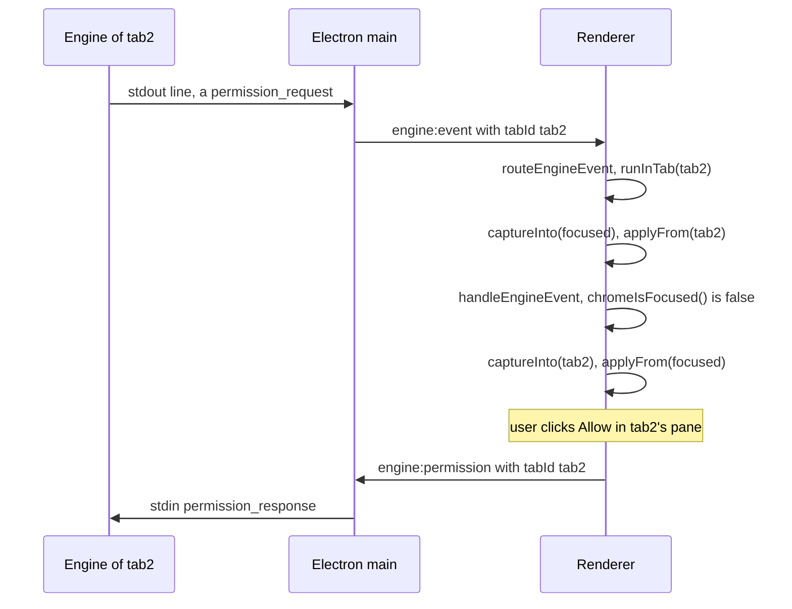

### Layout

The layout follows the tab count; there is no mode switch. `applyLayout()` is the one function that decides what is mounted.

- 1 tab: the focused tab's `streamEl` sits directly in `#transcript` with the shared bottom composer.
- 2+ tabs: `body.tiled`, `#transcript` becomes a grid (`data-panes`), and each tab gets a pane from `paneFor()` with its own header, transcript, input (`buildPaneComposer()`), slash palette, queue, jobs chip and in-pane approval. 2 = two columns; 3 = two on top and one full-width "big" pane below (default the third tab, changeable from the pane menu, `bigTabId`); 4 = a 2×2 grid. Reaching two tabs closes the inspector once; it stays reopenable.
- Focus follows `mousedown` on a pane or `focus` on its input, and never changes which pane is big.
- Only while tiled, the top-bar context meter (`updateContextMeter()` in `app/renderer/modules/session.js`) shows the sum over the open consoles; each pane keeps its own figure.

### What dies when

| Event | Engine | Renderer state |
|---|---|---|
| Close a tab (`tab:close` → `closeTab()`) | `stopEngine()`: EOF, SIGTERM, SIGKILL after 3 s; the transcript stays on disk | Pane and `TabState` dropped; closing the last tab reloads the renderer to the landing page |
| Close a secondary window | Its tabs stopped (`closeTabsForWindow()`) | Gone with the window |
| Close every window / quit | `stopAllEngines()` on `window-all-closed` and `before-quit` | Gone |
| Restart (banner button, a model pick with no live engine, the web-search toggle) | Old child stopped, new one spawned after it exits: a **new session** — the old one is only reachable by resume | `onRestarted` clears pending permissions and ends a busy turn |
| Engine crash | `engine_exit` with `expected: false`; the tab stays in the pool with no child | Banner in that tab; user-action frames to it answer "engine is not running" |
| `set_model`, `set_connection`, `set_vision` | Applied live; the session survives | Unchanged |

### Invariants

- One engine per folder, one child per tab, never two children for one tab at once.
- Main owns the pool and every tab lifecycle transition; the renderer only reacts to `tab:opened`, `tab:focused`, `tab:closed`, `tab:cap`.
- Any global that describes one conversation is a `TAB_ACCESSORS` row. A global left out leaks between tabs.
- While a tab is focused, its truth is in the globals and its `TabState` is stale. Read a focused tab through the globals, or `captureInto()` first — `applyLayout()` and `buildPaneComposer()`'s busy check both do.
- Anything sent later from a click handler must carry a `tabId` captured while the tab's state was applied; the handler runs after `runInTab()` has restored the focused tab.

### Traps

- **Untagged sends go to the focused tab.** `applySafetySettings()` in `app/renderer/modules/state.js` sends `set_deletion_guard`, `set_overdrive` and `set_compact_limit` with no `tabId`, and `onSessionStarted()` in `landing.js` calls it. When a background tab announces a new session (a cron-driven `/clear`, or a new tab whose engine boots after the user has clicked another pane), those frames reach the focused tab's engine, and the background tab's new session never receives the user's safety settings (engine-side, only OVERDRIVE survives a `/clear`).
- **`engine:interrupt` and `engine:restart` target the active tab.** They work from a pane because the pane's `mousedown` focuses it before the button's `click` fires. A control that triggers them without a preceding focus acts on the wrong workspace.
- **Web search is not tab-scoped.** `settings:setWebSearch` acts on `currentConfig.workspace` (the focused tab) and restarts that engine with `currentConfig.model`, ending its live session.
- **The same-folder rule is a string comparison.** `tabForWorkspace()` compares paths with `===`; two spellings of one folder (a symlink, different case on a case-insensitive disk) open two engines on it. The rule also lives only in the desktop app: the GUI's single-instance lock does not cover the TUI, so a `magentra` terminal session and a desktop tab can run on the same folder at once.
- **A renderer reload does not close tabs.** The home button reloads the renderer and leaves every engine running in main's pool. The fresh renderer has an empty `tabs` map, so events arrive with ids it does not know and `runInTab()` treats them as the focused tab; reopening such a folder hits the same-folder rule and focuses a tab the renderer no longer has.
- **Closing the primary window while a secondary one stays open does not stop its tabs.** Only secondary windows register `closeTabsForWindow()` on `closed`; the primary window's engines run on until every window closes, still counting against the cap.
- **No feature test drives the cap, the same-folder rule or the tiling itself.** The routing is pinned only where `every-per-workspace-action-names-its-tab` and `engine-lifecycle` reach it; `tests/features/session-meter.test.ts` sets `body.tiled` by hand to check the summed meter.

---

## §14 · The desktop app

**An Electron shell with three layers: a main process that owns the windows, the engine processes and every file write; a preload bridge that is the renderer's only way out; and a renderer made of 21 plain scripts that share one global scope. None of `app/` is typechecked, and `npm test` never launches it.**

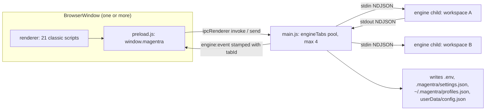

### Main process

| File | Owns |
| --- | --- |
| `app/main.js` | Windows, the engine pool, every `ipcMain` handler, attachment reading, connection application, navigation policy, the sandbox fallback |
| `app/main/config.js` | `userData/config.json` (recents, model, theme, window bounds, `updateCheck`), `writeJsonAtomic()`, settings-layer readers, `isLocalBaseUrl()`, the mirrored constants below |
| `app/main/profiles.js` | `~/.magentra/profiles.json` (keys inside, mode 0600); `sanitizeProfiles()` strips keys before anything crosses to the renderer |
| `app/main/connection.js` | `validateCredentialPayload()`, `testEndpoint()` (TEST button, incl. `discoverContextLimit()`), `.env` read/write, vision selection |
| `app/main/logging.js` | NDJSON launch logs in `<ws>/.magentra/logs/desktop-*.log` (fallback `userData/logs`), secret redaction, delta folding, keeps the newest 10 |
| `app/main/changes.js` | Undo: `undoWorkspaceDiffs()` reverse-applies diffs with `git apply --reverse`, all-or-nothing with rollback; `resolveWorkspaceFile()` refuses paths outside the workspace, symlinks resolved |
| `app/main/updates.js` | The two update tiers (§15) |

`currentConfig` in `main.js` is the single live copy of app config; `config.js` is pure read/write.

**The engine pool.** Each open workspace is a *tab* with its own engine child (`engineTabs`, `createTab()`). The cap `MAX_TABS = 4` is global across windows, with no eviction (`tab:cap` tells the renderer). One folder has at most one live tab across all windows (`tabForWorkspace()`; opening it again focuses it). Each window keeps its own focused tab in `win.mgActiveTabId`; `winOf(evt)` maps a request to its window, and `createExtraWindow()` opens a second full renderer for "open in new window".

`startEngine()` spawns `engineEntryPoint()` (§15) with `--serve --cwd <ws>`, `cwd` = the workspace, the workspace `.env` keys spread over the shell environment, and `MAGENTRA_MODEL`. Stdout is split into lines, parsed, logged, stamped with `tabId` and sent to that tab's window on `engine:event`; an unparseable line is logged, never forwarded. Stderr goes to the log; `classifyEngineStderr()` forwards only genuine warnings as `engine_notice`. `stopEngine()` ends stdin, sends SIGTERM, escalates to SIGKILL after 3 s, and parks the child in `tab.dying`; a replacement for that tab waits for its exit, so two engines never share one workspace. `child.expectedExit` separates a deliberate stop from a crash (only crashes get a banner).

`writeToEngine()` drops frames when no child is writable. Drops of `STATE_SYNC_FRAMES` (`set_deletion_guard`, `set_overdrive`, `set_compact_limit`) are silent because the renderer re-sends them on every `session_started`; drops of `USER_ACTION_FRAMES` come back as a non-fatal `error` event. `redactFrameForLog()` blanks `connection.apiKey` (and the vision key) and shrinks image payloads to name and size in the log only.

**Connections.** `hasCredentials()` asks the engine's own question in the engine's order (key for this provider in `.env`, then env, then a stored `apiKey`, then a keyless local `baseUrl`) over the merged global + workspace settings; `false` sends `setup:required` instead of spawning. `applyValidatedConnection()` is the one commit path for the wizard and for `profiles:apply`: it writes the key to `.env`, the rest to `.magentra/settings.json`, deletes stale keys from the global layer too (`clearGlobalSettingsKeys()`, because project settings merge over global), then either sends `set_connection` to a live engine (same session) or starts one. `settings:setVision` persists the flag and sends `set_vision`, never re-applying the connection. `settings:setWebSearch` rewrites settings and **restarts** the engine.

**Attachments are read in main**, because the renderer is sandboxed: `context:pickFiles` → `readAttachment()`. Caps span the whole pending set (15 files, 2 MB total; the renderer passes its current count and bytes). Documents go through the engine's own extractor (`loadDocExtractor()`: `resources/engine/doc-extract.mjs` packaged, `engine/core/dist/knowledge/docs.js` in dev). Images travel as base64 and are offered only when the asking tab's workspace has vision on.

**Window.** Every launch opens full screen (`shouldStartFullScreen()` returns true; `applyOpeningPosture()` falls back to maximize). F11 is handled in `wireWindowChrome()` and consumed, and the renderer draws its own window buttons while full screen hides native chrome. The theme name is mirrored into config so the pre-paint `backgroundColor` and the Windows title-bar overlay match (`THEME_CHROME`). The Chromium sandbox is on except for Windows portable (`PORTABLE_EXECUTABLE_FILE`) and a Linux dev run where `app/scripts/launch.js` finds no usable sandbox. A Windows renderer that dies before its first paint with the sandbox on relaunches once with `--no-sandbox` (`sandbox-rescue-relaunch`); the argv check stops a loop. `--smoke` skips the single-instance lock and exits 0 five seconds after first paint, or 1 if the renderer crashed.

**Navigation.** One `web-contents-created` handler denies every window-open and every navigation except a reload of the current URL (the home button reloads). `app:openExternal` opens only `EXTERNAL_URL_ALLOWLIST`.

### Preload: the whole bridge

`app/preload.js` exposes one object, `window.magentra`, through `contextBridge`. The renderer has no `require`, no `fs` and no raw IPC. The surface, grouped:

| Group | Methods |
| --- | --- |
| Engine | `send(frame, tabId?)`, `interrupt`, `restartEngine`, `respondPermission`, `onEvent`, `onRestarted` |
| Workspaces and tabs | `chooseWorkspace`, `openWorkspace`, `openWorkspaceFile`, `revealWorkspace(tabId)`, `focusTab`, `closeTab`, `openInNewWindow`, `onTabOpened/Focused/Closed/Cap`, `onRecentWorkspaces` |
| Connections | `testConnection`, `detectLocalServers`, `list/save/delete/applyProfile`, `getVision/setVision(tabId)`, `getWebSearch/setWebSearch`, `onSetupRequired`, `setModel` |
| Content | `pickContextFiles`, `undoChanges`, `generateAddon`, `saveAddonExport`, `getPathForFile` |
| App | `getConfig`, `getAppInfo`, update methods (§15), `openExternal`, `openLogs`, `setTitleBarTheme`, `windowControl`, `onFullScreen`, `setZoom/getZoom` |

`send()` without a `tabId` posts the bare frame, which main routes to the **sender window's active tab**; with one, it posts `{ frame, tabId }`. Per-workspace actions name a tab, never a path; main looks the folder up itself.

### Renderer: classic scripts, one global scope

`app/renderer/index.html` loads, in this order: `dom` · `tokens` · `state` · `rain` · `util` · `math` · `markdown` · `views` · `workbench` · `tasks` · `addons` · `overdrive` · `tour` · `stream` · `setup` · `events` · `landing` · `session` · `updates` · `tabs` · `composer`. There is no bundler and no `import`: every top-level `const`, `let` and `function` is a global the later files use by name. So:

- **The order is the dependency order for load-time code.** A top-level statement that touches a binding from a later file throws. `state.js` calls `applyUiSettings()` at load and guards `syncMatrixRain` with `typeof … === "function"`; that guard pattern (`chromeIsFocused`, `runInTab`, `applyEffort`) is how an earlier file reaches a later one. `setup.js` declares `wizTestedOkFor` before its load-time `applyWizPreset()` because the reverse threw in the temporal dead zone and killed every listener below it.
- `tabs.js` loads after every state-owning module and `composer.js` last, because it subscribes `onEvent` and calls `boot()`.
- A duplicate top-level `const`/`let` name in two files is a SyntaxError that disables the second file entirely; a duplicate `function` silently replaces the first.
- Graph tools see no edges between these files. Find a symbol's users with a text search over `app/renderer/modules/`.

| Module | Responsibility |
| --- | --- |
| `dom.js` | Every `getElementById` reference |
| `tokens.js` | Mirror of `engine/protocol/src/tokens.ts` (token text and estimates) |
| `state.js` | Per-session globals (`let`), `uiSettings` in `localStorage["magentra-ui"]`, `applySafetySettings()`, the fallback `SLASH_COMMANDS` |
| `views.js` | View switching, the in-app menu bar, modals, the liveness line |
| `stream.js` | Transcript DOM: progressive Markdown, per-frame writes, tool rows and runs, agent cards, `trimStream()` |
| `landing.js` | Start page and recents, **`handleEngineEvent()`** (the event switch), most `on*` handlers, permission and question cards |
| `events.js` | `file_edited` accumulation for the Changes view, failure banner, credential-failure path |
| `session.js` | `enterActiveState()`, model picker, thinking-effort control, context/cost meter, `boot()` |
| `workbench.js` | Inspector, sidebar, review drawer and Undo |
| `tasks.js`, `addons.js`, `overdrive.js`, `tour.js`, `updates.js`, `rain.js` | Task rail; addon catalogue and create wizard; OVERDRIVE toggle, first-use dialog, cinematic; first-run tour (`localStorage["magentra-tour-done"]`); update footer; matrix-theme canvas |
| `markdown.js`, `math.js` | Hand-rolled Markdown and LaTeX-to-MathML renderers that build DOM nodes, never `innerHTML` |
| `setup.js` | The connection wizard, the only place a connection is defined (presets custom / Ollama / LM Studio) |
| `tabs.js` | Per-tab state swap, tiling, per-pane inputs, `routeEngineEvent()` |
| `composer.js` | Input, slash palette, attachments, send/steer/queue, global listeners, `boot()` call |

### Events, tabs and the state swap

`composer.js` wires `onEvent(routeEngineEvent)`. `routeEngineEvent()` in `tabs.js` calls `runInTab(event.tabId, () => handleEngineEvent(event))`. The renderer was written for one console, so its per-console state is a few dozen module globals. `TAB_ACCESSORS` lists each as `[name, get, set, makeDefault]`; `runInTab()` captures the focused tab's globals, applies the target tab's `TabState`, runs, and swaps back. Closures, not `eval`, because the CSP forbids eval and classic-script `let` bindings are not on `window`. With one tab the swap never fires. While a background tab's event runs, `dispatchTabId` is set, and shared-chrome updaters return early when `chromeIsFocused()` is false.

Two to four tabs tile automatically (2 columns; 2 + 1 big pane; 2×2), each pane with its own transcript and input; the shared composer hides.

### Rendering, composer, safety

- **Streaming.** `markdownCommitPoint()` commits everything up to the last blank line whose code fences and `$$` are balanced; the tail stays plain text. Reasoning text and scroll-follow are batched once per animation frame (`requestStreamFrame()`, 250 ms timer fallback for hidden windows), and a live reasoning block shows only its tail. Consecutive calls to the same tool in the same container collapse into one `N × Tool` group (`placeToolRow()`, also used by session restore).
- **Attachments.** `composeWithAttachments()` inlines text and document bodies with a preamble saying they are snapshots, not files on disk; `imageFrameParts()` puts images in the frame's `images` array for the engine's vision step.
- **Slash palette.** `makeSlashPalette()` completes the `/word` under the caret at a word boundary. At the start of a single-line message it offers every command; mid-message only addons (`SlashCommandInfo.addon`), and Enter sends rather than completes. The list is always the engine's (`session_started.commands`, refreshed by `addons_updated`). Bare `/settings` opens the Settings view without sending; `/clear` also wipes the local view.
- **Busy.** Plain text typed during a turn is sent as `steer_message`; commands queue until the turn ends.
- **Safety re-assert.** `onSessionStarted()` calls `applySafetySettings(true)`, which re-sends deletion guard, OVERDRIVE and compact limit from `uiSettings`, because a fresh engine boots with defaults.

### Mirrors: constants the app cannot import

The app cannot import engine modules, so some constants are copied. Each copy has a parity test:

| Copy | Original | Test |
| --- | --- | --- |
| `IMAGE_TYPES` in `app/main.js` | `engine/tools/src/read.ts` | `mirror-image-types` |
| `DEFAULT_BASE_URL`, `VISION_API_KEY_ENV`, `REASONING_EFFORTS`, `isLocalBaseUrl()` in `app/main/config.js` | engine settings, `types.ts`, `providerFactory.ts` | `mirror-default-base-url`, `mirror-vision-key-env`, `mirror-reasoning-efforts`, `mirror-local-endpoint` |
| `THEMES` in `config.js` | `THEMES` in `state.js` | `mirror-theme-names` |
| `app/renderer/modules/tokens.js` | `engine/protocol/src/tokens.ts` | `mirror-token-algebra` |

### Assets and verification

The CSP in `index.html` is `default-src 'none'` with scripts, styles and fonts from `'self'` only and no `connect-src`: the renderer cannot fetch anything. Fonts ship in `app/renderer/fonts/` (Inter, JetBrains Mono, OFL). `fully-local-assets` guards this.

Nothing typechecks `app/`: the root `tsconfig.json` references only `engine/*` and `tui`. `npm test` never launches the app. Only `npm run test:ui` (the `ui` kind, selected by script name in `realUiTestsEnabled()`) does, through `tests/lib/appHarness.cjs`, which `require`s the unchanged `app/main.js` and drives the renderer over a loopback socket. CI's smoke boots the window only, with no workspace and no engine.

### Invariants

- A stored key never crosses to the renderer. Profiles arrive sanitised (`hasKey` only), and saved keys are resolved in main (`profiles:apply`, `useSavedKey` and `profileId` on TEST, `copyKeyFrom` on save-as-new, `profileId` on `addons:generate`).
- Connect, vision and the attach picker carry a `tabId`, and main acts on that tab. The focused-tab fallback is only for a single console (`every-per-workspace-action-names-its-tab`). A new per-workspace action must follow the same rule.
- A per-console global must be `let` and must be listed in `TAB_ACCESSORS`; anything missing leaks between tabs.
- `app/main/*.js` is bundled by listing the directory, and renderer modules stay separate unbundled files (§15).

### Traps

- An engine source change is invisible to `npm run app` until `npm run build`. Dev spawns `engine/host/dist/main.js` (§15).
- Untagged frames reach the window's *active* tab. `applySafetySettings()` sends untagged, and it runs even when the `session_started` being handled belongs to a background tab.
- `sessionChangeOrder` in `events.js` is a shared `const` that is not in `TAB_ACCESSORS`. With several tabs, one tab's `resetChanges()` empties it for all, and an Undo rebuilds the focused tab's list from edits made in every tab.
- `changes:undo`, `workspace:openFile` and `settings:get/setWebSearch` act on `currentConfig.workspace` (the focused tab), not a named tab.
- The update footer's "What's new" link calls `openExternal()` with a releases URL that is not on `EXTERNAL_URL_ALLOWLIST`, so main drops it and the click does nothing.
- `looksCredentialError()` classifies a fatal error as a credential problem by matching the message text (`api key`, `401`, and so on). Rewording an engine error changes which UI the user gets.

---

## §15 · Build, packaging, release, update

**`tsc -b` compiles the engine and the TUI into gitignored `dist/` folders, and nothing else rebuilds them. `bundle-engine.js` turns that output, plus some source, into the files a packaged app runs. Every push to `main` that carries a recognised commit type becomes a semver release with Windows and macOS artifacts. An installed app updates itself (NSIS) or opens the right download (everything else).**

### Two build paths, and what each one feeds

| Build | Produces | Consumed by |
| --- | --- | --- |
| `npm run build` (`node tools/brain/compile.mjs` writes `engine/protocol/src/brain.generated.ts` from `brain/`, then `tsc -b`, root `tsconfig.json` references `engine/protocol`, `providers`, `core`, `tools`, `host`, `tui`) | `engine/*/dist/`, `tui/dist/` (gitignored) | dev app (`node engine/host/dist/main.js`), the dev attach extractor (`engine/core/dist/knowledge/docs.js`), the test suite (engine package `exports` point at `dist/`), `tty-dispatch` (`tui/dist/`), and `bundle-engine.js`'s engine entry |
| `app/scripts/bundle-engine.js` (esbuild) | `app/build-resources/engine/*` and `app/build-resources/app/` (gitignored) | electron-builder only |

`app/` has no build step in development: `npm run app` runs `app/scripts/launch.js`, which spawns Electron on the source tree and builds nothing. `npm test` doesn't build either. Both run whatever `dist/` is on disk, so a stale build looks like a feature that doesn't happen. CI and the release job always run `npm run build` first.

### Packaging: `app/scripts/bundle-engine.js`

| Output | From | Form and reason |
| --- | --- | --- |
| `engine.cjs` | `engine/host/dist/main.js` (**compiled output**) | One minified CJS file, spawned as `process.execPath` + `ELECTRON_RUN_AS_NODE=1`, so no `node_modules` ship for the engine. `@vscode/ripgrep` is aliased to `app/shims/ripgrep-shim.cjs`, which points at the `rg` copied beside the bundle and restores its exec bit. |
| `doc-extract.mjs` | `engine/core/src/knowledge/docs.ts` (**source**) | ESM bundle that the main process imports for the attach picker (§14) |
| `tui.mjs` | `tui/src/cli.tsx` (**source**) | ESM, because ink and yoga use top-level await. `NODE_ENV=production`, a `createRequire` banner, and `react-devtools-core` aliased to `app/shims/devtools-shim.cjs` so the optional peer that is never installed doesn't become an external import that breaks ESM linking at launch. |
| `rg.exe` / `rg` | `@vscode/ripgrep-win32-x64`, `ripgrep-darwin-<arch>` in `node_modules` | A missing binary for a `--target win\|mac` OS fails the build. `npm run fetch:rg-win` stages the Windows one elsewhere. There is no Linux target. |
| `build-resources/app/` | `main.js`, `preload.js`, every `app/main/*.js` (directory listing), each renderer module, `styles.css`, `index.html`, `fonts/` | Minified file by file with `bundle: false` and no module format, so the renderer's classic scripts keep their shared global scope and load order (§14) |

The bundler refuses to run if `engine/host/dist/main.js` is missing. It doesn't check whether that file is fresh, so a local `npm run dist:*` after an engine edit without `npm run build` ships the old engine next to a new TUI and extractor.

### electron-builder: `app/scripts/dist.js` and `build` in `app/package.json`

`npm run dist:win` / `dist:mac` (root) → `app` workspace → `bundle-engine.js --target <os>` → `dist.js --win|--mac`. `dist.js` runs `electron-builder` with its cwd set to `app/` (from the repo root it would pick the wrong `package.json`), `--publish never` (the workflow uploads), the exact installed Electron version, and `-c.extraMetadata.magentraCommit=<short sha>`. The main process reports that commit through `app:info`. No version rewriting happens; `${version}` is `app/package.json`'s.

| Target | Config | Artifact |
| --- | --- | --- |
| Windows NSIS | `oneClick: false`, directory choosable, `include: build/installer.nsh`, `signExecutable: false` | `MAGENTRA-<v>-win-setup.exe` + `latest.yml` |
| Windows portable | same `extraResources` | `MAGENTRA-<v>-win-portable.exe` |
| macOS | `dmg`, `arm64` only, `identity: null` | `MAGENTRA-<v>-mac-arm64.dmg` |

`extraResources` copies `engine.cjs`, `doc-extract.mjs`, `tui.mjs` and the platform's `rg` into `resources/engine/`. `app/scripts/afterPack.js` then does three things:
- **Windows:** writes `magentra-cli.exe`, a byte copy of `MAGENTRA.exe` with the PE subsystem flipped from GUI to console. A GUI-subsystem binary never attaches to the launching console, so the TUI would get no TTY.
- **macOS:** writes the terminal launcher `Contents/Resources/bin/magentra` (mode 0755), then signs the bundle ad hoc (`codesign --force --deep --sign -`). Without a valid seal a downloaded copy fails Gatekeeper as "damaged".
- **Linux:** wraps the binary in a sandbox + TTY shell launcher. It still runs for a self-built copy; nothing publishes one (`docs/decisions/0014-magentra-does-not-ship-linux.md`).

**The `magentra` terminal command.** An interactive terminal gets the TUI (§18), and anything else gets the GUI.

| OS | Mechanism |
| --- | --- |
| Windows (NSIS) | `installer.nsh` installs `app/build/magentra.cmd` to `<install>\bin` and appends that directory to the HKCU `Path` (both reversed on uninstall). The shim runs `magentra-cli.exe resources\engine\tui.mjs` with `ELECTRON_RUN_AS_NODE=1` and preserves the exit code. It cannot test for a TTY, so `tui/src/cli.tsx` hands no-TTY or `--gui` launches to `MAGENTRA.exe`. The portable exe has no command. |
| macOS | The launcher follows symlinks (put on PATH with one documented `ln -s`) and routes to the TUI when `-t 0 && -t 1` and there is no `--gui` |

### Versioning (`docs/adr/0008-the-version-is-semver.md`)

`VERSION` is the truth. `tools/version/` (plain ESM with JSDoc types, no dependencies, runs straight after a clone) copies it into the eight `targets` in `version.config.json` (root, five engine packages, `app`, `tui`). `package-lock.json` is not a target, and its workspace versions lag.

- **Commit form**, checked by `checkMessage()` in `lib/commits.mjs`: `type(scope)!: subject`. The type must be one of `version.config.json`'s `types`. The scope is optional but, when given, must be in `scopes`. The subject is at most `subjectMaxLength` characters, doesn't start with a capital, and doesn't end with a full stop. A blank line follows the subject. Merges and git's own `Revert "…"` are exempt. `.githooks/commit-msg` runs this, enabled by the root `prepare` script (`core.hooksPath`); `git commit --no-verify` bypasses it.
- **Bump**, decided by `makePlan()` in `lib/plan.mjs`: `feat` is MINOR, a `!` or `BREAKING CHANGE:` footer is MAJOR, every other type is PATCH. The largest bump since the last tag wins. The base is the larger of `VERSION` and the highest `v*` tag, because the release commit reaches a local checkout late. Legacy four-part tags still parse (`lib/version.mjs`). Nothing special-cases 0.x, so one breaking commit releases 1.0.0.
- **Apply** (`magentra-version.mjs apply`): requires a clean tree, writes `VERSION`, the targets and `CHANGELOG.md`, commits `chore(release): vX.Y.Z [skip ci]`, creates an annotated tag whose message is the changelog, and writes `released`, `version` and `tag` to `GITHUB_OUTPUT`.

### Release and CI

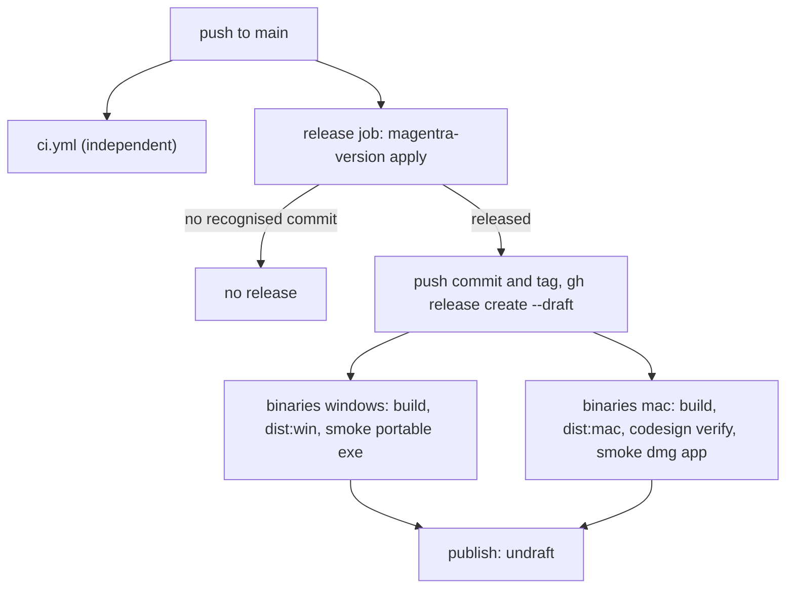

`.github/workflows/release.yml` runs on every push to `main` (and manual dispatch on `main`, never on forks), serialised by a non-cancelling `concurrency: release`. The binaries legs check out the **tag**, not `main`. The release stays a draft until both legs succeed, because a published release with no `latest.yml` would break the update check for every client. Each leg launches what it just packaged with `--smoke`. On Windows that is the portable exe via `Start-Process -Wait`; the NSIS installer is uploaded but never launched. On macOS the leg mounts the dmg and runs `codesign --verify --deep --strict` first. **Retract** a bad release with `gh release edit <tag> --prerelease`, never delete it (see Updates below). The release workflow runs no tests (its version-tool test step is commented out) and does not wait for CI.

`.github/workflows/ci.yml` runs on push to `main` only:

| Job | Runs |
| --- | --- |
| `engine-and-app` (windows, Node 20) | `npm ci`, `npm run build`, `npm run smoke --workspace app` (boots the window from source, no engine) |
| `tests` (windows, Node 22 and 24, bash shell) | `npm run build`, `npm test` teed to a log, a check that the reporter's `tests N` summary is at least **550** (`node --test` passes with zero tests, so this catches a collapsed or undiscovered suite, not one deleted test), then `npm run test:ui` |
| `types` (ubuntu) | `npm run typecheck:version` only |
| `commits`, `next-version` | Dormant: gated on `pull_request`, which is not a trigger |

CI does **not** run `test:llm`, `test:artifacts`, `test:mac`, `test:windows`, `typecheck:tests`, `typecheck:gateway`, gateway freshness, anything on macOS or Linux, or anything on pull requests and other branches. The `tools/version/test` job stays commented out. The version tool is tested instead by `tests/features/version-*.test.ts` inside `npm test`.

### Updates (`docs/adr/0009-updates-have-two-tiers.md`, verified against code)

`app/main/updates.js` decides the tier once, from `installFormat()`:

| Format | Detected by | Tier |
| --- | --- | --- |
| NSIS | `win32` without `PORTABLE_EXECUTABLE_DIR` | self (`electron-updater`, `latest.yml`) |
| portable | `PORTABLE_EXECUTABLE_DIR` set | assisted |
| dmg | `darwin` | assisted (unsigned, so it cannot replace itself) |
| AppImage (writable), deb, tar.gz | Linux branches, kept for self-built copies | self / assisted |
| any unpackaged run | `!app.isPackaged` | none (affordance hidden) |

States: `disabled`, `uptodate`, `available`, `downloading`, `ready`. There is deliberately no error state: an offline check, a refused check and a release missing its channel file all rest at `uptodate`. `initUpdates()` checks 5 s after launch and every 6 h, on unref'd timers, unless `config.json` has `updateCheck: false` (no UI sets it). `autoDownload` is off, so nothing downloads before one click. The self tier then downloads with progress and installs on quit, or immediately via `installNow()`. The assisted tier asks `github.com/…/releases/latest` for JSON (never `api.github.com`, which has a 60-per-hour-per-IP limit), compares with `compareVersions()`, and on click opens `assetName()`'s exact download URL, or the release page when none exists (Intel Mac). State is broadcast to every window (`updates:changed`) and rendered by `app/renderer/modules/updates.js` as the inspector footer plus a dot on the inspector toggle.

### Invariants

- `app/package.json`'s version is the release version. electron-builder names artifacts from it, `app.getVersion()` reports it, and the updater compares it. Only the version tool writes it.
- `assetName()` mirrors `build.*.artifactName`. The opt-in `windows-artifact` and `mac-artifact` tests pin it against a real build; CI does not run them.
- Windows portable is detected by `PORTABLE_EXECUTABLE_DIR`, never by platform. Handing it the NSIS installer installs a second, diverging copy.
- The release is published only after every artifact is attached, and retraction relies on `/releases/latest` skipping prereleases.
- Config keys are additive only (ADR 0009). No migration code exists.

### Traps

- Release and CI are independent workflows. A red CI still releases.
- A commit whose subject doesn't parse is *ignored* by the plan: no bump, no changelog line. The hook is the only guard, and it exists only where `npm install` ran.
- `updates.js` still knows the Linux formats and cites `build.linux.target`, which is gone. ADR 0009's Linux rows predate decision 0014 (its closing *Since* note says so). A self-built Linux copy now resolves to asset names that 404, or a missing `latest-linux.yml`.
- `installTier()`, one-click consent and retraction have gateway records (`update-tier-per-format`, `one-click-no-earlier-download`, `retraction`) with no tests.
- `readConfig()` returns only the keys it knows, so an older build that writes `config.json` drops keys a newer one added.

---

## §16 · Invariants, tripwires and known drift

**The rules that break the whole app when violated, the values written twice where `tsc` cannot compare them, the traps that fail without an error, and the places where comments or docs disagree with the code today.** Read this before any change that crosses a process, a package or the untyped `app/` seam.

### Invariants

Break one and the app breaks in a way that is hard to see. "Guard" names the feature test in `tests/features/` that fails when the rule is broken. "None" means the rule is held only by the code and by this table.

| Invariant | Where it lives | What breaks if you violate it | Guard |
| --- | --- | --- | --- |
| The protocol is the only surface between a frontend and the engine | `engine/protocol/src/types.ts` is the contract. `engine/host/src/serve.ts` speaks it over stdio. `app/main.js` `engineEntryPoint()` and `tui/src/engine/host.ts` spawn the host and import no engine code. | A private reference from a frontend into engine internals makes a second frontend impossible and the seam untestable. | `engine-host`, `wire-round-trip`, `ndjson-resilience` |
| The event queue has one consumer | `Engine.events` in `engine/core/src/runtime/engine.ts` (an `AsyncQueue` from `engine/core/src/util/asyncQueue.ts`), drained by the single `for await` loop in `runServe()` | A second reader does not throw. It silently takes some events and the first reader silently misses them. This is why multi-workspace is a pool of processes, one per workspace. | `single-consumer-events` |
| One live session per folder | `app/main.js`: `openWorkspace()` focuses `tabForWorkspace()` instead of opening a second engine, and `app.requestSingleInstanceLock()` sends a second launch to the first window (skipped for `--smoke`) | Two engines write the same `.magentra/` and the same git tree. | `boots` covers the lock and the smoke bypass. No test opens one folder twice. |
| A tab's dying child exits before its replacement spawns | `app/main.js` `stopEngine()` parks the old child in `tab.dying` (SIGTERM, then SIGKILL after 3 s). `startEngine()` waits for that child's `exit`. | Two engines race over one workspace's state. | `engine-lifecycle` (`proc` + `ui`) |
| Every dangling `tool_use` gets a `tool_result` | `repairToolPairing()` / `syntheticToolResults()` in `engine/core/src/state/transcript.ts`, and the interrupt path in `Session.runTurn()` | The provider rejects the next request, and `/resume` replays the broken pairing forever. | `transcript`, `interrupt` |
| `TAB_ACCESSORS` lists every per-conversation singleton | `app/renderer/modules/tabs.js`: the `[name, get, set, makeDefault]` rows that the tab swap captures and restores | A global left out of the table leaks across tabs, so one workspace's rows appear in another's transcript. | Specific cases only (`every-per-workspace-action-names-its-tab`, `the-sessions-list-follows-the-live-session`). Nothing checks that the table is complete. |
| Chrome updaters do nothing for a non-focused tab | `chromeIsFocused()` in `tabs.js`, called from `util.js`, `stream.js`, `session.js`, `overdrive.js`, `landing.js`, `tasks.js`, `views.js` | A background tab's turn repaints the focused tab's composer, LED, meter or model picker. | `the-sessions-list-follows-the-live-session` (one case) |
| Never add B(t), D(t) and T_turn together | `engine/protocol/src/tokens.ts`. B(t) is `inputTokensOf()` of the latest call. D(t) is the current phase's output. T_turn is `addUsage()` over every call. The renderer copy only displays these values. | The context meter climbs forever, or a cost figure turns out to be a window size. | `one-token-algebra`, `context-accounting`, `usage-normalization` |
| Model-facing defaults have one source, `brain/` | `brain/` compiled by `tools/brain/compile.mjs` into `engine/protocol/src/brain.generated.ts`; read through `brainPrompt()`, `toolDescription()`, `toolParam()`. The `subagent.*` prompts in `engine/core/src/agent/agents.ts` are the one exception. | A literal prompt or `.describe()` text left in code is invisible to the brain and can drift from it; a hand-edited generated module is overwritten by the next build. | `brain-is-the-single-source` |
| Behaviour knobs have one source, `brain/behavior.json` | `BEHAVIOR_SPEC` in `tools/brain/compile.mjs` defines every key (no values); the JSON holds the values; the engine reads them through `Session.behavior` / `activeBehavior()` and never keeps a constant for one. Every override passes `resolveBehavior()`. | A constant left in code beside its knob makes the knob a lie: editing brain changes nothing, or changes half the behaviour. | `brain-controls-behavior` |
| Root sessions offer only the current context's built-in tools | `brain/availability.json` (`main`, `overdrive`), applied by `ToolRegistry.offered()` and the by-name refusal in `Session.executeToolCalls()`. MCP tools and child sessions are exempt. | A withheld tool (Agent and Workflow by default) reaches the model, or a new built-in tool is never offered. | `brain-is-the-single-source` |
| Keys in persisted state are only ever added | `CONTEXT.md` (*Additive-Only State*), `docs/adr/0009-updates-have-two-tiers.md` (*Recovery*) | Going back one version stops being safe. MAGENTRA has no migration machinery, on purpose. | None: this is a convention |
| Drop the graph edge when unsure | `resolveJsSpec()` in `engine/core/src/knowledge/graph.ts` returns `undefined` rather than guess. `docs/adr/0004-the-import-graph-has-two-tiers.md` states the rule for every language. | An invented edge poisons PageRank, the blast radius and every consumer downstream. | `import-graph` |
| The finishing ladder runs in a fixed order | `Session.runTurn()` in `engine/core/src/runtime/session.ts`. The order is: Stop hook → Layer 3 (output cutoff) → Layer 2 (failed tool batch) → Layer 1.5 (open tasks) → runtime evidence → browser check → self-verify → Layer 1 (wrap-up summary). The header of `engine/core/src/runtime/finishing.ts` gives the reason. brain switches rungs and sets their bounds; it cannot reorder them. | With the shipped brain, self-verify runs only under OVERDRIVE. When it gets `DONE` it breaks the loop, so on a turn it verifies, any rung placed after it never runs. | `runtime-evidence-floor`, `web-changes-are-seen-in-a-browser`, `self-verify-rung` (`llm`), `honest-gap-outranks-a-manufactured-green`, `brain-controls-behavior` |
| Every rung has a per-turn bound | Layers 2 and 1 share `nudgeCount` < `finishing.nudgeBudget` (3, range 0..10). Layer 3 has its own streak, `finishing.lengthCutoff.maxStreak` (3 cutoffs in a row, 0..10). Layer 1.5, runtime evidence, browser check and self-verify each have a per-turn counter (`maxNudges` / `maxRounds`, 0..3; shipped 1, and self-verify 0 with 1 in OVERDRIVE). The Stop hook fires once per turn, on a boolean. Every range in `BEHAVIOR_SPEC` is finite. | Every re-fire costs a full-context round trip. On an uncapped root turn, a rung with no bound never terminates. | `brain-controls-behavior` drives the nudge budget, the rung counters, the self-verify rounds and the cutoff streak on real engines. The once-only default is also tested for runtime evidence and the browser check. |

### Mirrored constants

A **mirrored pair** is one value written twice, in two places `tsc` cannot compare. Usually one side is TypeScript under `engine/` and the other is untyped CommonJS under `app/`, which cannot import the engine because the engine ships as a bundled child process. Such a pair agrees on the day it is written and then silently stops agreeing. The only defence is a test that loads both sides and compares them. Each mirror test in the table below does that: the engine side is imported through `@magentra/*` (built `dist/`), and the app side is loaded as the app loads it (`createRequire` for `app/main/config.js`, `node:vm` for the renderer's classic script, the TypeScript parser for `app/main.js`, a live page for the renderer's state).

The seven records in section `Mirrored constants` of `tests/gateway/features/` are also the list the gateway's dependency view reads. `MIRRORED_SECTION` in `tools/magentra-gateway/src/deps.ts` flags any feature whose entry files overlap one of them.

| Value | Engine side | App side | Guarded by |
| --- | --- | --- | --- |
| Image extensions and their media types | `engine/tools/src/read.ts` `IMAGE_TYPES` (what Read sends to the vision endpoint) | `app/main.js` `IMAGE_TYPES` (what the attach picker offers) | `mirror-image-types`: `pure` compares keys and media types, `fs` shows Read refuses exactly these with no vision model, `ui` checks the picker |
| Is this a local or LAN endpoint? (a keyless connection may boot) | `engine/core/src/config/providerFactory.ts` `isLocalBaseUrl()`, used by `engine/host/src/bootstrap.ts` | `app/main/config.js` `isLocalBaseUrl()`, used by `app/main/connection.js` and `hasCredentials()` in `app/main.js` | `mirror-local-endpoint` (`pure` + `fs`) and `local-means-the-lan-in-both-halves` (`pure` + `fs` + `ui`). Both run the two copies over the same hosts and compare the answers. |
| Vision key variable (`MAGENTRA_VISION_API_KEY`) | `engine/core/src/config/settings.ts` `VISION_API_KEY_ENV` | `app/main/config.js` `VISION_API_KEY_ENV` | `mirror-vision-key-env` (`pure`). It also asserts that `DEFAULT_API_KEY_ENV` agrees and that the two names differ. |
| Default OpenAI-compatible base URL | `engine/core/src/config/settings.ts` `DEFAULT_OPENAI_BASE_URL` | `app/main/config.js` `DEFAULT_BASE_URL` | `mirror-default-base-url` (`pure`). It also asserts that each half holds exactly one copy. |
| Reasoning-effort levels and their order | `engine/protocol/src/types.ts` `REASONING_EFFORTS`. `WIRE_EFFORTS` in `engine/providers/src/effort.ts` maps to the wire by index. | `app/main/config.js` `REASONING_EFFORTS`, validated in `app/main/connection.js` | `mirror-reasoning-efforts` (`pure`) |
| Theme names, their order, and the default (the first entry) | none: both copies are in the app | `app/main/config.js` `THEMES` (the pre-paint frame colour) ↔ `app/renderer/modules/state.js` `THEMES` | `mirror-theme-names`. This is `ui` only, so it runs only under `npm run test:ui`. |
| Token estimate and formatting (κ = 3.5) | `engine/protocol/src/tokens.ts` `CHARS_PER_TOKEN`, `estimateTokens()`, `formatTokens()` | `app/renderer/modules/tokens.js` | `mirror-token-algebra` (`pure`, which runs the renderer file in `node:vm`). `one-token-algebra` also scans the source to confirm no surface defines its own algebra. |
| Atomic write-then-rename | `engine/core/src/util/fsAtomic.ts` `writeFileAtomic()` | `app/main/config.js` `writeJsonAtomic()` | `state-files-are-written-atomically` (`fs` + `proc`) |
| Addon slug rule (name → `<slug>.md`) | `validateAddonText()` in `engine/core/src/runtime/engine.ts` | `addonSlug()` in `app/renderer/modules/addons.js` | **Nothing** |

Other deliberate pairs. These are not between the app and the engine, but they have the same property: two places, and no compiler between them.

| Pair | Side A | Side B | Guarded by |
| --- | --- | --- | --- |
| The TUI's copy of the wire protocol | `tui/src/protocol.ts` | `engine/protocol/src/types.ts` | `tui-protocol-parity` (`pure`, uses the compiler API). The `background_notification` arm is excluded by the product owner's decision of 2026-09-20. Every other arm must still match. |
| TUI framing | `tui/src/engine/host.ts` (split on `\n`) | `engine/protocol/src/ndjson.ts` | **Nothing**. `ndjson-resilience` covers only the engine's decoder. |
| Connection writes (`<ws>/.env` and `.magentra/settings.json`) and the default key name | `tui/src/profiles.ts` `applyProfile()`, `DEFAULT_API_KEY_ENV` | `app/main.js` `applyValidatedConnection()`, `app/main/config.js` | `profile-pickup` pins the TUI side to a literal format. No test runs both writers and compares their output. |
| The six kinds | `tests/lib/inventory.ts` `Kind` (a type) | `tools/magentra-gateway/src/schema.ts` `KINDS` | No test. It is loud by construction: a new kind shows up as "no base class for kind x". |
| Kind base-class names | `tools/magentra-gateway/src/tests.ts` `KIND_BY_BASE_CLASS` | the classes in `tests/lib/*Test.ts` | No test. It is loud by construction: a renamed base shows up as "extends an unknown base class", with file and line. |
| Release asset names | `app/main/updates.js` `assetName()` | `build.*.artifactName` in `app/package.json` | `mac-artifact` and `windows-artifact` compare against `app/package.json` (these are opt-in artifact tests). `offline-rests` pins literals (`pure`). |
| The built-in tool names | `tools/brain/compile.mjs` `BUILTIN_TOOLS` (the compiler runs before `tsc` and cannot import the registry) | `engine/tools/src/index.ts` `createDefaultRegistry()` | `brain-is-the-single-source` (the compiler's list equals the registry's names) and `tool-registry-contract` (the 27 names) |
| A params text that states a code value (Monitor's `timeout_ms` default, PushNotification's `message` cap) | `brain/tools/<Name>/params.md` | the constant in `engine/tools/src/<tool>.ts` | `assertToolParamStates()` at module load: the import throws when they disagree |
| The brain file rules | `brain/README.md` | the header comment and parser of `tools/brain/compile.mjs` | The parser is authoritative; `brain-is-the-single-source` round-trips every file. Nothing compares the README's prose. |
| The behaviour checker (validation and merge of a behaviour object, and the problem wording) | `tools/brain/compile.mjs` (`childrenOf`, `leafProblems`, `sectionProblems`, `mergeBehavior`, `crossProblems`, `behaviorProblems`), which runs before `tsc` | `engine/protocol/src/brain.ts` (the same functions, line for line, over the emitted `BRAIN_BEHAVIOR_SPEC`), which validates `EngineOptions.behavior` at run time | `brain-controls-behavior` (`an-override-is-refused-with-the-compilers-own-words-naming-the-dotted-key`: both run over one corpus and must give the same problems in the same words). The spec itself is emitted, so only the code is twinned. |
| The knob table | `BEHAVIOR_SPEC` (ranges, docs) | the key tables in `brain/README.md` | **Nothing** compares the README's tables. |
| Freshness hash (path + content, CRLF folded) | `tools/magentra-gateway/src/freshness.ts` `hashFiles()` | `.claude/skills/bigpicture/bigpicture.mjs` `hashFiles()`, which also drops a `package.json`'s top-level `version` and a gateway record's `freshness` block on purpose | **Nothing** |


### Tripwires: things that break silently

- **A stale or stripped brain.** `engine/protocol/src/brain.generated.ts` is gitignored and written only by `node tools/brain/compile.mjs`; a bare `tsc -b` compiles whatever brain was compiled last. Prompt bodies keep every byte except one trailing newline, so an editor that trims trailing whitespace or drops the final newline changes a prompt (`brain/.editorconfig` and `brain/.gitattributes` exist to stop that).
- **A knob change that prose or UI still contradicts.** `brain/behavior.json` moves behaviour, but text outside the claim check does not follow it. The compiler warns (never fails) only for the phrases in `CLAIMS` (§12). Nothing checks a `where` line, and nothing reaches the frontends' own OVERDRIVE copy: `app/renderer/index.html` (the OVERDRIVE button's title "self-verifying, no caps", the first-use dialog's "Before it ends, it self-verifies…", the deletion-guard glossary line), `app/renderer/modules/tour.js`, `state.js` ("autonomous · nothing asks"), `tui/src/components/TrustGate.tsx` and `tui/src/engine/useEngine.ts`. All of it is true for the shipped brain. Setting OVERDRIVE's self-verify rounds to 0, or a guard to `"refuse"`, makes some of it false, while the engine's own `/overdrive` lines (`overdriveTexts()`) follow the knobs.
- **A stale `engine/*/dist/`.** Every `@magentra/*` package exports `./dist/index.js`. In development, `app/main.js` spawns `engine/host/dist/main.js`, and `tui/src/config.ts` resolves the same file. Every test imports the built packages. `npm run app` (`app/scripts/launch.js`) and `npm test` never build, and `dist/` is gitignored. After changing engine source, run `npm run build`, or you are running the previous build.
- **The untyped `app/` seam.** `tsconfig.json` references `engine/*` and `tui` only. Nothing typechecks `app/`, and frame names are bare string literals on both sides of `app/main.js` ↔ `app/renderer/modules/landing.js`. Renaming a frame in `engine/protocol/src/types.ts` still compiles. Ask `.claude/skills/bigboycoding/blast-radius.mjs` (`untypedAppReach`, `untypedSeam`, `frames`) before you rename.
- **Prompt wording is held by no test.** A rewording of any `brain/prompts/` or `brain/tools/` text, an `order:` change, a core file added or switched off, or a tool schema change in `engine/tools/src/` leaves `npm test` green (`docs/decisions/0016-no-test-holds-prompt-wording.md`). Three word dependencies remain and break for real: `finishing.self-verify` must name the word `isSelfVerifyDone()` accepts (`DONE`), Monitor's `timeout_ms` and PushNotification's `message` texts must state the values `assertToolParamStates()` checks or the engine refuses to load, and a `CLAIMS` phrase reworded away leaves that compiler warning guarding nothing.
- **Gateway freshness hashes path and content.** Each record's stamp digests `path + NUL + content` per entry file, with CRLF folded to LF (`tools/magentra-gateway/src/freshness.ts`). Any of the following makes the record stale, and one stale record marks the whole inventory untrusted: editing a comment or whitespace in an entry file, moving or deleting that file (it hashes as `MISSING`), or reordering `entryFiles`. If you add an entry file without its `fileHashes` entry, or put a non-renderer file on a `deferred` record, the schema rejects the record and the gateway refuses to start.
- **`GraphData.version` in `engine/core/src/knowledge/graph.ts`.** Cached entries are reused whenever a file's mtime and size are unchanged. A fix to import extraction therefore reaches no existing `graph.json` until the version is bumped, and the version appears in three places: the type, `buildGraph()` and `isValidGraph()`.
- **NodeNext specifiers.** Engine source imports `./x.js` for a file that is `x.ts` on disk, so a grep for `x.ts` finds nothing. `tests/` is the opposite: Node's type stripping resolves specifiers literally, so tests import `./x.ts`, and a `.js` specifier there fails at load time. `tools/magentra-gateway/` uses `.js` and runs only under `tsx`.
- **Barrels widen the public surface.** `engine/core/src/index.ts` uses `export *` over 26 modules, and `engine/protocol/src/index.ts` over 6. A new export in any of those modules becomes public API of the package, and the tests and the gateway can reach it. The barrel also hides fan-in: everything reaches `types.ts` through `engine/protocol/src/index.ts`.
- **Gateway dependencies come from neighbours.** `tools/magentra-gateway/package.json` declares no dependencies and is not an npm workspace. `npm run gateway` needs `tsx`, which only `tui/package.json` declares. The gateway needs `zod`, which only `engine/core` and `engine/tools` declare. Remove either package from those manifests and the gateway stops starting.

### Known drift

Each item below was checked against the working tree on 2026-09-28 (the brain/ and Monitor rows on 2026-10-02, the behaviour-knob rows on 2026-10-03). None of them changes behaviour. They change what a reader believes about the behaviour.

| Where | Drift |
| --- | --- |
| `engine/core/src/config/providerFactory.ts`, `app/main/config.js` (`isLocalBaseUrl`, `REASONING_EFFORTS`) | The comments say "NOTHING ASSERTS THE PARITY RIGHT NOW … TODO(tests)". `mirror-local-endpoint`, `local-means-the-lan-in-both-halves` and `mirror-reasoning-efforts` assert it. |
| `FEATURES.md` | The file says "every box in this file is empty", and all its boxes are still unticked. The gateway derives 141 of 178 records as covered. The *Local means the LAN* entry still says nothing asserts the parity. `docs/decisions/0001-the-gateway-is-the-inventory.md` says `FEATURES.md` is generated from the registry, but nothing generates it. |
| `tests/gateway/features/interactive-turns-run-uncapped.json` | The invariant promises "unlimited signal-driven recovery nudges (failed batch, length cutoff, open tasks)". The code bounds all three: `finishing.nudgeBudget`, `finishing.lengthCutoff.maxStreak`, and the `finishing.incompleteTasks.maxNudges` counter, each with a finite range. The record has no test, so nothing has caught this. |
| `tests/README.md` | It says 164 records, "86 of 165 covered" and 9 deferred. Today there are 178 records, 141 covered and 13 deferred. Its tree omits `lib/llmUsageReporter.mjs` and `gateway/descriptions/`. It calls the CI test job commented out on Node 20, but `.github/workflows/ci.yml` runs a live `tests` job on Windows under Node 22 and 24. Rule 6 says a stale record means "no test runs", but `npm test` never reads freshness: stale is a gateway verdict (`tools/magentra-gateway/src/gate.ts`). |
| `docs/decisions/0006-the-gateway-does-not-run-or-brief.md` | This file is cited by `docs/decisions/README.md`, `SPEC.md`, 0007, 0009, `gate.ts`, `tests.ts`, `server.ts`, `ui/app.js`, `ci.yml` and `tests/README.md`. It does not exist, and no commit has ever held it. |
| `engine/host/src/main.ts` | The header says the desktop app "is its only frontend". `tui/` spawns the same host (`tui/src/config.ts`). |
| `app/renderer/modules/landing.js`, `events.js` | `landing.js` announces itself as the startup landing page, but it holds `handleEngineEvent()` and every `on*` engine-event handler. `events.js` opens with an "Engine event handlers" banner that has no handlers under it (the file holds the changes panel and the failure banner). |
| `brain/tools/TaskOutput/description.md`, `brain/tools/TaskStop/description.md`, `brain/prompts/3-in-turn-reminders/reminder.stall-ask.md` | With Agent withheld from root sessions by default, the TaskOutput and TaskStop descriptions still mention a background Agent, and `reminder.stall-ask` still says "(you are a subagent)". They are pinned bytes, recorded in `brain/README.md` as residuals for a person to reword. |
| `brain/prompts/3-in-turn-reminders/reminder.monitor-noise-stop.md`, `engine/tools/src/monitor.ts` | The noise-stop `<task-notification>` sends the literal text `{{noiseLimit}}` and `{{noiseWindowSec}}`. The pre-brain literal never filled them, and `monitor.ts` still fills only `{{id}}`, on purpose: filling them changes what the model receives, which is a separate approved change. |
| `tui/src/profiles.ts` | It writes `.magentra/settings.json` and `.env` with plain `writeFileSync`. That is outside the write-then-rename rule, even though `state-files-are-written-atomically` names `settings.json`. |

---

## §17 · Concept → file index

**Where each concept lives, across the engine, the desktop app, the terminal UI, the tests, the tools and the docs.** Start from the concept, open the file, then read the named symbol rather than skimming. Line numbers live in the generated `docs/big-picture/MAP.md`, never here.

### Engine: `engine/*`

| If you are looking for… | Go to |
| --- | --- |
| Every event and request shape, `PROTOCOL_VERSION`, `REASONING_EFFORTS` | `engine/protocol/src/types.ts` |
| NDJSON framing: `encodeFrame()`, `decodeFrames()` | `engine/protocol/src/ndjson.ts` |
| The token algebra: B(t), D(t), T_turn, `estimateTokens()`, `formatTokens()` | `engine/protocol/src/tokens.ts` |
| The text of any prompt, tool description or parameter description; which tools a root session offers; the order of the core system-prompt sections | `brain/` (`brain/README.md`): `prompts/<group-dir>/<id>.md` (`order:` in `1-core-system`), `tools/<Name>/`, `availability.json` |
| A behaviour knob's value: rung budgets and switches, stall thresholds, clarify limits, compaction tail, default output bytes, the evidence word lists, OVERDRIVE overrides, snapshot and guards | `brain/behavior.json`; each key's type, range and doc in `BEHAVIOR_SPEC` (`tools/brain/compile.mjs`); the claim check in `CLAIMS` there |
| Editing the brain safely, by hand or by an agent: the page, the change vocabulary, staged planning, the engine check, profile folders | `tools/brain-editor/` (`README.md`): `src/model.ts` (`loadBrain`, `planChanges`, `applyChanges`, `newProfile`), `src/guide.ts` (`CHANGE_GUIDE`), `src/engine.ts` + `src/probe.mjs`, `src/ui/` |
| Compiling brain/ into the engine | `tools/brain/compile.mjs` → `engine/protocol/src/brain.generated.ts` (gitignored) |
| The prompt registry, `brainPrompt()`, `promptDefault()`, `renderPromptIfEnabled()`, `coreSectionOrder()`, `~/.magentra/prompts/<id>.txt` overrides, `promptCatalog()` | `engine/protocol/src/prompts.ts` |
| `toolDescription()`, `toolParam()`, tool availability (`resolveToolAvailability()`, `isToolOffered()`, `toolAvailabilityWith()`); behaviour (`resolveBehavior()`, `effectiveBehavior()`, `behaviorWith()`, `behaviorProblems()`, `BehaviorOverride`) | `engine/protocol/src/brain.ts` |
| Product name, CLI name, the `.magentra` state-dir name | `engine/protocol/src/branding.ts` |
| Host process entry, and boot failures reported in-band | `engine/host/src/main.ts` |
| Settings → provider → `Engine`, and the keyless-local boot check | `engine/host/src/bootstrap.ts` |
| The stdio server loop, interrupt on EOF, shutdown | `engine/host/src/serve.ts` `runServe()` |
| The `.env` loader (a real env var always wins) | `engine/host/src/env.ts` |
| Request dispatch, slash commands, addon install and export, session list / resume / rename / archive, live model and connection swap | `engine/core/src/runtime/engine.ts` `Engine.send()` |
| What the engine says OVERDRIVE does (the `/overdrive on` and `off` lines, the `/overdrive` description) | `engine.ts` `overdriveTexts()`, `slashCommands()` |
| The turn loop and every finishing rung; the knobs in force (`Session.behavior`, `activeBehavior()`) | `engine/core/src/runtime/session.ts` `runTurn()` |
| Compaction, subagent spawn, image description, the clarify round | `session.ts` `maybeCompact()`, `spawnAgent()`, `describeImage()`, `maybeClarify()` |
| Finishing-rung predicates and the evidence detectors built from `evidence.*` (their prose is in `brain/prompts/4-end-of-turn-rungs/`) | `engine/core/src/runtime/finishing.ts` |
| Permission resolution, stances, the deletion guard, the OVERDRIVE guards (`overdrive.guards.*`), grant shapes | `engine/core/src/runtime/permissions.ts` |
| The read-before-write freshness store | `engine/core/src/runtime/fileState.ts` |
| Per-session token and cost stats behind `session_report` | `engine/core/src/runtime/sessionStats.ts` |
| The settings schema (the source of truth), key resolution, the vision key | `engine/core/src/config/settings.ts` |
| Turning settings into a Provider, `isLocalBaseUrl()` | `engine/core/src/config/providerFactory.ts` |
| The rate card behind cost estimates | `engine/core/src/config/pricing.ts` |
| System-prompt assembly (`SECTION_*`, `behaviorCore()`, `buildSystemPrompt()`, in `coreSectionOrder()`); the section texts and their `order:` are in `brain/prompts/1-core-system/` | `engine/core/src/agent/prompts.ts` |
| Addons: loader, built-ins | `engine/core/src/agent/addons.ts`, `engine/core/src/agent/builtinAddons.ts` |
| Hooks, subagent types (and the `subagent.*` prompts, the one exception to brain/), the tool base and `ToolRegistry.offered()` | `engine/core/src/agent/hooks.ts`, `agents.ts`, `tool.ts` |
| The import graph, PageRank, blast radius, `GraphData.version` | `engine/core/src/knowledge/graph.ts` |
| Symbols, request → seeds, the reuse reminder, `STANDARDS.md`, document text extraction | `engine/core/src/knowledge/symbols.ts`, `seeds.ts`, `reuseGate.ts`, `standards.ts`, `docs.ts` |
| Transcript JSONL and tool-pairing repair; the task store | `engine/core/src/state/transcript.ts`, `engine/core/src/state/taskStore.ts` |
| Background jobs, cron, the workflow runner | `engine/core/src/scheduling/background.ts`, `cron.ts`, `workflow.ts` |
| The MCP client | `engine/core/src/integrations/mcp.ts` |
| Atomic writes; the single-consumer queue | `engine/core/src/util/fsAtomic.ts`, `engine/core/src/util/asyncQueue.ts` |
| What `@magentra/core` exports | `engine/core/src/index.ts` (a barrel) |
| The OpenAI-compatible adapter (image parts, `cached_tokens`) | `engine/providers/src/openai-compat.ts` |
| Anthropic, Ollama, the effort ladder, `<think>` parsing, retry | `engine/providers/src/anthropic.ts`, `ollama.ts`, `effort.ts`, `think.ts`, `retry.ts` |
| The scripted provider every test runs on | `engine/providers/src/fake.ts` `FakeProvider` |
| The tool registration list | `engine/tools/src/index.ts` `createDefaultRegistry()` (one file per tool beside it) |

### Desktop app: `app/`

| If you are looking for… | Go to |
| --- | --- |
| The engine pool, tab routing, IPC handlers, attachments, applying a connection | `app/main.js` (`startEngine()`, `stopEngine()`, `openWorkspace()`, `applyValidatedConnection()`) |
| The bridge the renderer sees as `window.magentra` | `app/preload.js` |
| App config, themes, the app halves of the mirrored constants, `writeJsonAtomic()` | `app/main/config.js` |
| Profiles and the vision pointer | `app/main/profiles.js` |
| Connection validation, endpoint discovery, writing `.env` | `app/main/connection.js` |
| The two update tiers | `app/main/updates.js`, `app/renderer/modules/updates.js` |
| The redacted session log | `app/main/logging.js` |
| Undoing a file from the changes panel | `app/main/changes.js` |
| Renderer script order (classic scripts, one global scope) | `app/renderer/index.html` |
| TabState, `TAB_ACCESSORS`, `chromeIsFocused()`, tiling | `app/renderer/modules/tabs.js` |
| The event switch and every engine-event handler | `app/renderer/modules/landing.js` `handleEngineEvent()` |
| Transcript rendering, tool rows, progressive Markdown | `app/renderer/modules/stream.js` |
| The changes panel and the engine failure banner | `app/renderer/modules/events.js` |
| Attachments, the send path, the `engine:event` listener | `app/renderer/modules/composer.js` |
| The connection wizard | `app/renderer/modules/setup.js` |
| The renderer's token-algebra copy; UI settings and `THEMES` | `app/renderer/modules/tokens.js`, `app/renderer/modules/state.js` |
| Markdown and LaTeX → MathML | `app/renderer/modules/markdown.js`, `app/renderer/modules/math.js` |
| Bundling the engine and ripgrep; building installers; the dev launcher | `app/scripts/bundle-engine.js`, `app/scripts/dist.js`, `app/scripts/launch.js` |
| electron-builder config and artifact names | `app/package.json` (`build`) |

### Terminal UI: `tui/`

| If you are looking for… | Go to |
| --- | --- |
| Entry point and flags; the root component | `tui/src/cli.tsx`, `tui/src/app.tsx` |
| Where the engine binary is resolved | `tui/src/config.ts` `resolveEngineSpawn()` |
| Spawning the host and reading its frames | `tui/src/engine/host.ts`, `tui/src/engine/useEngine.ts` |
| The TUI's copy of the protocol | `tui/src/protocol.ts` |
| Profiles and connecting a folder; folder trust | `tui/src/profiles.ts`, `tui/src/trust.ts` |

### Tests, tools and docs

| If you are looking for… | Go to |
| --- | --- |
| How the suite works, and its rules | `tests/README.md` |
| The test base, the registrar, opt-in selection by script name | `tests/lib/featureTest.ts` |
| The six kind bases | `tests/lib/pureTest.ts`, `fsTest.ts`, `procTest.ts`, `netTest.ts`, `llmTest.ts`, `uiTest.ts` |
| A real engine on the scripted provider, in-process or as a child (`behavior` changes a knob for one engine) | `tests/lib/scriptedEngine.ts`, `tests/lib/engineHarness.ts` |
| One tool, run as the Session runs it | `tests/lib/directTool.ts` |
| Driving the real desktop app | `tests/lib/appHarness.cjs`, `tests/lib/appDriver.ts` |
| One feature's tests | `tests/features/<feature-id>.test.ts` |
| The brain's tests; the behaviour knobs' tests | `tests/features/brain-is-the-single-source.test.ts`; `tests/features/brain-controls-behavior.test.ts` |
| Feature records and descriptions | `tests/gateway/features/<id>.json`, `tests/gateway/descriptions/` |
| The gateway: record schema, freshness, gate, test discovery, HTTP | `tools/magentra-gateway/src/schema.ts`, `freshness.ts`, `gate.ts`, `tests.ts`, `server.ts` |
| Version planning, changelog, sync; the commit hook | `tools/version/bin/magentra-version.mjs`, `tools/version/lib/`, `version.config.json`, `.githooks/commit-msg` |
| Blast radius before an edit; doc freshness after it | `.claude/skills/bigboycoding/blast-radius.mjs`, `.claude/skills/bigpicture/bigpicture.mjs` |
| CI: build, app smoke, the feature suite | `.github/workflows/ci.yml` |
| Working rules for coding agents: commands, gates, what not to touch | `AGENTS.md` |
| The generated per-file index: exports, members with line numbers | `docs/big-picture/MAP.md` |
| The ubiquitous language | `CONTEXT.md` |
| Why a product decision was made | `docs/adr/` |
| Why the gateway and the suite are built this way | `docs/decisions/` (read `SPEC.md` first) |
| The feature backlog as prose | `FEATURES.md` (coverage is read from the gateway, not from here) |
| How the version is decided | `VERSIONING.md`, `docs/adr/0008-the-version-is-semver.md` |

### The files that explain the most per line

1. `engine/protocol/src/types.ts`: the whole contract between every frontend and the engine.
2. `engine/core/src/runtime/session.ts` `runTurn()`: the agent's entire behaviour, including the order of the finishing ladder and where each bound is read (§16). The bound values are in `brain/behavior.json`.
3. `engine/core/src/config/settings.ts`: every knob, each with a comment saying why it exists.
4. `engine/protocol/src/tokens.ts`: the header defines the three token quantities that must never be confused.
5. `app/renderer/modules/tabs.js`: its header and `TAB_ACCESSORS` are, with §13, the written account of the multi-tab design.
6. `tests/README.md`: what a test must be, how kinds and opt-in scripts select, and what the suite forbids.
7. `CONTEXT.md`: the glossary. It is short, and it names the concepts the code assumes you already hold.

---

## §18 · The TUI

**`tui/` is a second frontend: an ink/React terminal client that spawns the same engine host as the desktop app and speaks the same NDJSON protocol over its stdio. It imports nothing from `engine/`. It ships inside the desktop artifacts as `resources/engine/tui.mjs` and runs through Electron's own Node. `tsc -b` typechecks it, but most of its behaviour-level invariants have no test.**

### Shape

| File | Role |
| --- | --- |
| `tui/src/cli.tsx` | Entry: argv, workspace choice, GUI handoff, `render(<App/>)` |
| `tui/src/config.ts` | Where the engine comes from (`isPackagedRun()`, `resolveEngineSpawn()`, `loadConfig()`) |
| `tui/src/engine/host.ts` | `startHost()`: spawn, NDJSON framing, stderr lines, stdin-EOF shutdown |
| `tui/src/engine/useEngine.ts` | The only file that knows a protocol exists: events to transcript `Line`s, send-side verbs, boot order, paint coalescing |
| `tui/src/protocol.ts` | A hand-copied **subset** of `engine/protocol/src/types.ts` (`PROTOCOL_VERSION = 1`) |
| `tui/src/trust.ts`, `tui/src/profiles.ts` | Folder trust; the read-only profile store plus committing a profile to a workspace |
| `tui/src/markdown.ts` | The layout core: one Markdown line plus a width gives the exact rows to print, measured in display cells |
| `tui/src/app.tsx`, `components/*.tsx` | `<Static>` transcript plus the live region: `LiveLine`, `Activity`, `ToolTail`, `TaskStrip`, `TrustGate`, `ProfilePicker`, `SessionPicker`, `Prompt`, `Composer`, `CommandPalette` |

### Entry and dispatch: `cli.tsx`

`magentra [path] [--resume [id]] [--gui]`. The workspace is the positional path (which must exist), otherwise the launch directory. `INIT_CWD` is honoured only in dev (`npm start --workspace tui` runs `tsx src/cli.tsx` after npm has changed directory). In a packaged run it is ignored, because an inherited stale value would open the wrong tree.

If it is a packaged run and there is `--gui` or no interactive stdin+stdout, the TUI hands off to the desktop binary. It spawns `MAGENTRA.exe` beside `magentra-cli.exe` on Windows, the sibling `magentra` wrapper on Linux, and `process.execPath` otherwise, detached, with `ELECTRON_RUN_AS_NODE` removed and no argv, then exits 0 before ink renders. This covers the case the Windows `.cmd` shim cannot test for; the shell launchers test for a TTY before Node starts (§15). Because `cli.tsx` imports `App` statically, even the handoff path loads the whole bundle.

### Where the engine comes from: `config.ts`

- **Packaged:** a sibling `engine.cjs` next to the running `tui.mjs` is the whole test (`isPackagedRun()`). It spawns `process.execPath engine.cjs --cwd <ws>` with `ELECTRON_RUN_AS_NODE=1`, the same pattern as `engineEntryPoint()` in `app/main.js`. No system Node is needed.
- **Dev:** `~/.magentra-tui.json` holds one key, `engineHome`, a MAGENTRA checkout. On first run it is created with a guess: the repo that contains this `tui/`. The spawn is system `node <engineHome>/engine/host/dist/main.js --cwd <ws>`. A missing build is fatal, with text naming the file to fix. That file must never hold connection settings; those belong to the engine's layered settings.

`startHost()` spawns with `cwd` = the workspace, like the desktop. It skips blank lines, strips a trailing `\r`, turns an unparseable line into a non-fatal `error` event, and shuts down by ending stdin, with `kill()` after 1.5 s as a backstop.

### Boot order

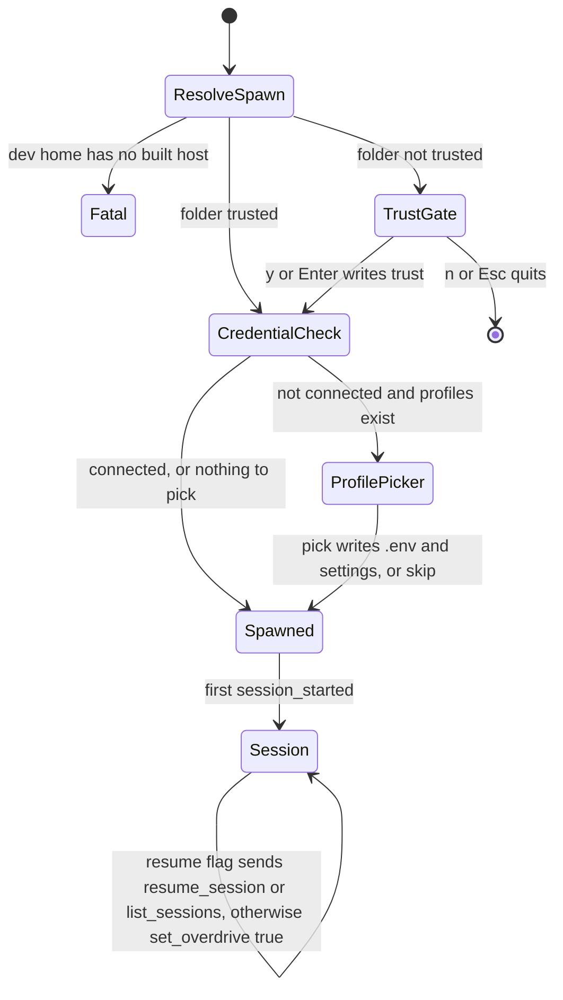

**Trust** (`trust.ts`). The record is global, `~/.magentra/trusted-folders.json` (mode 0600), never a marker in the folder, because the folder being judged could ship one. `isTrusted()` is true for the folder or any trusted ancestor, matched on path **segments** (`f + sep` prefix), so `/home/me/work` never trusts `/home/me/workspace`. It compares case-insensitively on Windows. Until the gate is answered nothing is spawned and nothing is written. The gate comes before the profile picker because writing a key into `<ws>/.env` is itself an act of trust.

**Credentials** (`profiles.ts`). `workspaceConnected()` is true if a key variable is set in the environment, `.env` has any `*API_KEY=` line, or `.magentra/settings.json` names a provider, base URL, model or key. Otherwise saved profiles from `~/.magentra/profiles.json` are offered. `applyProfile()` writes the key to `.env` (skipped for keyless endpoints, retired `DEEPINFRA_API_KEY` dropped) and merges provider (spelled `openai-compatible`), `baseUrl`, `model`, `contextWindow`, `reasoningEffort` and `allowInsecureTls` into settings, deleting `apiKeyEnv`.

**Stance.** On the first `session_started` of a session the TUI started fresh, it sends `set_overdrive: true` once, if the folder is trusted and the engine reports OVERDRIVE off. A `--resume` session is left alone, because the engine restores the stance its transcript recorded. `/clear` re-emits `session_started` and doesn't re-trigger resume or the default. A `session_started` whose `v` differs from `PROTOCOL_VERSION` commits a visible error line.

### Rendering

- **Two regions.** Committed lines go into ink's `<Static>` and are printed once, then owned by terminal scrollback. The live region (streaming prose, activity, tail, tasks, prompts, composer) is the only thing that repaints. Every committed line must therefore be final: a tool call commits one row when it **finishes**, and a burst of consecutive same-verb calls is held in `pendingToolRun` and committed as `verb ×N`, because a `<Static>` line cannot be edited after it prints. Thinking text is never shown; a finished block commits one `◌ thought` row with its duration.
- **Layout in cells.** `<Static>` lays its children out as content-sized boxes, so `flexGrow` never reaches the right edge and wrapped continuations drift. `markdown.ts` owns the arithmetic: `displayWidth()` (wide CJK and emoji count as 2, combining marks as 0), `inlineSpans()` before `wrapSpans()` so a bold phrase stays bold across a wrap, and `layoutLine()`. `TranscriptLine.tsx` right-aligns metric columns by hand from `width`, which `app.tsx` reads from `stdout.columns` and threads down.
- **No reflow.** `LiveLine.tsx` lays the streaming text out with the same `layoutLine()` at the same width as the committed line, so a paragraph has its final shape while it streams (only its last `maxRows` rows render).
- **Paint coalescing.** Ink's legacy React root doesn't batch updates that arrive from stdout, so one `setState` per `text_delta` meant one render and one repaint per delta. Deltas and committed lines accumulate in refs and flush through `schedulePaint()`, a leading-edge throttle with `PAINT_MS = 33`: an idle stream paints the first token immediately, and only a stream that already painted within the frame waits. A `painting` guard stops a drain from re-entering itself.

### Input

A single-line `/…` is a command. The TUI itself handles `/model` (lists `model_catalog`, switches with `set_model`), `/exit`/`/quit`, bare `/overdrive` (toggle), bare `/resume` (session picker) and `/clear` (forwarded; the repaint waits for the new `session_started`). Everything else, including addons, goes to the engine as `slash_command`. The palette lists `LOCAL_COMMANDS` plus the engine's registry. Plain text sends `user_message`, or `steer_message` while a turn runs. The composer never locks. Ctrl+C shuts the host down and exits. The trust gate, profile picker, session picker and permission/question prompts each take the keyboard while they are open.

### One engine, two frontends

The TUI and the desktop app spawn the same `engine.cjs` (packaged) or `engine/host/dist/main.js` (dev), in the workspace directory, and read and write the same workspace files. Neither frontend knows the other is running. The differences are deliberate or incidental, and changing one side does not change the other:

| | Desktop (§14) | TUI |
| --- | --- | --- |
| Engines | one per tab, at most 4 | one |
| Args and env | `--serve --cwd`; `.env` keys over the environment; `MAGENTRA_MODEL` | `--cwd`; inherited environment (`--serve` is accepted and ignored by `engine/host/src/main.ts`) |
| Before spawn | `hasCredentials()` in engine order; otherwise the setup wizard | trust gate, then the looser `workspaceConnected()`; otherwise the profile picker |
| Stance at session start | re-sends the saved deletion guard, OVERDRIVE and compact limit | OVERDRIVE on for a fresh session in a trusted folder |
| Applying a profile | `applyValidatedConnection()`: vision endpoint and key, global-layer cleanup, atomic writes, live `set_connection` | `applyProfile()`: no vision fields, no global-layer cleanup, plain `writeFileSync`, only before spawn |
| Protocol version | not checked | error line on mismatch |
| Logs, Changes, attachments, addon wizard | yes | none |

### What is tested

Covered by `npm test`: `tui-protocol-parity` (compares `protocol.ts` with the engine's types arm by arm, excluding `background_notification`'s payload by decision), `packaged-boot` (`config.ts` resolution plus a real spawn), `tty-dispatch` (the handoff, run from a sandboxed copy of the built `tui/dist/`), `workspace-resume-args`, `profile-pickup`.

No test covers any of these (the backlog table in `.claude/skills/bigboycoding/SKILL.md` still matches the code):
- The display-cell layout and right alignment (`displayWidth`, `wrapSpans`, `layoutLine`).
- The no-reflow rule shared by `LiveLine` and `TranscriptLine`.
- Trust's global, inherited, segment-matched rule (tests only pre-trust a folder).
- The paint throttle, the tool-run merge, the OVERDRIVE default and the protocol-version warning.
- The interactive TTY branch (Windows can't provide one to an automated test).

### Invariants

- The TUI never imports engine code. Every frame shape it reads must exist in `engine/protocol/src/types.ts` (`tui-protocol-parity`).
- Nothing is spawned or written in an untrusted folder.
- Lines pushed to `<Static>` are final; anything that may still change stays in the live region or a holding ref.
- Live and committed text go through `layoutLine()` at the same width.

### Traps

- `tui.mjs` is bundled from `tui/src` source, but it spawns whatever engine sits beside it. In dev that is `engineHome`'s `dist/`, which only `npm run build` refreshes.
- `useEngine.ts`, `profiles.ts` and `protocol.ts` duplicate desktop and engine behaviour by hand. A change to `applyValidatedConnection()`, the settings schema or an event shape compiles cleanly and diverges silently. Only `tui-protocol-parity` and `profile-pickup` would notice, and only for what they assert.
- `profiles.ts` claims its writes are identical to the IDE's. They are not for vision fields, global-layer keys or a default `baseUrl`.
- A new engine event is ignored by the `default:` arm, which is by design, but a desktop-only event silently has no terminal rendering.

---

## §19 · The feature suite and the gateway

**Every test lives in `tests/`, one file per feature, and every feature has a committed record in `tests/gateway/features/` that says what the feature promises, which files implement it, and which tests prove it.** The gateway (`tools/magentra-gateway/`) reads the records and the test files and decides whether the inventory can be believed. It never runs a test, and the suite never imports the gateway. `tests/README.md` is the authority on the suite and `docs/decisions/SPEC.md` is the authority on the gateway. This section is the map to both.

### Why it is built this way

On 2026-09-09 the previous suite was deleted. `FEATURES.md` had ticked boxes whose tests either did not exist or asserted nothing (`docs/decisions/0001-the-gateway-is-the-inventory.md`). Everything here is designed against that one failure: a green result with nothing behind it. So the inventory comes first, a record's status is derived from the test files and never typed in by hand, the base class counts assertions, and approval steps belong to a person.

### The suite: `tests/`

- **One file per feature.** A feature's tests live in `tests/features/<feature-id>.test.ts`. At 0.20.2 there are 143 files and 646 registered tests: 240 `fs`, 197 `pure`, 80 `proc`, 75 `ui`, 27 `net`, 27 `llm`. Recount with the gateway's startup banner rather than trusting these figures.
- **A test is a class.** It extends a kind base and is passed to `registerFeatureTests()` in `tests/lib/featureTest.ts`. It must declare `featureId`, `id`, `kind`, `whyItExists` (the failure it would have caught) and the record's `invariant`, copied verbatim. It may also declare `artifact`, `platform` or `desktop`.
- **What the base enforces, in code rather than by convention:**
  - `run()` receives a narrowed `TestRun` with no `skip`, `todo` or `plan`.
  - `t.assert` is counted, and a test that asserts nothing fails.
  - The test's kind must be one the record declares, its invariant must match the record's, and its id must appear in the record's `tests` array.
- **Tests run TypeScript directly.** Node's type stripping (Node ≥ 22.18) runs them with no build step, which is why imports inside `tests/` end in `.ts`. `tests/tsconfig.json` is checked only by `npm run typecheck:tests`. That check is not part of `tsc -b` and not part of CI.

Tests inherit on **kind**, not on area. The kind decides setup, teardown, and whether the test can run at all (`docs/decisions/0004-tests-inherit-on-kind.md`):

| Kind | Base | What the base owns |
| --- | --- | --- |
| `pure` | `tests/lib/pureTest.ts` | It snapshots the environment and the working directory, and fails a test that leaks either one. |
| `fs` | `tests/lib/fsTest.ts` | A temp workspace, with `HOME` and `USERPROFILE` both redirected. |
| `proc` | `tests/lib/procTest.ts` | It spawns a real process into its own group and kills the whole tree on teardown (`childProcesses.ts`). A survivor fails the test. |
| `net` | `tests/lib/netTest.ts` | A real server on 127.0.0.1 (`localServer.ts`), closed afterwards. |
| `llm` | `tests/lib/llmTest.ts` | A real model on the connection this folder names. It throws when there is none. |
| `ui` | `tests/lib/uiTest.ts` | The real desktop app under Electron (`appHarness.cjs` hosts `app/main.js` unchanged), driven over a loopback socket passed in `MAGENTRA_HARNESS_PORT`. Electron's main process has no usable stdin on Windows, which is why a socket is used. |

**The doubles are scripts, never mocks.** The model is the only thing replaced. `FakeProvider` (`engine/providers/src/fake.ts`) plays back scripted turns. `tests/lib/scriptedEngine.ts` runs the real `Engine` in-process on it, offering what `brain/availability.json` ships unless the test passes `toolAvailability` (a test that scripts an `Agent` call opts it back in with `toolAvailabilityWith("Agent")`). `tests/lib/engineHarness.ts` runs the real host loop (`runServe`) around a real `Engine` in a child process, and reports only what it observes, as `type: "harness"` lines. The one other script is `tests/lib/scriptedFetch.ts`. It exists for the connection wizard, whose `testEndpoint` takes `fetchImpl` as a parameter. A behaviour that belongs to the model itself is the `llm` kind's job, and no scripted test may claim it.

### Selecting what runs: the script name is the switch

Build first. The tests import `engine/*/dist/` and no test script builds it. The opt-in flag is the npm **script name**, which the registrar reads from `npm_lifecycle_event`. The reason is Windows: npm runs scripts through `cmd.exe`, where `VAR=1 node …` is not an assignment. The environment variables (`MAGENTRA_UI_TESTS`, `MAGENTRA_LLM_TESTS`, `MAGENTRA_MAC_TESTS`, `MAGENTRA_WINDOWS_TESTS`, `MAGENTRA_ARTIFACT_TESTS`) remain the underlying contract for bare `node --test`.

| Script | Runs | Direction | Why |
| --- | --- | --- | --- |
| `npm test` | Every test except those that open the app (`desktop ?? kind === "ui"`), `llm` tests and artifact tests | the base run | |
| `npm run test:ui` | Only the tests that launch the desktop app | subtractive | `docs/decisions/0011-ui-tests-are-opt-in.md` |
| `npm run test:llm` | Only the `llm` kind, plus a per-feature token bill (`tests/lib/llmUsageReporter.mjs`) | subtractive | `docs/decisions/0009-real-model-tests-are-opt-in.md`, `docs/decisions/0013-a-test-llm-run-is-the-llm-kind-alone.md` |
| `npm run test:mac`, `npm run test:windows` | Only tests whose `platform` names that OS. Implies artifacts. On any other OS they are withheld and name the OS they need. | subtractive | `docs/decisions/0012-os-tests-are-selected-by-subject.md` |
| `npm run test:artifacts` | The ordinary run plus the tests that build and launch a real installer | additive | `docs/decisions/0010-packaged-artifact-tests-are-opt-in.md` |

A withheld test is still registered, with `{ skip }` and a reason that includes the command that runs it. A test is never left unregistered, because `node:test` reports a file that registers nothing as one passing test. Asking for `ui` and `llm` together is an error, not an empty green. `--test-concurrency=1` is load-bearing: it guarantees one Electron at a time. The `platform` tag selects a test and never excuses it: every test still runs on every OS and asserts that OS's truth.

**No approved artifacts.** `tests/approved/`, its printers and `npm run approve` were removed on 2026-10-04 (`docs/decisions/0016-no-test-holds-prompt-wording.md`, superseding 0015). A test that needs a prompt's text reads it from brain (`promptDefault`, `promptText`, `renderPrompt`, the engine's builders), never as a literal.

**CI.** The `tests` job in `.github/workflows/ci.yml` runs on `windows-latest` under Node 22 and 24. It builds, runs `npm test`, fails if fewer than 550 tests register (because `node --test` exits 0 on an empty discovery), and then runs `npm run test:ui`.

### The gateway: `tools/magentra-gateway/`

`npm run gateway` starts `tsx tools/magentra-gateway/src/cli.ts` and serves `http://127.0.0.1:4320`. It accepts `--port`, `--host` and `--no-open`. It uses `node:http` and binds to loopback only. It has no build step, so it starts even when `npm run build` is broken (`docs/decisions/0002-the-gateway-is-typescript-in-process.md`).

**Records.** Each record is `tests/gateway/features/<id>.json`, validated by the strict schema in `tools/magentra-gateway/src/schema.ts`:

| Field | Meaning |
| --- | --- |
| `id`, `name`, `area`, `section`, `prose` | Identity. `prose` is kept verbatim from `FEATURES.md`. |
| `kinds` | The kinds needed to prove the feature. A claim about the proof, checked against each test's base class. |
| `entryFiles` | The files that implement the feature. They are hashed for freshness, and their order is part of the hash. |
| `invariant` | The one sentence every test for this feature must repeat verbatim. |
| `deferred` | Set by rule, not opinion: true exactly when every entry file is under `app/renderer/`. A deferred feature needs no test, but may still have one (`docs/decisions/0008-a-deferred-feature-may-still-be-proven.md`). |
| `tests` | The test ids in the feature's file. `tests.ts` `driftOf()` reports it when this list disagrees with the file. |
| `freshness` | `hash` (the rollup), `fileHashes` (one per entry file), `recordedAt`. |

`status` is never stored. A record that carries one fails to load. Status is derived from the parsed test files (`docs/decisions/0007-tests-are-discovered-not-declared.md`):

- `untested`: no registered test.
- `partial`: tests exist, but not one for every declared kind.
- `covered`: one test per declared kind.

`tools/magentra-gateway/src/tests.ts` reads `tests/features/` with the TypeScript parser. It never imports or runs a test file. A class it cannot read statically, a class that is never registered, or a file named for the wrong feature each becomes a named problem, never a silent omission. At 0.20.2 there are 178 records: 141 covered (including all 13 deferred ones), 2 partial, and 35 with no test file yet. There are no discovery problems.

Records are committed JSON. The UI does not create or edit them (`POST /api/features` answers 501). A malformed record, for example an entry file without its per-file hash, stops the gateway at startup, naming the file.

**Descriptions** are the specification a coding agent acts on (SPEC §2.2).

- A description is `tests/gateway/descriptions/<uuid>.json` while it is a `draft`, and moves to `tests/gateway/descriptions/ready/` once it is `ready`, so the folder a file sits in is its status.
- Saving a description never changes its status. `draft` → `ready` happens only through `POST /api/descriptions/<id>/ready`, and that route requires the `x-magentra-gateway-action: 1` header, and rejects any `Origin` other than the gateway's own. It is the person's approval, and the gateway may suggest it but never apply it.
- A ready description says nothing about whether a test exists yet. That is the record's derived status.
- At 0.20.2 there are 183 descriptions (131 ready, 52 draft). Every record has at least one description.

**The two-stage gate** (`tools/magentra-gateway/src/gate.ts`, `docs/decisions/0005-the-two-stage-gate.md`):

1. **Freshness, checked on every read** (`freshness.ts`). Each entry file is digested as `path + NUL + content`: a truncated SHA-256, with CRLF folded to LF in text files and binaries left untouched. The per-file digests are rolled into the record's `hash`. The gateway asks the content, never the clock, because mtime schemes failed twice. **Any one stale record blocks the whole inventory**, and no flag bypasses it: partial credit would teach people to read past the gate.
2. **Connection, checked at startup** (`connection.ts`). The question is presence, not reachability: does this folder have what the engine needs to boot? The answer is delegated to `tui/src/profiles.ts` `workspaceConnected()`, not re-implemented.

"Blocked" means *no record here can be trusted*. It does not mean that tests cannot run, because the gateway has no run button and writes no agent brief. The coding agent that implements a description runs the tests afterwards (SPEC §7–8; the ADR cited for this, 0006, is missing, see §16). `npm test` never reads freshness itself.

**Reconcile is a person's review.** `POST /api/features/<id>/reconcile` is approval-gated like the description routes. It re-records the stamp from disk (`reRecord()`, which also drops the derived `status` before writing). The function cannot tell whether anyone read the drifted files. If you reconcile without reviewing, the gate stops meaning anything.

**Dependencies.** `deps.ts` calls `.claude/skills/bigboycoding/blast-radius.mjs --json` per entry file. The result lists importers, untyped `app/` reach, frame seams, and any `Mirrored constants` record the feature overlaps (§16). If the script cannot answer, the gateway says so rather than returning an empty set.

**The one-way rule.** The suite must run without the gateway (tests/README rule 5). `tests/lib/inventory.ts` reads records with `readFileSync` and imports no gateway code. The gateway, in turn, carries its own copy of the kind names (§16, *Other deliberate pairs*).

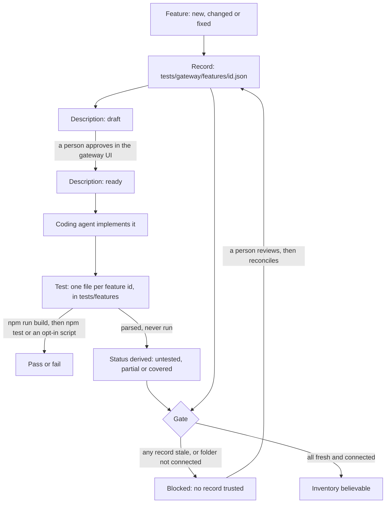
